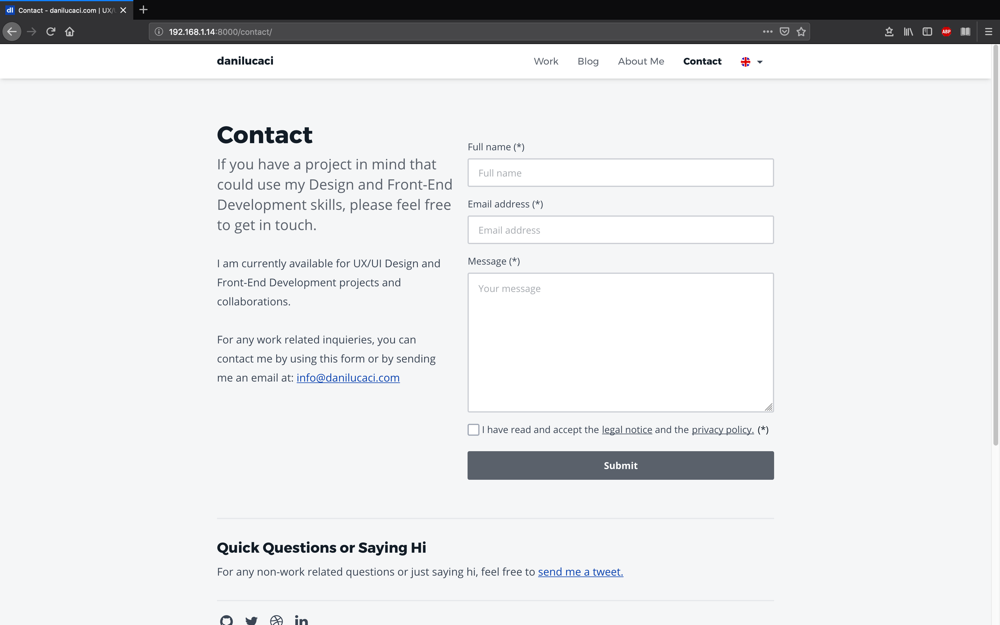

<nav class="toc">

### Table of Contents

<!-- TOC -->

- [What Options Do We Have](#what-options-do-we-have)
- [What Do You Need To Get Started](#what-do-you-need-to-get-started)
- [Spam Protection](#spam-protection)
- [Handling Form Submissions](#handling-form-submissions)
- [Showing a Loading Indicator](#showing-a-loading-indicator)
- [Form Validation with CSS](#form-validation-with-css)
- [Bonus Points, GDPR Compliant Contact Form](#bonus-points-gdpr-compliant-contact-form)
- [The Contact Form with All the Options Included](#the-contact-form-with-all-the-options-included)

<!-- /TOC -->

</nav>

## What Options Do We Have

Since Gatsby.js simply generates an <abbr title="Hyper Text Markup Language">HTML</abbr> version of your site in production mode, if you need to have a contact form on your site, you will need a back-end server to receive any form submissions.

In my case, as a designer that needs a contact form to be able to be reached by potential clients, building a back-end server seemed like a bit of an overkill.

Even though Gatsby.js has many useful plugins that let you add pretty much any kind of functionality to your site, there are no plugins that let you handle form submissions.

So after searching to see what services and solutions are available for static sites, I eventually came across a <a href="https://github.com/agarrharr/awesome-static-website-services" target="_blank" rel="noopener noreferer">repo on github<span class="sr-only">Opens in new window</span><span aria-hidden="true" class="external-link"></span></a> that had a bunch of resources available for static sites, not only for Gatsby but also for other static site generators such as Hugo or Jekyll.

After comparing a couple of services, I soon realized that most of them didn’t have a free plan, and if they did, it was really limited, so I decided to use Netlify’s forms since I am already hosting the site there.

They offer a great free starter package that lets you receive 100 form submissions per month, and after that, you’ll need to upgrade to a Pro plan.


## What Do You Need To Get Started

If you host your website on Netlify, you can start using their forms service right away.

To get started, simply add a `data-netlify="true"` or a `netlify` attribute to your form, a `name="whatever-you-want"` attribute —which is the name your form will have in the Netlify panel.

This is just the starting tag from mine, the entire form is a bit longer, we’ll get to it later.

```jsx{2,5}
<Form
  name="contact"
  method="post"
  action={thanksURL}
  data-netlify="true"
  data-netlify-honeypot="botfield"
  onSubmit={handleSubmit}
>
```

### Aditional Input Field for JSX Forms

If you are adding your form to a static site generator such as Gatsby.js, you will need to add a hidden input field with `name` set to `form-name` and the `value` set to the form’s name, which in my case is `contact`.

This step is necessary, otherwise, your form won’t show up in your Netlify admin panel.

```jsx
<input
  type="hidden"
  name="form-name"
  arria-hidden="true"
  value="contact"
/>
```

And now you’re all set to start receiving form submissions on your Gatsby.js static site 🎉. 

## Spam Protection

If you need to enable spam filtering —and you probably should, or you’ll spend your 100 form submissions a month pretty fast— Netlify gives you 2 options.

The first one is to use a hidden “honeypot” input field which only bots trying to submit your form will see and complete, so if Netlify sees this field completed, the form will just be ignored. In my example, mine is called `data-netlify-honeypot="botfield"`.

The second way you can enable spam filtering is by using reCAPTCHA 2, which you can learn how to use in the <a href="https://www.netlify.com/docs/form-handling/" target="_blank" rel="noopener noreferer">Netlify blog post<span class="sr-only">Opens in new window</span><span aria-hidden="true" class="external-link"></span></a>.

I’m using the honeypot field, so I’ll continue explaining my method.

## Handling Form Submissions

By default, when anyone submits your forms, Netlify will redirect them to a generic confirmation screen, which is great, but we can add our own custom “Thank You” page or React component for when javascript is enabled in the users browser.

```jsx{4,7}
<StyledForm
  name="contact"
  method="post"
  action={thanksURL}
  data-netlify="true"
  data-netlify-honeypot="botfield"
  onSubmit={handleSubmit}
>
```

In my case I decided to handle both cases.

### 1. The User has Disabled Javascript in Her Browser

When javascript is disabled in the users' browser, she will be redirected to my custom `action={thanksURL}` page. This way I don’t have to rely on Netlify's default screen.


### 2. The User Has Enabled Javascript in Her Browser

When Javascript is enabled in the users' browser, the form will be handled by the `onSubmit={handleSubmit}` function, and since this is done asynchronously, I can improve the UX of the form and render a loading indicator while it is being sent over to the Netlify servers.

```jsx{4,5,20}
async function handleSubmit(e) {
  e.preventDefault();

  setShowFormLoading(true);
  setFormSubmitted(true);

  const form = e.target;
  fetch("/", {
    method: "POST",
    headers: { "Content-Type": "application/x-www-form-urlencoded" },
    body: encode({
      "form-name": form.getAttribute("name"),
      email,
      fullname: fullName,
      message,
      botfield: botField,
    }),
  })
    .then(() => {
      handleFormSent();
    })
    .catch((error) => handleFormError(error));
}
```

Let’s see how to show a loading indicator while the data is being sent over to the Netlify servers.

From this example, you can see I’m using the new Hooks API, but it could be done in a similar way with classes.

The first thing the `handleSubmit()` function does is to set the state of `showFormLoading` to `true`, so that the spinner is immediately rendered. 

Then it toggles the state value `formSubmited` from `false` to `true` so that a `<EmailLoading ... />` component is rendered (more on that later).

## Showing a Loading Indicator

When `fetch()` returns a response, the `handleFormSent()` function is run which sets the state variable `formLoading` to `false` and the `showFormSuccess` variable to `true`, if there weren’t any errors returned.

```jsx
function handleFormSent() {
  setShowFormLoading(false);
  setShowFormSuccess(true);
}
```

If an error was returned, the `handleFormError()` function will run inside the `catch()` block which will set the state variable `showFormError` to `true`, so that it renders an error message.

```jsx
function handleFormSent() {
  let timer = setTimeout(() => {
    setShowFormLoading(false);
    setShowFormSuccess(true);
    
    clearTimeout(timer);
  }, 800);
}

function handleFormError(error) {
  setShowFormLoading(false);
  setShowFormError(true);
  setFormErrorRes(error);
}
```

I also included a `setTimeOut()` if you want to test the loading indicator. If you have a decent internet connection and the response comes back fast, you might not get to see the spinner long enough.

With this, you can set a delay to see how it renders.

While the form is being sent, a simple spinner is rendered in the submit button.

When `formSubmitted` is set to `true`, the `<EmailLoading />` component will be rendered and it will display the loading indicator and then the success, or error messages, on the screen.

```jsx
{formSubmitted && (
  <EmailLoading
    showFormLoading={showFormLoading}
    showFormSuccess={showFormSuccess}
    showFormError={showFormError}
    formErrorRes={formErrorRes}
    locale={locale}
  />
)}
```

The `<EmailLoading ... />` component simply returns a loading indicator when `isLoading` is `true` or a success/error message when the response is returned.

```jsx
{showFormLoading ? (
    <Spinner locale={locale} />
  ) : (
    <React.Fragment>
      {FORM_SUBMIT_STATUS.cta[locale]}
      <StyledIcon aria-hidden="true">
        <use xlinkHref="#correct" />
      </StyledIcon>
    </React.Fragment>
  )}
</StyledLoadingCTA>
{showFormSuccess && <EmailSuccessMessage locale={locale} />}
{showFormError && <EmailErrorMessage locale={locale} formErrorRes={formErrorRes} />}
```

### Final Result of The Loading Indicator

<figure>
<span class="video-iphoneX">
<span class="video-iphoneX--video">
<video autoplay loop muted playsinline controls>
<source src="./.webm" type="video/webm">
<source src="./.mp4" type="video/mp4">
Your browser does not support HTML5 video.
<a href="./.gif">See the Contact Form With a Loading Indicator and Status Messages Gif.</a>
</video>
</span>
</span>
<figcaption>Contact Form With a Loading Indicator and Status Messages</figcaption>
</figure>

## Form Validation with CSS

In order to handle the form validation I decided to use <abbr title="Cascading Style Sheets">CSS</abbr> only since I could get most of what I needed without having to use javascript. Furthermore, it also worked when someone tried to contact me using a browser that has javascript disabled.

My solution is based on using <abbr title="Cascading Style Sheets">CSS</abbr> Level 3 selectors such as `&:valid`, `:not()`, `:placeholder-shown` or `:invalid`. If you’d like to learn more about them, you can read <a href="https://css-tricks.com/form-validation-ux-html-css/" target="_blank" rel="noopener noreferer">this article from css-tricks<span class="sr-only">Opens in new window</span><span aria-hidden="true" class="external-link"></span></a>.

By using a combination of these <abbr title="Cascading Style Sheets">CSS</abbr> selectors, I could even get real-time validation while users are typing information in the form fields.

For example, this is a way to check the input field when it is currently not focused, data has been entered and it's valid.

```css
/*  Input is: */
/*  1. Valid */
/*  2. NOT Empty */
/*  3. NOT In Focus */
&:valid:not(:focus):not(:placeholder-shown) {
  color: ${theme.colors.success600};
  background-color: white !important;
  border: 2px solid ${theme.colors.success400};
  padding-right: ${rem(40)};

  & ~ span {
    display: block !important;
    ${optimizedSuccessSVGDataURI};
    background-size: ${rem(24)};
    background-repeat: no-repeat;
    background-position: 0px 0px;
  }
}
```

In this case, I’m also showing an svg icon inserted with a ES6 template literal `${optimizedSuccessSVGDataURI};` as a background image, by using the css `~` selector.

### How it Looks Like While Entering Data in the Form

<figure>
<span class="video-iphoneX">
<span class="video-iphoneX--video">
<video autoplay loop muted playsinline controls>
<source src="./.webm" type="video/webm">
<source src="./.mp4" type="video/mp4">
Your browser does not support HTML5 video.
<a href="./.gif">See the Contact Form With a Loading Indicator and Status Messages Gif.</a>
</video>
</span>
</span>
<figcaption>Contact Form With a Loading Indicator and Status Messages</figcaption>
</figure>

Besides validating the form fields, you should also make sure that you’re using the wright attributes on each input field, such as the `email` input field type I’m using, by setting the correct type. In this example I disabled auto capitalization with `autoCapitalize` and auto correction with `autoCorrect`. I also set the  `autoComplete` to `email`, so that the users' browser can autocomplete the data faster without them having to type everything by hand.

```jsx
<StyledInput
  type="email"
  value={email}
  name="email"
  placeholderType="email"
  title={INPUT_EMAIL_ERROR[locale]}
  pattern="^([^\x00-\x20\x22\x28\x29\x2c\x2e\x3a-\x3c\x3e\x40\x5b-\x5d\x7f-\xff]+|\x22([^\x0d\x22\x5c\x80-\xff]|\x5c[\x00-\x7f])*\x22)(\x2e([^\x00-\x20\x22\x28\x29\x2c\x2e\x3a-\x3c\x3e\x40\x5b-\x5d\x7f-\xff]+|\x22([^\x0d\x22\x5c\x80-\xff]|\x5c[\x00-\x7f])*\x22))*\x40([^\x00-\x20\x22\x28\x29\x2c\x2e\x3a-\x3c\x3e\x40\x5b-\x5d\x7f-\xff]+|\x5b([^\x0d\x5b-\x5d\x80-\xff]|\x5c[\x00-\x7f])*\x5d)(\x2e([^\x00-\x20\x22\x28\x29\x2c\x2e\x3a-\x3c\x3e\x40\x5b-\x5d\x7f-\xff]+|\x5b([^\x0d\x5b-\x5d\x80-\xff]|\x5c[\x00-\x7f])*\x5d))*(\.\w{2,})+$"
  autoCapitalize="off"
  autoCorrect="off"
  `autoComplete`="email"
  onChange={(e) => setEmail(e.target.value)}
  required
/>
```

The regular expression used in the `pattern` fields is used to test if the entered email is correct, particularly the part after the *@* that contains the domain name. The value stored in the `title` attribute will be shown as a message when the input field isn’t valid, however, each browser shows this message differently, so test it first.

The `INPUT_EMAIL_ERROR[locale]` simply stores a localized version of the title —this blog is translated into spanish and english.

## Bonus Points, GDPR Compliant Contact Form

Since I live in Spain, I have to consider Europe’s GDPR and Spain’s RGPD laws. Therefore, I needed some extra form fields and logic, particularly a consent checkbox which has to be enabled before anyone can submit the form.

This is also pretty straightforward to do with Netlify forms since you can send over the values stored in each input field and whether the user accepted the checkbox or not.

Before you continue reading, you should note that by simply following these steps, **you won’t be fully GDPRD or RGPD compliant, many more steps and information are needed which are not shown here**, so you should talk to your own lawyer like I did.

### Invalidating the Submit Button with CSS

According to the current privacy laws in Europe, users can’t send you their personal information before giving you their consent to use or store their personal information. So I had to add a checkbox —that isn’t checked by default— which controls if the form can be submitted.

Since I wanted to still be able to receive messages if anyone had javascript disabled, I decided to use the checkbox hack to disable the submit button and a simple way of doing it is by disabling `pointer-events` for the submit button.

```css
&:not(:checked) {
  & ~ input {
    pointer-events: none !important;
    background-color: ${theme.colors.dark700};
    color: ${theme.colors.gray100};

    &:hover,
    &:focus {
      background-color: ${theme.colors.dark700};
    }
  }
}

&:checked {
  & ~ input {
    pointer-events: auto;
  }
}
```

## The Contact Form with All the Options Included



