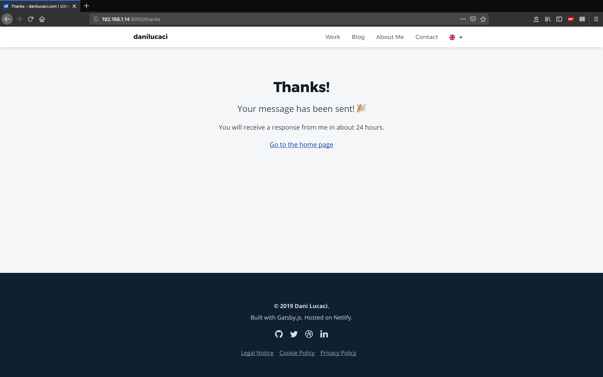

<nav class="toc">

### Table of Contents

<!-- TOC -->

- [What Options Do We Currently Have?](#what-options-do-we-currently-have)
- [What Do You Need To Get Started?](#what-do-you-need-to-get-started)
- [Handling Form Submissions](#handling-form-submissions)
- [Showing a Loading Indicator and Status Messages](#showing-a-loading-indicator-and-status-messages)
- [Validating the Form with CSS](#validating-the-form-with-css)
- [Making the Contact Form GDPR Compliant](#making-the-contact-form-gdpr-compliant)
- [Final Thoughts](#final-thoughts)

<!-- /TOC -->

</nav>

## What Options Do We Currently Have?

One of the main features that I needed on my personal website was a contact form, so that any potential client can get in touch.

But I thought that building a back-end server just for that, was maybe too much.

So I started looking for ways I could handle all the form submissions.

First I thought of using a third-party service like Formspree. They have free a plan to get started but it was kind off limited and the paid one were too expensive for my needs.

So I eventually decided to use Netlify’s form feature since I am already hosting the site there.

They offer a great starter plan with up to 100 form subsmissions a month, which was great for what I needed.

If you wanna see other services or tools that work great on static sites, this [repo on Github](https://github.com/agarrharr/awesome-static-website-services "Github repository with several resources for static sites") has a great list of them.

## What Do You Need To Get Started?

If you host your website on Netlify, you can start using their forms service right away.

To get started, simply add a `data-netlify="true"` or a `netlify` attribute to your form, a `name="form-name"` attribute &mdash;which is the name your form will have in the Netlify panel.

This is just the starting tag from mine, the entire form is a bit longer, we’ll get to that later on.

```jsx{2,5}
<Form
  name="contact"
  method="post"
  action={thanksURL}
  data-netlify="true"
  data-netlify-honeypot="botfield"
  onSubmit={handleSubmit}
>
```

### Aditional Input Field for JSX Forms

If you are adding your form to a static site generator such as Gatsby.js, you will need to add a hidden input field with `name` set to `form-name` and the `value` set to the form’s name, which in my case is `contact`.

This step is necessary, otherwise, your form won’t show up in your Netlify admin panel.

```jsx
<input type="hidden" name="form-name" arria-hidden="true" value="contact" />
```

### Adding Spam Protection

If you need to enable spam filtering —and you probably should, or you’ll spend your 100 form submissions a month pretty fast— Netlify gives you 2 options.

The first one, is to use a hidden “honeypot” input field which only bots trying to submit your form will see and complete. If the Netlify bots see this field completed, the form will just be ignored. In my case, mine is called `data-netlify-honeypot="botfield"`.

```jsx
data-netlify-honeypot="botfield"
```

The second way you can enable spam filtering, is by using reCAPTCHA 2. If you’d like to learn how to set it up on your site, you can read this [blog post from Netlify](https://www.netlify.com/docs/form-handling/) in which they explain how you can do it.

So let’s start building the form.

## Handling Form Submissions

By default, when anyone submits your forms, Netlify will redirect them to a generic confirmation screen. If you’re ok with using their default screen, you’re good to go.

But you can also create a custom “Thank You” page or use a React component for when javascript is enabled in the user’s browser.

```jsx{4,7}
<StyledForm
  name="contact"
  method="post"
  action={thanksURL}
  data-netlify="true"
  data-netlify-honeypot="botfield"
  onSubmit={handleSubmit}
>
```

In my case I decided to handle both cases.

### 1. The User has Disabled Javascript in Her Browser

When javascript is disabled in the user's browser, she will be redirected to my custom `action={thanksURL}` page. This way I can use a custom "Thank You" page that is with my own styling.



### 2. The User Has Enabled Javascript in Her Browser

When Javascript is enabled in the user’s browser, the form will be handled by the `onSubmit={handleSubmit}` function. Since this is done asynchronously, I can improve the UX of the form by rendering a loading indicator while the form data is sent over to Netlify’s servers.

So let’s see how to do that.

```jsx{4,5,20}
async function handleSubmit(e) {
  e.preventDefault();

  setShowFormLoading(true);
  setFormSubmitted(true);

  const form = e.target;
  fetch("/", {
    method: "POST",
    headers: { "Content-Type": "application/x-www-form-urlencoded" },
    body: encode({
      "form-name": form.getAttribute("name"),
      email,
      fullname: fullName,
      message,
      botfield: botField,
    }),
  })
    .then(() => {
      handleFormSent();
    })
    .catch((error) => handleFormError(error));
}
```

From this example, you can see I’m using the new React Hooks API, but it could be done in a similar way with classes.

The first thing the `handleSubmit()` function does is to set the state value of `showFormLoading` to `true`. Then, a loading indicator (spinner icon) is rendered.

Immediately after that, it toggles the state value `formSubmited` from `false` to `true`, so that a `<EmailLoading ... />` component gets rendered on the screen (more on that later).

## Showing a Loading Indicator and Status Messages

When `fetch()` returns a response, the `handleFormSent()` function will be executed which will set the state variable `formLoading` to `false` and the `showFormSuccess` variable to `true` —if there weren’t any errors returned.

```jsx
function handleFormSent() {
  setShowFormLoading(false);
  setShowFormSuccess(true);
}
```

If an error is returned, the `handleFormError()` function will run inside the `catch()` block which will set the state variable `showFormError` to `true`, so that it renders an error message.

```jsx
function handleFormSent() {
  setShowFormLoading(false);
  setShowFormSuccess(true);
}

function handleFormError(error) {
  setShowFormLoading(false);
  setShowFormError(true);
  setFormErrorRes(error);
}
```

While the form data is sent over to Netlify’s servers, a spinner icon replaces the copy inside the submit button.

Then, when `formSubmitted` is set to `true`, the `<EmailLoading />` component will render and it will display the loading indicator, together with the success, or error messages, on the screen.

```jsx
{
  formSubmitted && (
    <EmailLoading
      showFormLoading={showFormLoading}
      showFormSuccess={showFormSuccess}
      showFormError={showFormError}
      formErrorRes={formErrorRes}
      locale={locale}
    />
  );
}
```

The `<EmailLoading />` component simply returns a loading indicator when `isLoading` is `true` and a success/error message when the response is returned.

```jsx
{showFormLoading ? (
    <Spinner />
  ) : (
    <React.Fragment>
      {FORM_SUBMIT_STATUS.cta[locale]}
      <StyledIcon aria-hidden="true">
        <use xlinkHref="#correct" />
      </StyledIcon>
    </React.Fragment>
  )}
</StyledLoadingCTA>
{showFormSuccess && <EmailSuccessMessage locale={locale} />}
{showFormError && <EmailErrorMessage locale={locale} formErrorRes={formErrorRes} />}
```

## Validating the Form with CSS

In order to handle the form validation, I decided to use only CSS.

My solution is based on using CSS Level 3 selectors such as `&:valid`, `:not()`, `:placeholder-shown` or `:invalid`.

If you’d like to learn more about them, you can read [this article from css-tricks](https://css-tricks.com/form-validation-ux-html-css/).

By using a combination of these CSS selectors, I could even get real-time validation while users are typing the information in the form fields.

For example, this is how you could validate the data in the input field when it is currently not focused, data has been entered and it's valid.

```css
/*  Input is:
 *  1. Valid
 *  2. NOT Empty
 *  3. NOT In Focus
 */
&:valid:not(:focus):not(:placeholder-shown) {
  color: ${theme.colors.success600};
  background-color: white !important;
  border: 2px solid ${theme.colors.success400};
  padding-right: ${rem(40)};

  & ~ span {
    display: block !important;
    ${optimizedSuccessSVGDataURI};
    background-size: ${rem(24)};
    background-repeat: no-repeat;
    background-position: 0px 0px;
  }
}
```

In this case, I’m also showing an svg icon inserted with a ES6 template literal `${optimizedSuccessSVGDataURI};` as a background image, by using the css `~` selector.

Besides validating the form fields, you should also make sure that you’re using the wright attributes on each input field.

In my example, I use the `email` input type, which has auto capitalization disabled with `autoCapitalize=off` and auto correction disabled with `autoCorrect=off`.

I also set the `autoComplete` attribute to `email`, so that the user's browser can autocomplete her email faster without having to type it.

```jsx
<StyledInput
  type="email"
  value={email}
  name="email"
  placeholderType="email"
  title={INPUT_EMAIL_ERROR[locale]}
  pattern="^([^\x00-\x20\x22\x28\x29\x2c\x2e\x3a-\x3c\x3e\x40\x5b-\x5d\x7f-\xff]+|\x22([^\x0d\x22\x5c\x80-\xff]|\x5c[\x00-\x7f])*\x22)(\x2e([^\x00-\x20\x22\x28\x29\x2c\x2e\x3a-\x3c\x3e\x40\x5b-\x5d\x7f-\xff]+|\x22([^\x0d\x22\x5c\x80-\xff]|\x5c[\x00-\x7f])*\x22))*\x40([^\x00-\x20\x22\x28\x29\x2c\x2e\x3a-\x3c\x3e\x40\x5b-\x5d\x7f-\xff]+|\x5b([^\x0d\x5b-\x5d\x80-\xff]|\x5c[\x00-\x7f])*\x5d)(\x2e([^\x00-\x20\x22\x28\x29\x2c\x2e\x3a-\x3c\x3e\x40\x5b-\x5d\x7f-\xff]+|\x5b([^\x0d\x5b-\x5d\x80-\xff]|\x5c[\x00-\x7f])*\x5d))*(\.\w{2,})+$"
  autoCapitalize="off"
  autoCorrect="off"
  `autoComplete`="email"
  onChange={(e) => setEmail(e.target.value)}
  required
/>
```

The regular expression used in the `pattern` fields is used to test if the entered email is correct, particularly the part after the _@_ that contains the domain name.

The value stored in the `title` attribute will be shown when the input field isn’t valid. However, each browser shows this message differently, so test it first.

The `INPUT_EMAIL_ERROR[locale]` simply stores a localized version of the title since this blog is translated into spanish and english.

## Making the Contact Form GDPR Compliant

Since I live in Europe, I have to be GDPR compliant. Therefore, I needed some extra form fields and logic. The main input field that is missing is a consent checkbox which has to be enabled by the user before she can submit the form.

This is also pretty straightforward to do with Netlify forms since you can send over the values stored in each input field. You can also save the user’s consent, which you’ll need to prove that they gave you their explicit consent to use their personal data.

**Note:**

Before you continue reading, you should note that by simply following these steps, **you won’t be fully GDPR compliant. There’s much more involved with being GDPR compliant, which I won’t show here.**

To be sure, you should talk to your own lawyer like I did.

### Disabling the Submit Button

According to the current privacy laws in Europe, users can’t send you their personal information before giving you their consent to use or store their personal information.

So I had to add a checkbox which isn’t checked by default— that controls if the form can be submitted.

This was pretty easy to do by using a boolean state variable that is set to `true` when the checkbox is enabled. Otherwise, the button is disabled by default, until the checkbox is enabled.

```jsx
{
  !formSubmitted && <SubmitButton disabled={!acceptsConsentCheckbox} />;
}
```

Then in your Netlify forms panel, you should see all the form submissions, with the user’s consent value.

### The Final Version of the Contact Form

```jsx
function ContactForm({ locale }) {
  const [email, setEmail] = useState("");
  const [fullName, setFullName] = useState("");
  const [message, setMessage] = useState("");
  const [botField, setBotField] = useState("");
  const [acceptsConsentCheckbox, setAcceptsConsentCheckbox] = useState(false);
  const [checkboxValue, setCheckboxValue] = useState(CONSENT_VALUE[locale].no);
  const [formSubmitted, setFormSubmitted] = useState(false);
  const [showFormLoading, setShowFormLoading] = useState(false);
  const [showFormSuccess, setShowFormSuccess] = useState(false);
  const [showFormError, setShowFormError] = useState(false);
  const [formErrorRes, setFormErrorRes] = useState({});

  function encode(data) {
    return Object.keys(data)
      .map(
        (key) => encodeURIComponent(key) + "=" + encodeURIComponent(data[key])
      )
      .join("&");
  }

  async function handleSubmit(e) {
    e.preventDefault();

    setShowFormLoading(true);
    setFormSubmitted(true);

    const form = e.target;
    fetch("/", {
      method: "POST",
      headers: { "Content-Type": "application/x-www-form-urlencoded" },
      body: encode({
        "form-name": form.getAttribute("name"),
        email,
        fullname: fullName,
        message,
        datesent: dateSent,
        botfield: botField,
        acceptsconsentcheckbox: acceptsConsentCheckbox,
      }),
    })
      .then(() => {
        handleFormSent();
      })
      .catch((error) => handleFormError(error));
  }

  function handleConsentCheckbox(e) {
    setAcceptsConsentCheckbox(e.target.checked);

    if (e.target.checked) {
      setCheckboxValue(CONSENT_VALUE[locale].yes);
    } else {
      setCheckboxValue(CONSENT_VALUE[locale].no);
    }
  }

  function handleFormSent() {
    setShowFormLoading(false);
    setShowFormSuccess(true);
  }

  function handleFormError(error) {
    setShowFormLoading(false);
    setShowFormError(true);
    setFormErrorRes(error);
  }

  return (
    <FormContainer>
      <StyledForm
        name="contact"
        method="post"
        action="path-to-custom-thank-you-page"
        data-netlify="true"
        data-netlify-honeypot="botfield"
        onSubmit={handleSubmit}
      >
        <input
          type="hidden"
          name="form-name"
          arria-hidden="true"
          value="contact"
        />
        <input
          style={{ display: "none" }}
          arria-hidden="true"
          name="botfield"
          value={botField}
          onChange={(e) => setBotField(e.target.value)}
        />
        <StyledLabel labelType="full name">
          <StyledInput
            type="text"
            value={fullName}
            name="fullname"
            placeholderType="full name"
            autoCorrect="off"
            autoComplete="name"
            onChange={(e) => setFullName(e.target.value)}
            required
          />
          <InputStatusIcon arriaHidden="true" />
        </StyledLabel>
        <StyledLabel labelType="email">
          <StyledInput
            type="email"
            value={email}
            name="email"
            placeholderType="email"
            title={INPUT_EMAIL_ERROR[locale]}
            pattern="^([^\x00-\x20\x22\x28\x29\x2c\x2e\x3a-\x3c\x3e\x40\x5b-\x5d\x7f-\xff]+|\x22([^\x0d\x22\x5c\x80-\xff]|\x5c[\x00-\x7f])*\x22)(\x2e([^\x00-\x20\x22\x28\x29\x2c\x2e\x3a-\x3c\x3e\x40\x5b-\x5d\x7f-\xff]+|\x22([^\x0d\x22\x5c\x80-\xff]|\x5c[\x00-\x7f])*\x22))*\x40([^\x00-\x20\x22\x28\x29\x2c\x2e\x3a-\x3c\x3e\x40\x5b-\x5d\x7f-\xff]+|\x5b([^\x0d\x5b-\x5d\x80-\xff]|\x5c[\x00-\x7f])*\x5d)(\x2e([^\x00-\x20\x22\x28\x29\x2c\x2e\x3a-\x3c\x3e\x40\x5b-\x5d\x7f-\xff]+|\x5b([^\x0d\x5b-\x5d\x80-\xff]|\x5c[\x00-\x7f])*\x5d))*(\.\w{2,})+$"
            autoCapitalize="off"
            autoCorrect="off"
            autoComplete="email"
            onChange={(e) => setEmail(e.target.value)}
            required
          />
          <InputStatusIcon arriaHidden="true" />
        </StyledLabel>
        <StyledLabel labelType="message">
          <StyledTextArea
            rows="8"
            value={message}
            name="message"
            onChange={(e) => setMessage(e.target.value)}
            required
          />
          <InputTextAreaStatusIcon arriaHidden="true" />
        </StyledLabel>
        <PrivacyCheckbox
          type="checkbox"
          name="acceptsconsentcheckbox"
          value={checkboxValue}
          onChange={handleConsentCheckbox}
          locale={locale}
          required
        />

        {formSubmitted && (
          <EmailLoading
            showFormLoading={showFormLoading}
            showFormSuccess={showFormSuccess}
            showFormError={showFormError}
            formErrorRes={formErrorRes}
            locale={locale}
          />
        )}

        {!formSubmitted && <SubmitButton disabled={!acceptsConsentCheckbox} />}
      </StyledForm>
    </FormContainer>
  );
}
```

<figure>
  <span class="video-wrapper">
    <span class="video__inner">
      <video
        autoplay
        loop
        muted
        playsinline
        controls
        poster="./contact_form_loading_and_success_state.png"
      >
        <source
          src="./contact_form_loading_and_success_state.mp4"
          type="video/mp4"
        />
        Your browser does not support HTML5 video.
        <a href="./contact_form_loading_and_success_state.gif">
          See a GIF with the Contact Form With a Loading Indicator and Status
          Messages.
        </a>
      </video>
    </span>
  </span>
  <figcaption>
    Contact Form With a Loading Indicator and Status Messages
  </figcaption>
</figure>

## Final Thoughts

Adding a contact form on a static site generator like Gatsby.js turned out to be easier than I thought.

By using a service such as Netlify, it’s pretty straightforward to build, and it can also be GDPR compliant.

Hope it helped you learn how to add one on your site.

Feel free to comment bellow if you know any alternatives to using Netlify. So far I’m happy with it, but it can always be improved 🤔.
