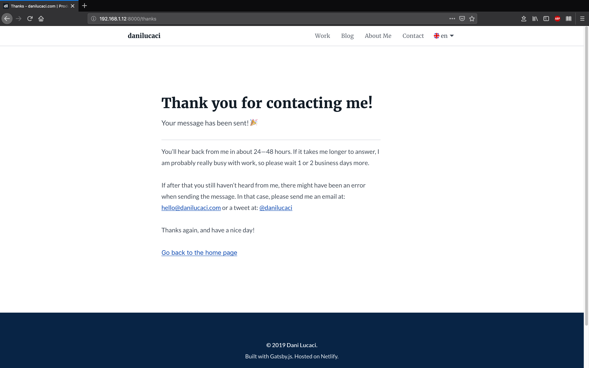

<nav class="toc">

### Table of Contents

<!-- TOC -->

- [What Options Do We Currently Have?](#what-options-do-we-currently-have)
- [What Do You Need To Get Started?](#what-do-you-need-to-get-started)
- [Handling Form Submissions](#handling-form-submissions)
- [Form Validation with CSS](#form-validation-with-css)
- [Bonus Points, GDPR Compliant Contact Form](#bonus-points-gdpr-compliant-contact-form)

<!-- /TOC -->

</nav>

## What Options Do We Currently Have?

One of the main features that I site needed on my portfolio was a contact form, so that any potential client can get in touch.

But I thought that building a back-end server just for that, was maybe too much.

So I started looking for ways I could handle all the form submissions.

First I thought of using a third-party service like Formspree.

They have free a plan to get started but it was kind off limited and the paid one were too expensive for my needs.

So I eventually decided to use Netlify’s form feature since I am already hosting the site there.

They offer a great starter plan with up to 100 form subsmissions a month, which is great for what I need.

If you wanna to look into other services or tools that work great on static sites, this <a href="https://github.com/agarrharr/awesome-static-website-services" target="_blank" rel="noopener noreferer">repo on github<span class="sr-only">Opens in new window</span><span aria-hidden="true" class="external-link"></span></a> has a great list of them.

## What Do You Need To Get Started?

If you host your website on Netlify, you can start using their forms service right away.

To get started, simply add a `data-netlify="true"` or a `netlify` attribute to your form, a `name="form-name"` attribute &mdash;which is the name your form will have in the Netlify panel.

This is just the starting tag from mine, the entire form is a bit longer, we’ll get to it later.

```jsx{2,5}
<Form
  name="contact"
  method="post"
  action={thanksURL}
  data-netlify="true"
  data-netlify-honeypot="botfield"
  onSubmit={handleSubmit}
>
```

### Aditional Input Field for JSX Forms

If you are adding your form to a static site generator such as Gatsby.js, you will need to add a hidden input field with `name` set to `form-name` and the `value` set to the form’s name, which in my case is `contact`.

This step is necessary, otherwise, your form won’t show up in your Netlify admin panel.

```jsx
<input
  type="hidden"
  name="form-name"
  arria-hidden="true"
  value="contact"
/>
```

And now you’re all set to start receiving form submissions on your Gatsby.js static site 🎉. 

### Spam Protection

If you need to enable spam filtering —and you probably should, or you’ll spend your 100 form submissions a month pretty fast— Netlify gives you 2 options.

The first one is to use a hidden “honeypot” input field which only bots trying to submit your form will see and complete. If the Netlify bots see this field completed, the form will just be ignored. In my example, mine is called `data-netlify-honeypot="botfield"`.

The second way you can enable spam filtering is by using reCAPTCHA 2, which you can learn how to setup in this <a href="https://www.netlify.com/docs/form-handling/" target="_blank" rel="noopener noreferer">blog post form Netlify<span class="sr-only">Opens in new window</span><span aria-hidden="true" class="external-link"></span></a>.

So let’s start building the form.

## Handling Form Submissions

By default, when anyone submits your forms, Netlify will redirect them to a generic confirmation screen. So far so good, but we can add your own custom “Thank You” page or React component for when javascript is enabled in the users browser.

```jsx{4,7}
<StyledForm
  name="contact"
  method="post"
  action={thanksURL}
  data-netlify="true"
  data-netlify-honeypot="botfield"
  onSubmit={handleSubmit}
>
```

In my case I decided to handle both cases.

### 1. The User has Disabled Javascript in Her Browser

When javascript is disabled in the users' browser, she will be redirected to my custom `action={thanksURL}` page. This way I don’t have to rely on Netlify's default screen.



### 2. The User Has Enabled Javascript in Her Browser

When Javascript is enabled in the users' browser, the form will be handled by the `onSubmit={handleSubmit}` function. Since this is done asynchronously, I can improve the UX of the form by rendering a loading indicator while the form data is sent over to Netlify’s servers.

So let’s see how to do that.

```jsx{4,5,20}
async function handleSubmit(e) {
  e.preventDefault();

  setShowFormLoading(true);
  setFormSubmitted(true);

  const form = e.target;
  fetch("/", {
    method: "POST",
    headers: { "Content-Type": "application/x-www-form-urlencoded" },
    body: encode({
      "form-name": form.getAttribute("name"),
      email,
      fullname: fullName,
      message,
      botfield: botField,
    }),
  })
    .then(() => {
      handleFormSent();
    })
    .catch((error) => handleFormError(error));
}
```

From this example, you can see I’m using the new React Hooks API, but it could be done in a similar way with classes.

The first thing the `handleSubmit()` function does is to set the state value of `showFormLoading` to `true`. Then, a loading indicator (spinner icon) is rendered. 

Immediately after that, it toggles the state value `formSubmited` from `false` to `true`, so that a `<EmailLoading ... />` component gets rendered on the screen (more on that later).

### Rendering a Loading Indicator with Success and Error Messages

When `fetch()` returns a response, the `handleFormSent()` function will be executed which will set the state variable `formLoading` to `false` and the `showFormSuccess` variable to `true`, if there weren’t any errors returned.

```jsx
function handleFormSent() {
  setShowFormLoading(false);
  setShowFormSuccess(true);
}
```

If an error is returned, the `handleFormError()` function will run inside the `catch()` block which will set the state variable `showFormError` to `true`, so that it renders an error message.

```jsx
function handleFormSent() {
  let timer = setTimeout(() => {
    setShowFormLoading(false);
    setShowFormSuccess(true);
    
    clearTimeout(timer);
  }, 800);
}

function handleFormError(error) {
  setShowFormLoading(false);
  setShowFormError(true);
  setFormErrorRes(error);
}
```

I also included a `setTimeOut()` if you want to test the loading indicator. If you have a decent internet connection and the response comes back fast, you might not get to see the spinner long enough.

With this, you can set a delay to see how it renders.

While the form data is sent over to Netlify’s servers, a spinner replaces the copy inside the submit button.

Then, when `formSubmitted` is set to `true`, the `<EmailLoading />` component will render and it will display the loading indicator, together with the success, or error messages, on the screen.

```jsx
{formSubmitted && (
  <EmailLoading
    showFormLoading={showFormLoading}
    showFormSuccess={showFormSuccess}
    showFormError={showFormError}
    formErrorRes={formErrorRes}
    locale={locale}
  />
)}
```

The `<EmailLoading />` component simply returns a loading indicator when `isLoading` is `true` and a success/error message when the response is returned.

```jsx
{showFormLoading ? (
    <Spinner locale={locale} />
  ) : (
    <React.Fragment>
      {FORM_SUBMIT_STATUS.cta[locale]}
      <StyledIcon aria-hidden="true">
        <use xlinkHref="#correct" />
      </StyledIcon>
    </React.Fragment>
  )}
</StyledLoadingCTA>
{showFormSuccess && <EmailSuccessMessage locale={locale} />}
{showFormError && <EmailErrorMessage locale={locale} formErrorRes={formErrorRes} />}
```

### Final Result of The Contact Form with Loading Indicator and Status Messages

<figure>
<span class="video-iphoneX">
<span class="video-iphoneX--video">
<video autoplay loop muted playsinline controls>
<source src="./.webm" type="video/webm">
<source src="./.mp4" type="video/mp4">
Your browser does not support HTML5 video.
<a href="./.gif">See the Contact Form With a Loading Indicator and Status Messages Gif.</a>
</video>
</span>
</span>
<figcaption>Contact Form With a Loading Indicator and Status Messages</figcaption>
</figure>

## Form Validation with CSS

In order to handle the form validation I decided to use only <abbr title="Cascading Style Sheets">CSS</abbr>. With just <abbr title="Cascading Style Sheets">CSS</abbr> I could get most of what I needed without having to use javascript. Furthermore, it also worked when someone tried to contact me using a browser that has javascript disabled.

My solution is based on using <abbr title="Cascading Style Sheets">CSS</abbr> Level 3 selectors such as `&:valid`, `:not()`, `:placeholder-shown` or `:invalid`. If you’d like to learn more about them, you can read <a href="https://css-tricks.com/form-validation-ux-html-css/" target="_blank" rel="noopener noreferer">this article from css-tricks<span class="sr-only">Opens in new window</span><span aria-hidden="true" class="external-link"></span></a>.

By using a combination of these <abbr title="Cascading Style Sheets">CSS</abbr> selectors, I could even get real-time validation while users are typing information in the form fields.

For example, this is a way to validate the input field when it is currently not focused, data has been entered and it's valid.

```css
/*  Input is: */
/*  1. Valid */
/*  2. NOT Empty */
/*  3. NOT In Focus */
&:valid:not(:focus):not(:placeholder-shown) {
  color: ${theme.colors.success600};
  background-color: white !important;
  border: 2px solid ${theme.colors.success400};
  padding-right: ${rem(40)};

  & ~ span {
    display: block !important;
    ${optimizedSuccessSVGDataURI};
    background-size: ${rem(24)};
    background-repeat: no-repeat;
    background-position: 0px 0px;
  }
}
```

In this case, I’m also showing an svg icon inserted with a ES6 template literal `${optimizedSuccessSVGDataURI};` as a background image, by using the css `~` selector.

### How it Looks Like While Entering Data in the Form

<figure>
<span class="video-iphoneX">
<span class="video-iphoneX--video">
<video autoplay loop muted playsinline controls>
<source src="./.webm" type="video/webm">
<source src="./.mp4" type="video/mp4">
Your browser does not support HTML5 video.
<a href="./.gif">See the Contact Form With a Loading Indicator and Status Messages Gif.</a>
</video>
</span>
</span>
<figcaption>Contact Form With a Loading Indicator and Status Messages</figcaption>
</figure>

Besides validating the form fields, you should also make sure that you’re using the wright attributes on each input field, such as the `email` input field type I’m using. In this example I disabled auto capitalization with `autoCapitalize` and auto correction with `autoCorrect`. I also set the `autoComplete` attribute to `email`, so that the users' browser can autocomplete the data faster without them having to type everything by hand.

```jsx
<StyledInput
  type="email"
  value={email}
  name="email"
  placeholderType="email"
  title={INPUT_EMAIL_ERROR[locale]}
  pattern="^([^\x00-\x20\x22\x28\x29\x2c\x2e\x3a-\x3c\x3e\x40\x5b-\x5d\x7f-\xff]+|\x22([^\x0d\x22\x5c\x80-\xff]|\x5c[\x00-\x7f])*\x22)(\x2e([^\x00-\x20\x22\x28\x29\x2c\x2e\x3a-\x3c\x3e\x40\x5b-\x5d\x7f-\xff]+|\x22([^\x0d\x22\x5c\x80-\xff]|\x5c[\x00-\x7f])*\x22))*\x40([^\x00-\x20\x22\x28\x29\x2c\x2e\x3a-\x3c\x3e\x40\x5b-\x5d\x7f-\xff]+|\x5b([^\x0d\x5b-\x5d\x80-\xff]|\x5c[\x00-\x7f])*\x5d)(\x2e([^\x00-\x20\x22\x28\x29\x2c\x2e\x3a-\x3c\x3e\x40\x5b-\x5d\x7f-\xff]+|\x5b([^\x0d\x5b-\x5d\x80-\xff]|\x5c[\x00-\x7f])*\x5d))*(\.\w{2,})+$"
  autoCapitalize="off"
  autoCorrect="off"
  `autoComplete`="email"
  onChange={(e) => setEmail(e.target.value)}
  required
/>
```

The regular expression used in the `pattern` fields is used to test if the entered email is correct, particularly the part after the *@* that contains the domain name. The value stored in the `title` attribute will be shown when the input field isn’t valid. However, each browser shows this message differently, so test it first.

The `INPUT_EMAIL_ERROR[locale]` simply stores a localized version of the title —this blog is translated into spanish and english.

## Bonus Points, GDPR Compliant Contact Form

Since I live in Spain, I have to follow the guidelines of Europe’s GDPR and Spain’s RGPD laws. Therefore, I needed some extra form fields and logic. The main input field that is missing is a consent checkbox which has to be enabled by the user before she can submit the form.

This is also pretty straightforward to do with Netlify forms since you can send over the values stored in each input field and whether the user accepted the checkbox or not.

**Note:**

Before you continue reading, you should note that by simply following these steps, **you won’t be fully GDPRD or RGPD compliant, many more steps and information is needed which are not shown here**, so you should talk to your own lawyer like I did.

### Invalidating the Submit Button

According to the current privacy laws in Europe, users can’t send you their personal information before giving you their consent to use or store their personal information. 

So I had to add a checkbox —that isn’t checked by default— which controls if the form can be submitted.

This was pretty easy to do by using a boolean state variable that is set to `true` when the checkbox is enabled. Otherwise, the button is disabled by default, until the checkbox is enabled.

```jsx
{!formSubmitted && <SubmitButton disabled={!acceptsConsentCheckbox} />}
```

### The Final Version of the Contact Form


