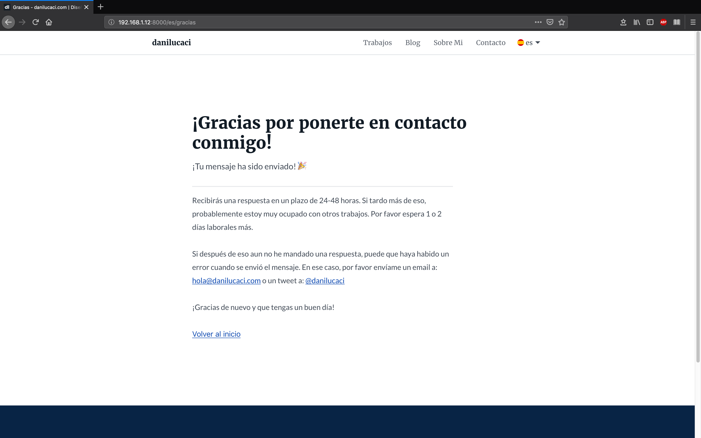

<nav class="toc">

### Índice

<!-- TOC -->

- [¿Qué Opciones Tenemos?](#¿qué-opciones-tenemos)
- [¿Qué Necesitas Para Empezar?](#¿qué-necesitas-para-empezar)
- [Protección Antispam](#protección-antispam)
- [Gestionando los Envíos de los Formularios](#gestionando-los-envíos-de-los-formularios)
- [Mostrando un Indicador del Estado de Carga](#mostrando-un-indicador-del-estado-de-carga)
- [Validación de Formularios con CSS](#validación-de-formularios-con-css)
- [Puntos Extra, Formulario de Contacto que Cumple con la RGPD](#puntos-extra-formulario-de-contacto-que-cumple-con-la-rgpd)
- [El Formulario de Contacto con Todas las Opciones Incluidas](#el-formulario-de-contacto-con-todas-las-opciones-incluidas)

<!-- /TOC -->

</nav>

## ¿Qué Opciones Tenemos?

Teniendo en cuenta que Gatsby.js simplemente genera una versión en HTML de tu página en el modo de producción, si necesitas tener un formulario de contacto en tu web, tendrás que tener un servidor back-end que reciba todos los envíos del formulario.

En mi caso, siendo un diseñador que necesita un formulario de contacto para que cualquier posible cliente pueda ponerse en contacto conmigo, consideré que crear un servidor back-end solo para eso sería demasiado.

Aunque Gatsby.js tiene una gran cantidad de plugins útiles que te permiten añadir muchos tipos de funcionalidades a tu página, no hay ninguno que permita gestionar peticiones de formularios.

Así que después de buscar que servicios o soluciones hay para las webs estáticas, finalmente conseguí encontrar <a href="https://github.com/agarrharr/awesome-static-website-services" target="_blank" rel="noopener noreferer">un repositorio en Github<span class="sr-only">Abre en nueva ventana</span><span aria-hidden="true" class="external-link"></span></a> que tenía un listado de muchos recursos útiles para las webs estáticas, no solo para Gatsby.js, si no que también para las creadas con Hugo o Jekyll.

Después de comparar los distintos servicios disponibles, me di cuenta de que la mayoría no ofrecen una versión gratuita, y si la ofrecen, esta es muy limitada. Al final decidí optar por los formularios que ofrece Netlify, que es donde tengo la web hospedada tambíen, asi que me pareció la mejor opción.

Netlify te ofrece un buen plan para empezar que te permite tener hasta 100 peticiones al mes, y si superas ese limite, tendrás que pasarte a alguno de los planes de pago Pro.

## ¿Qué Necesitas Para Empezar?

Si tienes tu web hospedada en Netlify, ya puedes empezar a usar su servicio de formularios.

Para poder hacerlo, solo tienes que añadir un atributo `data-netlify="true"` o `netlify` a tu formulario y un atributo `name="nombre-que-quieras"` —que es el que verás como nombre del formulario en tu panel de usuario de Netlify.

Este es simplemente el inicio de la etiqueta del mío, el formulario entero es un poco más largo, volveremos a eso más adelante.

```jsx{2,5}
<Form
  name="contact"
  method="post"
  action={thanksURL}
  data-netlify="true"
  data-netlify-honeypot="botfield"
  onSubmit={handleSubmit}
>
```

### Elementos Adicionales Para los Inputs en Formularios JSX

Si estas usando tu formulario en un generador de webs estáticas como Gatsby.js, tendrás que añadir un input oculto con el valor `name` puesto como `form-name` y el `value` puesto como el nombre de tu formulario, en mi caso es `contact`.

Este paso es importante ya que si no, el formulario no aparecerá en el panel de usuario de Netlify.

```jsx
<input
  type="hidden"
  name="form-name"
  arria-hidden="true"
  value="contact"
/>
```

Ahora ya puedes empezar a recibir mensajes a tu formulario de contacto en tu web estática hecha con Gatsby.js 🎉. 

## Protección Antispam

Si necesitas activar el filtro de spam —yo te recomiendo hacerlo si no es posible que llegues a tu limite de 100 peticiones al mes bastante rápido— Netlify te ofrece 2 opciones.

La primera es usando un input oculto tipo “honeypot” el cual solo los bots que intenten rellenar el formulario verán, y si Netlify detecta ese campo como completado, simplemente ignorará la presentación de ese formulario. En mi ejemplo, el mio se llama `data-netlify-honeypot="botfield"`.

La segunda manera de activar el filtro Spam es usando reCAPTCHA 2, y si necesitas aprender como implementarlo, puedes <a href="https://www.netlify.com/docs/form-handling/" target="_blank" rel="noopener noreferer"> leer el artículo de Netlify<span class="sr-only">Opens in new window</span><span aria-hidden="true" class="external-link"></span></a> en el que explican como puedes hacerlo.

Yo utilizo el campo “honeypot”, así que seguiré explicando siguiendo ese método.

## Gestionando los Envíos de los Formularios

Por defecto, cuando alguien te presenta un formulario, Netlify les redirige a una página genérica de agradecimiento, lo cual esta bien, pero podemos crear una personalizada, o podemos crear un componente React para cuando el usuario tiene activado el javascript en su navegador.

```jsx{4,7}
<StyledForm
  name="contact"
  method="post"
  action={thanksURL}
  data-netlify="true"
  data-netlify-honeypot="botfield"
  onSubmit={handleSubmit}
>
```

En mi caso he decidido implementar ambos casos.

### 1. El Usuario ha Desactivado Javascript en su Navegador

Cuando el usuario tiene javascript deshabilitado en su navegador, será redirigido a una página hecha por mi usando el atributo `action={thanksURL}` del formulario. De esta manera, no tengo que depender de la pantalla por defecto de Netlify.



### 2. El Usuario Tiene Activado Javascript en su Navegador

Cuando el usuario tiene javascript habilitado en su navegador, el formulario será gestionado por la función `onSubmit={handleSubmit}`, y teniendo en cuenta de que todo se realiza de forma asíncrona, puedo mostrar un indicador del estado de carga mientras la información es enviada a los servidores de Netlify. 

```jsx{4,5,20}
async function handleSubmit(e) {
  e.preventDefault();

  setShowFormLoading(true);
  setFormSubmitted(true);

  const form = e.target;
  fetch("/", {
    method: "POST",
    headers: { "Content-Type": "application/x-www-form-urlencoded" },
    body: encode({
      "form-name": form.getAttribute("name"),
      email,
      fullname: fullName,
      message,
      botfield: botField,
    }),
  })
    .then(() => {
      handleFormSent();
    })
    .catch((error) => handleFormError(error));
}
```

Vamos a ver como implementar un indicador del estado de carga mientras la información se esta enviando a los servidores de Netlify.

En este ejemplo puedes ver que estoy usando la nueva API de Hooks de React, pero lo mismo se podría conseguir de manera similar usando clases.

Lo primero que hace la función `handleSubmit()` es cambiar el valor de la variable de estado `showFormLoading` a `true`, para que el spinner se muestre en pantalla.

Después cambia el valor de la variable de estado `formSubmited` de `false` a `true` para que el componente `<EmailLoading ... />` se muestre en pantalla (más sobre eso más adelante).

## Mostrando un Indicador del Estado de Carga

Cuando `fetch()` devuelve una respuesta, se ejecuta la función `handleFormSent()` que cambiará el valor de la variable de estado `formLoading` a `false` y el valor de la variable `showFormSuccess` a `true`, si no se ha devuelto ningún error.

```jsx
function handleFormSent() {
  setShowFormLoading(false);
  setShowFormSuccess(true);
}
```

Si la respuesta devuelve un error, la función `handleFormError()` se ejecutará dentro del bloque `catch()`, el cual cambiará el valor de la variable de estado `showFormError` a `true`, para que muestre en pantalla un mensaje de error.

```jsx
function handleFormSent() {
  let timer = setTimeout(() => {
    setShowFormLoading(false);
    setShowFormSuccess(true);
    
    clearTimeout(timer);
  }, 800);
}

function handleFormError(error) {
  setShowFormLoading(false);
  setShowFormError(true);
  setFormErrorRes(error);
}
```

También he incluido un `setTimeOut()` si quieres probar como se ve el indicador del estado de carga. Si tienes una conexión a internet rápida y la respuesta vuelve muy rápido, no tendrás mucho tiempo de ver como se comporta el indicador de carga.

Con esto puedes retrasar la ejecución para ver el indicador durante más tiempo en pantalla y ver como se comporta.

Cuando `formSubmitted` cambia a `true`, el componente `<EmailLoading />` se mostrará en pantalla y a la vez mostrará el indicador del estado de carga y luego los mensajes de error o éxito dependiendo de la respuesta del servidor.

```jsx
{formSubmitted && (
  <EmailLoading
    showFormLoading={showFormLoading}
    showFormSuccess={showFormSuccess}
    showFormError={showFormError}
    formErrorRes={formErrorRes}
    locale={locale}
  />
)}
```

El componente `<EmailLoading ... />` simplemente devuelve un indicador del estado de carga de la información cuando `isLoading` es equivalente a `true` o un mensaje de éxito o error cuando recibe la respuesta del servidor.

```jsx
{showFormLoading ? (
    <Spinner locale={locale} />
  ) : (
    <React.Fragment>
      {FORM_SUBMIT_STATUS.cta[locale]}
      <StyledIcon aria-hidden="true">
        <use xlinkHref="#correct" />
      </StyledIcon>
    </React.Fragment>
  )}
</StyledLoadingCTA>
{showFormSuccess && <EmailSuccessMessage locale={locale} />}
{showFormError && <EmailErrorMessage locale={locale} formErrorRes={formErrorRes} />}
```

### El Resultado Final del Indicador de Carga

<figure>
<span class="video-iphoneX">
<span class="video-iphoneX--video">
<video autoplay loop muted playsinline controls>
<source src="./.webm" type="video/webm">
<source src="./.mp4" type="video/mp4">
Tu navegador no soporta el vídeo HTML5.
<a href="./.gif">See the Contact Form With a Loading Indicator and Status Messages Gif.</a>
</video>
</span>
</span>
<figcaption>Contact Form With a Loading Indicator and Status Messages</figcaption>
</figure>

## Validación de Formularios con CSS

Para validar la información introducida en el formulario he decido usar solo <abbr title="Cascading Style Sheets">CSS</abbr> ya que me permite tener los resultados que necesito sin tener que usar javascript. De esta forma, los usuarios siguen pudiendo presentar formularios cuando tienen deshabilitado javascript en su navegador.

Mi solución esta basada en usar los selectores de nivel 3 de <abbr title="Cascading Style Sheets">CSS</abbr> como `&:valid`, `:not()`, `:placeholder-shown` o `:invalid`. Si te gustaría leer más sobre ellos, puedes leer <a href="https://css-tricks.com/form-validation-ux-html-css/" target="_blank" rel="noopener noreferer">este articulo de css-tricks<span class="sr-only">Opens in new window</span><span aria-hidden="true" class="external-link"></span></a> en el que lo explican más.

Usando una combinación de estos selectores <abbr title="Cascading Style Sheets">CSS</abbr>, puedo tener hasta validación del formulario en tiempo real mientras el usuario esta introduciendo la información.

Por ejemplo, esto es una forma de comprobar si el input no esta activado o tiene focus, si se ha introducido información y si es válido.

```css
/*  Input is: */
/*  1. Valid */
/*  2. NOT Empty */
/*  3. NOT In Focus */
&:valid:not(:focus):not(:placeholder-shown) {
  color: ${theme.colors.success600};
  background-color: white !important;
  border: 2px solid ${theme.colors.success400};
  padding-right: ${rem(40)};

  & ~ span {
    display: block !important;
    ${optimizedSuccessSVGDataURI};
    background-size: ${rem(24)};
    background-repeat: no-repeat;
    background-position: 0px 0px;
  }
}
```

En este caso, también estoy mostrando un icono svg insertado usando un template literal de ES6 `${optimizedSuccessSVGDataURI};` como background-image que se activa con el selector css `~`.

### Como Queda Mientras se Rellena el Campo

<figure>
<span class="video-iphoneX">
<span class="video-iphoneX--video">
<video autoplay loop muted playsinline controls>
<source src="./.webm" type="video/webm">
<source src="./.mp4" type="video/mp4">
Tu navegador no soporta el vídeo HTML5.
<a href="./.gif">See the Contact Form With a Loading Indicator and Status Messages Gif.</a>
</video>
</span>
</span>
<figcaption>Contact Form With a Loading Indicator and Status Messages</figcaption>
</figure>

Aparte de la validación de la información del formulario, también deberías asegurarte de usar los atributos correctos para cada tipo de input, como, por ejemplo, en el input tipo `email` que estoy usando. Para este caso he desactivado las mayúsculas automáticas con `autoCapitalize` y la autocorección con ` autoCorrect`. También he añadido el atributo `autoComplete` para que el navegador autocomplete la información de contacto del usuario.

```jsx
<StyledInput
  type="email"
  value={email}
  name="email"
  placeholderType="email"
  title={INPUT_EMAIL_ERROR[locale]}
  pattern="^([^\x00-\x20\x22\x28\x29\x2c\x2e\x3a-\x3c\x3e\x40\x5b-\x5d\x7f-\xff]+|\x22([^\x0d\x22\x5c\x80-\xff]|\x5c[\x00-\x7f])*\x22)(\x2e([^\x00-\x20\x22\x28\x29\x2c\x2e\x3a-\x3c\x3e\x40\x5b-\x5d\x7f-\xff]+|\x22([^\x0d\x22\x5c\x80-\xff]|\x5c[\x00-\x7f])*\x22))*\x40([^\x00-\x20\x22\x28\x29\x2c\x2e\x3a-\x3c\x3e\x40\x5b-\x5d\x7f-\xff]+|\x5b([^\x0d\x5b-\x5d\x80-\xff]|\x5c[\x00-\x7f])*\x5d)(\x2e([^\x00-\x20\x22\x28\x29\x2c\x2e\x3a-\x3c\x3e\x40\x5b-\x5d\x7f-\xff]+|\x5b([^\x0d\x5b-\x5d\x80-\xff]|\x5c[\x00-\x7f])*\x5d))*(\.\w{2,})+$"
  autoCapitalize="off"
  autoCorrect="off"
  `autoComplete`="email"
  onChange={(e) => setEmail(e.target.value)}
  required
/>
```

El regular expression que utilizo en el atributo `pattern` sirve para comprobar si formato del email introducido es correcto, en concreto la parte que sigue después de la *@* que contiene el dominio del email. El valor guardado en `title` será el que es mostrado al usuario cuando el formato del email introducido no es válido, pero deberías tener en cuenta que cada navegador muestra el mensaje de forma distinta, así que pruébalo primero.

La variable `INPUT_EMAIL_ERROR[locale]` simplemente guarda una versión traducida del `title` ya que el blog lo he traducido al inglés y castellano.

## Puntos Extra, Formulario de Contacto que Cumple con la RGPD

Ya que actualmente vivo en España, tengo que cumplir con la ley de protección de datos RGPD, y, por tanto, faltan algunos campos en el formulario, sobretodo un checkbox que se tiene que activar antes de que cualquier persona pueda presentar un formulario con su información personal.

Esto también es relativamente fácil hacer con Netlify ya que puedes enviar los valores de cada input y si el usuario ha dado el consentimiento de usar su información o no, activando el checkbox.

Antes de continuar leyendo, deberías tener en cuenta de que solo siguiendo estos pasos **no estarás cumpliendo con la RGPD, faltan muchos otros pasos y más información que no esta detallada en este artículo**, por tanto, deberías consultar con tu propio abogado como hice yo.

### Desactivar el Botón de Enviar

De acuerdo con las leyes actuales de privacidad, los usuarios no pueden enviarte su información personal si no te han dado un consentimiento expreso previamente.

Por ello, añadí el checkbox —que no puede estar marcado por defecto— que controla si el formulario puede ser presentado o no.

## El Formulario de Contacto con Todas las Opciones Incluidas


