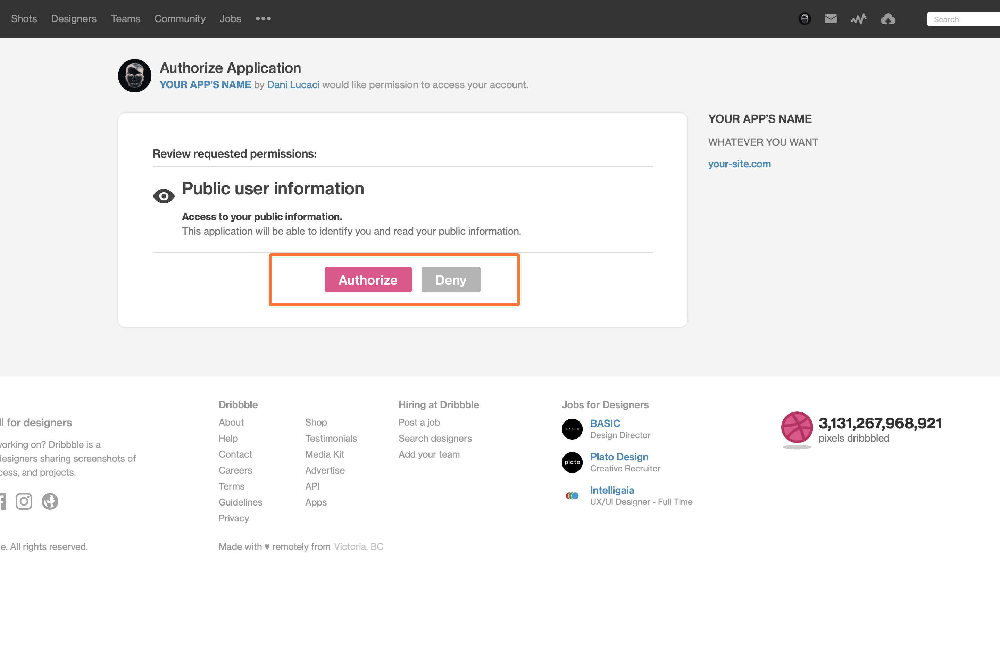

<nav class="toc">

### Table of Contents

<!-- TOC -->

- [Registering a New Dribbble App](#registering-a-new-dribbble-app)
- [Making Async Requests With React Hooks](#making-async-requests-with-react-hooks)
- [Rendering Placeholder Elements While Data is Fetched](#rendering-placeholder-elements-while-data-is-fetched)
- [Loading More Shots](#loading-more-shots)
- [Final Demo](#final-demo)
- [Next Steps](#next-steps)

<!-- /TOC -->

</nav>

## Registering a New Dribbble App

Before you can start making requests from the Dribbble V2 API, you need to register your app with them.

To do so, you will need to follow these steps —I’m assuming you already have a Dribbble account.

- First open up your Dribbble **account settings** page
- Then click on **Applications**
- Under **Developers**, click on _Register a new application_


Now you should be able to add in your own information, similar to how I did it in this example.

#### The most important things here are:

- The **Callback URL** is your sites’ URL which you should type including the `https://` part, otherwise you’ll get an error.
- You’ll need the **Client ID** and **Client Secret** to make a POST request later on, in order to get an access token.

### Getting a Dribbble Access Code

The next thing you’ll need is a `CLIENT_ID`. To access your `CLIENT_ID`, open a new tab in your browser and enter the following URL:

```js
https://dribbble.com/oauth/authorize?client_id=CLIENT_ID
```

- `CLIENT_ID` is the id from the previous step.

For the app I’m using for this tutorial it’s:

```js
https://dribbble.com/oauth/authorize?client_id=e9e05f3...
```

Click on *Authorize* to authorize your new app.



Once you’ve authorized it, you will be redirected to a page with an URL similar to this one:

```js
http://callback_url?code=5asdas892aas8dh8as9d9ashd
```

The `callback_url` is be the URL you’ve entered in your Dribbble admin panel. The important part here is to copy the long code `5asdas892aas8dh8as9d9ashd`, which you’ll need for the next step.

In order to get the access token, I used <a href="https://www.getpostman.com/downloads/" target="_blank" rel="noopener noreferer">Postman<span class="sr-only">Opens in new window</span><span aria-hidden="true" class="external-link"></span></a> which you can install on your computer by following the previous link, so that you can make a POST request to the following Dribbble URL:

```js
https://dribbble.com/oauth/token?client_id=CLIENT_ID&client_secret=CLIENT_SECRET&code=CODE_FROM_PREVIOUS_URL
```

This will give you the access token you need to be able to make requests to Dribbbles’s V2 API.

- **CLIENT\_ID**: the client id from the Dribbble acount page (look at the first screenshot in this tutorial)
- **CLIENT\_SECRET**: the client secret from the Dribbble acount page (look at the first screenshot)
- **CODE\_FROM\_PREVIOUS\_URL**: the code you get after you visit the URL with the `callback_url` of your site

### Making a POST Request With Postman

- Open up Postman
- Make a new `POST` **Request**
- Use the URL from the previous step with your `CLIENT_ID`, `CLIENT_SECRET` and `CODE_FROM_PREVIOUS_URL`

Now you should receive a JSON response similar to this one:

```json
{
  "access_token": "d8ashd98ashd9a8hsd9ah98dsadsh98ahsd9a8sda",
  "token_type": "bearer",
  "scope": "public",
  "created_at": 1231233453
}
```

If it doesn’t work, and instead you receive this response, or any response containing an error:

```json
{
  "error": "invalid_grant",
  "error_description": "The provided authorization grant is invalid, expired, revoked, does not match the redirection URI used in the authorization request, or was issued to another client."
}
```

You should start over and get a new code. When I was trying to register mine, I wasn’t able to get the access token and I kept getting this error. After searching for a solution, I found this <a href="https://developer.dribbble.com/v1/oauth/" target="_blank" rel="noopener noreferer">help page from the Dribbble API docs<span class="sr-only">Opens in new window</span><span aria-hidden="true" class="external-link"></span></a> in which they explain what you can do in case you get an error from the API.

If everything went fine, you should now have your access token which you can use to send requests to  Dribbble’s V2 API 🎉.

## Making Async Requests With React Hooks

In order to be able to send requests to the API, I decided to use React Hooks. If you don’t want to use hooks, you can <a href="https://matthewelsom.com/blog/display-shots-on-webpage-with-dribbble-v2-api.html" target="_blank" rel="noopener noreferer nofollow">read this article<span class="sr-only">Opens in new window</span><span aria-hidden="true" class="external-link"></span></a> in which you can learn how to send requests to Dribbble’s API using ajax.

Using React Hooks to fetch data from an API is pretty easy, however, you should learn how they work first, because it’s **really** easy to enter an infinite loop of data fetching that will reach the API’s limit in a second.

You should be particullarly careful if your API is a paid service like Firebase or AWS.

But don’t worry, I’ll explain how you can avoid running into that later on.

In order to get started you will need the following:

- **React v16.8** or newer installed (so that you can use hooks)
- **<a href="https://github.com/axios/axios" target="_blank" rel="noopener noreferer">Axios<span class="sr-only">Opens in new window</span><span aria-hidden="true" class="external-link"></span></a>** for making requests to Dribbble’s V2 API
- **The Dribbble access token** you got from the the previous steps in this tutorial

Before you continue, I recommend you should read the guide on <a href="https://overreacted.io/a-complete-guide-to-useeffect/" target="_blank" rel="noopener noreferer">how to use hooks<span class="sr-only">Opens in new window</span><span aria-hidden="true" class="external-link"></span></a> from Dan Abramov, and <a href="https://www.robinwieruch.de/react-hooks-fetch-data/" target="_blank" rel="noopener noreferer">this article<span class="sr-only">Opens in new window</span><span aria-hidden="true" class="external-link"></span></a> from Robin Wieruch in which he explains some of the techniques I used in this tutorial, among others.

Although mine is based on Robin’s article, I did change it quite a bit, so that I can avoid making unnecessary network requests on each render. I’m also using placeholder elements, besides spinners as loading indicators, while the data is being fetched from Dribbble.

But first, let’s start with fetching shots from Dribbble.

### The Dribbble V2 API Endpoint

In order to fetch your own shots from Dribbble, you will need to access the following endpoint:

```js
https://api.dribbble.com/v2/user/shots?access_token=ACCESS_TOKEN&page=1&per_page=4
```

**Where:**

- `ACCESS_TOKEN`: is the token you got after following the first steps in this article.
- `&page=1`: this part isn’t really necessary, I’m using for pagination, more on that later.
- `&per_page=4`: same thing, not necessary, I’m only using it for pagination, keep reading or skip it if you don’t need it.

### Fetching Data With Axios

For this tutorial I used axios, which you can install with `npm install axios`.

```jsx{11,13,15}
const [isLoading, setIsLoading] = React.useState(true);
const [isError, setIsError] = React.useState(false);
const [dribbblePage, setDribbblePage] = React.useState(1);
const [dribbblePosts, setDribbblePosts] = React.useState([]);

React.useEffect(() => {
  let dribbbleRes = {};

  async function getDribbblePosts() {
    try {
      dribbbleRes = await axios.get(`https://api.dribbble.com/v2/user/shots?access_token=${GATSBY_DRIBBBLE_TOKEN}&page=${dribbblePage}&per_page=${SHOTS_PER_PAGE}`);

      setDribbblePosts([...dribbblePosts, ...dribbbleRes.data]);

      if (isLoading) setIsLoading(false);
    } catch (error) {
      console.warn(error);
      if (isLoading) setIsLoading(false);
      setIsError(true);
    }
  }

  getDribbblePosts();
}, [dribbblePosts, dribbblePage, isLoading, isError]);
```

**So let’s see what this gets us so far:**

- First, I use `async await` to fetch the data, which is stored using the `setState` hook in the `dribbblePosts` array.
- The `isLoading` state variable is used to render a loading indicator, spinner in most cases, while the data is being fetched. It’s initially set to `true`, and then set to `false` once we get a response from `await`.
- The entire request is wrapped inside a `Try...Catch` block to handle any errors that might be returned.

You can see I’m also destructuring the previous state in the `dribbblePosts` array, because `setState()` doesn’t merge the previous state values as it happens when using classes.

I’m destructuring the previous values plus the new ones, so that I can merge the posts from the previous requests with the new data from the incomming requests, when a users clicks on the *Load More* button to fetch more posts, which we’ll get to later on.

So far, so good, however if you try to run the code you will enter an infinite loop, and the Dribbble API will give you a `Too Many Requests` error.

You’ll also get a memory leak if you navigate to another page from where the component is rendered, before the state is set. Since the data is fetched asynchronously using `async await`, if you navigaate to a different page before it resolves, React will try to save the data in a state variable of a component that has been unmounted and it will throw an error.

```js
index.js:2177 Warning: Can’t perform a React state update on an unmounted component. 
This is a no-op, but it indicates a memory leak in your application. 
To fix, cancel all subscriptions and asynchronous tasks in a useEffect cleanup function.
```

So let’s see how to to fix these issues.

### How to Avoid Making Requests on Each Render

Basically, the loop happens because each time `state` is changed in React, it triggers a new render. Then on each render, a new request will be made, which changes `state` again, which causes a new render, and so on...

One solution would be to simply add an empty array as a dependency of the `useEffect()` hook, so that it only runs on the first render. However, in my case it wouldn’t work, because I’m changing the state again with `if (isLoading) setIsLoading(false)`.

```jsx{11,13,22}
const [isLoading, setIsLoading] = React.useState(true);
const [isError, setIsError] = React.useState(false);
const [dribbblePage, setDribbblePage] = React.useState(1);
const [dribbblePosts, setDribbblePosts] = React.useState([]);

React.useEffect(() => {
  async function getDribbblePosts() {
    try {
      const dribbbleRes = await axios.get(`https://api.dribbble.com/v2/user/shots?access_token=${GATSBY_DRIBBBLE_TOKEN}&page=${dribbblePage}&per_page=${SHOTS_PER_PAGE}`);

      setDribbblePosts([...dribbblePosts, ...dribbbleRes.data]);

      if (isLoading) setIsLoading(false);
    } catch (error) {
      console.warn(error);
      if (isLoading) setIsLoading(false);
      setIsError(true);
    }
  }

  getDribbblePosts();
}, []);
```

This happens because the first time the component renders, the request will be made and the response from the API will be stored in the `dribbblePosts` array, which will trigger a render when state is changed.

Then on the second render, the `dribbblePosts` will have the data stored inside, however, the API call will run again since there’s nothing preventing it from executing. 

Then the response will be stored again in state, which leads to a new render.

The same thing will hapen once `setIsLoading(false)` is run, state will change again, a new render will happen, and a new API call will be triggered.

And you’ve probably noticed that this is the perfect recipe for an infinite loop, which will give you a `Too Many Calls` error.

In my case the solution was pretty simple, I just wrapped `axios.get()` with an if statement.

```jsx{3,12,14,27,28}
const [isLoading, setIsLoading] = React.useState(true);
const [isError, setIsError] = React.useState(false);
const [postsFetched, setPostsFetched] = React.useState(false);
const [dribbblePage, setDribbblePage] = React.useState(1);
const [dribbblePosts, setDribbblePosts] = React.useState([]);

React.useEffect(() => {
  let dribbbleRes = {};

  async function getDribbblePosts() {
    try {
      if (!postsFetched) {
        dribbbleRes = await axios.get(`https://api.dribbble.com/v2/user/shots?access_token=${GATSBY_DRIBBBLE_TOKEN}&page=${dribbblePage}&per_page=${SHOTS_PER_PAGE}`);
        setPostsFetched(true);
      }

      setDribbblePosts([...dribbblePosts, ...dribbbleRes.data]);
      if (isLoading) setIsLoading(false);
    } catch (error) {
      console.warn(error);
      setPostsFetched(true);
      if (isLoading) setIsLoading(false);
      setIsError(true);
    }
  }

  if (!postsFetched) {
    getDribbblePosts();
  }
}, [dribbblePosts, dribbblePage, postsFetched, isLoading, isError]);
```

By using the boolean `postsFetched`, I can limit the amount of network requests made on each render. The first time the component renders, the network request will be made, then, since I’m changing state, a new render will be triggered by React. However, this time around the network request won’t be made since `postsFetched` will be `true`, and the if statement won’t be executed.

When you are making network requests using `useEffect()` hooks, each time you change state, a new render will be triggered. If you don’t check if you already made a request or if the data is already fetched, it will lead to an infinite loop of renders and network requests.

### How to Avoid Memory Leaks When Fetching Data Using useEffect()

In order to fix this issue, I used the clean up function that React hooks provide, which is executed when the component is unmounted.

```jsx{8,18,19,25,33,34,37,38}
const [isLoading, setIsLoading] = React.useState(true);
const [isError, setIsError] = React.useState(false);
const [postsFetched, setPostsFetched] = React.useState(false);
const [dribbblePage, setDribbblePage] = React.useState(1);
const [dribbblePosts, setDribbblePosts] = React.useState([]);

React.useEffect(() => {
  let didCancel = false;
  let dribbbleRes = {};

  async function getDribbblePosts() {
    try {
      if (!postsFetched) {
        dribbbleRes = await axios.get(`https://api.dribbble.com/v2/user/shots?access_token=${GATSBY_DRIBBBLE_TOKEN}&page=${dribbblePage}&per_page=${SHOTS_PER_PAGE}`);
        setPostsFetched(true);
      }

      if (!didCancel) {
        setDribbblePosts([...dribbblePosts, ...dribbbleRes.data]);

        if (isLoading) setIsLoading(false);
      }
    } catch (error) {
      console.warn(error);
      if (!didCancel) {
        if (isLoading) setIsLoading(false);
        setPostsFetched(true);
        setIsError(true);
      }
    }
  }

  if (!postsFetched && !didCancel) {
    getDribbblePosts();
  }

  return () => {
    didCancel = true;
  };
}, [dribbblePosts, postsFetched, dribbblePage, isLoading, isError]);
```

By using a boolean `didCancel` I can avoid saving data in state if the component is unmounted. The clean up function can be used to toggle the boolean from `false` to `true`. Then the next time it’s executed, it won’t save anything in state. This way React won’t try to save data in the state of a component that has been unmounted.

Note that this doesn’t cancel also the axios data fetching part. If you’d like to learn how to do that, you can read their <a href="https://github.com/axios/axios#cancellation" target="_blank" rel="noopener noreferer">their docs<span class="sr-only">Opens in new window</span><span aria-hidden="true" class="external-link"></span></a> in which they explain how it can be achieved.

Great, so far we have a `useEffect()` hook that only fetches data from the Dribbble API once, and stores it only when the component is still mounted.

With just these optimizations we could start working, however, in my case I wanted to display placeholder elements while the data was being fetched, to avoid large layout shifts when the posts were rendered.

## Rendering Placeholder Elements While Data is Fetched

While the data was being fetched from the API, I wanted to render a spinner and some placeholder elements that were about as large as the final image from Dribbble.

The main logic behind it all was to use pagination and a certain amount of shots per request.

You probably have seen I was using template literal strings to create the URL:

```jsx
await axios.get(`https://api.dribbble.com/v2/user/shots?access_token=${GATSBY_DRIBBBLE_TOKEN}&page=${dribbblePage}&per_page=${SHOTS_PER_PAGE}`);
```

The Dribbble V2 API gives you the ability to use pagination by using the `&page=X` and the `&per_page=X` query params.

### Creating the Placeholder Elements

The first time anyone loads the page where the component was rendered, I wanted to only show 4 or 6 shots, so I’m storing the amount of shots I want in a const.

```jsx
const SHOTS_PER_PAGE = 4;
```

This was then used in the `axios.get()` URL and also to create create the placeholder elements by creating an array that had as many values inside, as the lenght of the `SHOTS_PER_PAGE` const.

```jsx
const placeholderArr = Array.from({ length: SHOTS_PER_PAGE }, (v, i) => i);
```

When using `Array.from()` you can specify a second argument which is a `map()` function, that will be run on each of the elements in the array. This way I can create a pre-filled array which I can use to map over while `isLoading=true` and render placeholder elements.

```jsx
{isLoading && placeholderArr.map((i) => <DribbblePostPlaceholder key={i} />)}
```

To create these elements you can use the following code. It’s simply a wrapper div with `position: relative;` and a child element with a `padding-bottom: 75%;`. The padding-bottom of 75% is used to have the same aspect ratio as the images fetched from Dribbble.

I’m also using a `background-position` animation to animate the background from a light gray to a darker one, to simulate a loading indicator.

Note that I’m using Styled Components to style all the components in this tutorial.

```css
const StyledPlaceholder = styled.div`
  position: relative;
  overflow: hidden;
  height: 100%;
  width: 100%;
`;

const placeholderAnimation = keyframes`
0% {
  background-position: 0% 50%;
 }
 50% {
  background-position: 100% 50%;
 }
 100% {
  background-position: 0% 50%;
 }
 `;

const StyledPlaceholderInner = styled.span`
  display: block;
  width: 100%;
  padding-bottom: 75%;
  background: linear-gradient(
    90deg,
    ${theme.colors.gray100},
    ${theme.colors.gray400},
    ${theme.colors.gray100}
  );
  background-size: 200% 200%;
  animation: ${placeholderAnimation} 3s ease infinite;
`;

function DribbblePostPlaceholder() {
  return (
    <StyledPlaceholder>
      <StyledPlaceholderInner />
    </StyledPlaceholder>
  );
}
```

Then once `isLoading` is changed to `false`, I simply render the shots from Dribbble.

```jsx
{!isLoading && dribbblePosts.map((post) => <DribbblePost key={post.id} post={post} />)}
```

### The Final Result

<figure>
<span class="video-iphoneX">
<span class="video-iphoneX--video">
<video autoplay loop muted playsinline controls>
<source src="./.webm" type="video/webm">
<source src="./.mp4" type="video/mp4">
Your browser does not support HTML5 video.
<a href="./.gif">See the Contact Form With a Loading Indicator and Status Messages Gif.</a>
</video>
</span>
</span>
<figcaption>Contact Form With a Loading Indicator and Status Messages</figcaption>
</figure>

## Loading More Shots

When I was designing the page where the component is mounted, I only wanted to show 4 or 6 shots at most, but I also wanted to have an option to load more shots if any user wanted to see more or them, without having to send them over to the Dribbble page.

Initially I thought of fetching several posts, 20 or so, and slicing the array into 4 to 6 long chunks so that I only rendered a couple of shots at a time. But I soon realized that it wasn’t a really good idea to download that many images, especially for the users which are visiting my site on a mobile conection with a limited bandwidth.

So I decided to only load 4 shots initially, and if any user wanted to see more, they could use the *Load More* button which would fetch 4 shots more.

Since the Dribbble API has built-in pagination which lets me load a certain amount of shots per page, it was the perfect solution to my problem.

In order to load more shots, I added a button that when clicked would trigger the `loadMorePosts()` function.

```jsx
<LoadMore onClick={loadMorePosts}>
  {!isLoadingMore && (
    <LoadMoreLabel>Load More...</LoadMoreLabel>
  )}
  {isLoadingMore && <Spinner dark />}
</LoadMore>
```

Once the button is pressed, the function will add 1 to the `dribbblePage` state variable and set the `postsFetched` boolean used to control whether the `axios.get()` is triggered.

```jsx
function loadMorePosts() {
  setDribbblePage(dribbblePage + 1);
  setPostsFetched(false);
  setIsLoadingMore(true);
}
```

Furthermore, the `isLoadingMore` variable lets me load more placeholder elements while the new shots are being fetched from the API.

By using a different variable and not the original `isLoading` one, I could avoid changing the shots I already had and rendered, thus adding new placeholders and shots bellow the ones I already had.

In order to make this all work, I also needed to merge the previous state with the new state, since `useState()` overrides all existing values in the state.

```jsx
{isLoadingMore && placeholderArr.map((i) => <DribbblePostPlaceholder key={i} />)}
```

### The Final Version of the Dribbble Posts Component

```jsx
function DribbblePostsV2() {
  const SHOTS_PER_PAGE = 4;

  const [isLoading, setIsLoading] = React.useState(true);
  const [isLoadingMore, setIsLoadingMore] = React.useState(false);
  const [isError, setIsError] = React.useState(false);
  const [postsFetched, setPostsFetched] = React.useState(false);
  const [dribbblePage, setDribbblePage] = React.useState(1);
  const [dribbblePosts, setDribbblePosts] = React.useState([]);

  const placeholderArr = Array.from({ length: SHOTS_PER_PAGE }, (v, i) => i);

  React.useEffect(() => {
    let didCancel = false;
    let dribbbleRes = {};

    async function getDribbblePosts() {
      try {
        if (!postsFetched) {
          dribbbleRes = await axios.get(`https://api.dribbble.com/v2/user/shots?access_token=${GATSBY_DRIBBBLE_TOKEN}&page=${dribbblePage}&per_page=${SHOTS_PER_PAGE}`);
          setPostsFetched(true);
        }

        if (!didCancel) {
          setDribbblePosts([...dribbblePosts, ...dribbbleRes.data]);

          if (isLoading) setIsLoading(false);
          if (isLoadingMore) setIsLoadingMore(false);
        }
      } catch (error) {
        console.warn(error);
        if (!didCancel) {
          if (isLoading) setIsLoading(false);
          if (isLoadingMore) setIsLoadingMore(false);
          setPostsFetched(true);
          setIsError(true);
        }
      }
    }

    if (!postsFetched && !didCancel) {
      getDribbblePosts();
    }

    return () => {
      didCancel = true;
    };
  }, [dribbblePosts, postsFetched, dribbblePage, isLoading, isError, isLoadingMore]);

  function loadMorePosts() {
    setDribbblePage(dribbblePage + 1);
    setPostsFetched(false);
    setIsLoadingMore(true);
  }

  return (
    <DribbblePostsWrapper>
      {isError && <ErrorMessage>Sorry, something went wrong...</ErrorMessage>}

      {isLoading && placeholderArr.map((i) => <DribbblePostPlaceholder key={i} />)}
      {!isLoading && dribbblePosts.map((post) => <DribbblePost key={post.id} post={post} />)}

      {isLoadingMore && placeholderArr.map((i) => <DribbblePostPlaceholder key={i} />)}
      <LoadMore onClick={loadMorePosts}>
        {!isLoadingMore && (
          <LoadMoreLabel>Load More...</LoadMoreLabel>
        )}
        {isLoadingMore && <Spinner dark />}
      </LoadMore>
    </DribbblePostsWrapper>
  );
}
```

## Final Demo

In the demo bellow you can see the initial fetching (only 2 shots for the demo), then loading more shots on each click (2 shots per requests). Take a look also at the network requests being made on each click or page load. Even though the component is rendered several times —each time state changes—, I’m only making a single network request.

The UX of the component is also greatly improved by showing a loading indicator with the spinner, and also avoiding large layout shifts, by using the placeholder elements while the data is fetched.

<figure>
<span class="video-iphoneX">
<span class="video-iphoneX--video">
<video autoplay loop muted playsinline controls>
<source src="./.webm" type="video/webm">
<source src="./.mp4" type="video/mp4">
Your browser does not support HTML5 video.
<a href="./.gif">See the Contact Form With a Loading Indicator and Status Messages Gif.</a>
</video>
</span>
</span>
<figcaption>Contact Form With a Loading Indicator and Status Messages</figcaption>
</figure>

## Next Steps

So far I’m quite happy with the results. I got all the features I needed by combining React Hooks with the the pagination Dribbble’s V2 API.

Some improvements I’m considering are using the `useReducer()` hook to combine the different changes to state, and also caching the results. Currently, each time the component mounts, the shots are fetched from Dribbble and if a user returns to the page after already having seen it, the shots aren’t saved in cache.