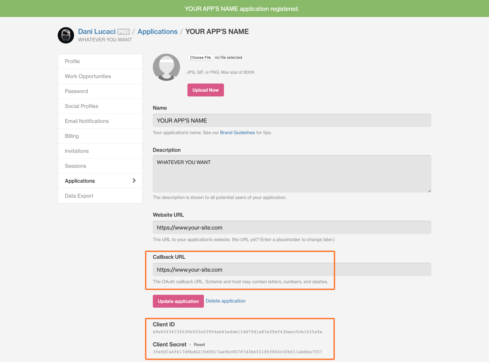
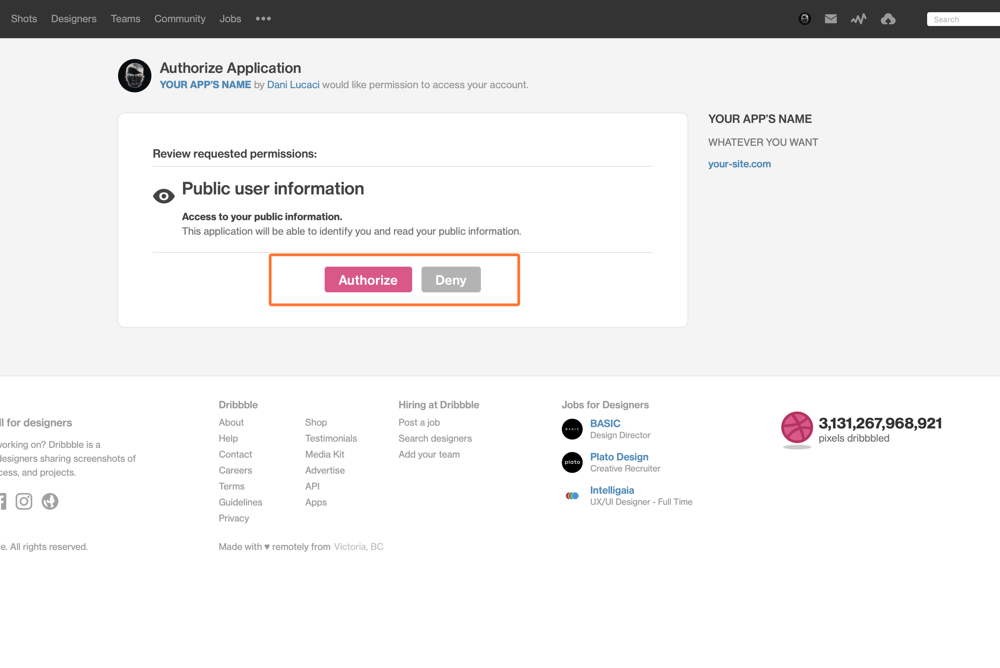

<nav class="toc">

### Índice

<!-- TOC -->

- [Registering a New Dribbble App](#registering-a-new-dribbble-app)
- [Making Async Requests With React Hooks](#making-async-requests-with-react-hooks)
- [Rendering Placeholder Elements While Data is Fetched](#rendering-placeholder-elements-while-data-is-fetched)
- [Loading More Shots](#loading-more-shots)
- [(Update) Refactoring to useReducer](#update-refactoring-to-usereducer)
- [Final Demo](#final-demo)
- [Next Steps](#next-steps)

<!-- /TOC -->

</nav>

## Registering a New Dribbble App

Before you can start making requests from the Dribbble V2 API, you need to register your app.

For that, you will need to follow these steps —I’m assuming you already have a Dribbble account.

- First, open up your Dribbble **account settings** page
- Then click on **Applications**
- Under **Developers**, click on _Register a new application_

Now you should be able to add your own information, similar to how I did it in this example:



#### The most important things are:

- The **Callback URL** is your sites’ URL which you should type including the `https://` part, otherwise you’ll get an error.
- The **Client ID** and **Client Secret** which you’ll need to be able to make a POST request, in order to get an access token.

### Getting a Dribbble Access Code

The next thing you’ll need is a `CLIENT_ID`. To access your `CLIENT_ID`, open a new tab in your browser and enter the following URL:

```js
https://dribbble.com/oauth/authorize?client_id=CLIENT_ID
```

- `CLIENT_ID` is the *id* from the previous step.

For the app I’m using in this tutorial it’s:

```js
https://dribbble.com/oauth/authorize?client_id=e9e05f3...
```

Click on *Authorize* to authorize your new app.



Once you’ve authorized it, you will be redirected to a page with an URL similar to this one:

```js
http://callback_url?code=5asdas892aas8dh8as9d9ashd
```

The `callback_url` is the URL you’ve entered in your Dribbble admin panel. The important part here is to copy the long code `5asdas892aas8dh8as9d9ashd`, which you’ll need for the next step.

In order to get the access token, I used <a href="https://www.getpostman.com/downloads/" target="_blank" rel="noopener noreferer">Postman<span class="sr-only">Opens in a new window</span><span aria-hidden="true" class="external-link"></span></a> which you can install on your computer by following the previous link, so that you can make a POST request to the following Dribbble URL:

```js
https://dribbble.com/oauth/token?client_id=CLIENT_ID&client_secret=CLIENT_SECRET&code=CODE_FROM_PREVIOUS_URL
```

This will give you the access token you need to be able to make requests to Dribbbles’s V2 API.

- **CLIENT\_ID**: is the client id from the Dribbble account page (look at the first screenshot in this tutorial)
- **CLIENT\_SECRET**: is the client secret from the Dribbble account page (look at the first screenshot)
- **CODE\_FROM\_PREVIOUS\_URL**: is the code you get after you visit the URL with the `callback_url` of your site

### Making a POST Request With Postman

1. Open up Postman
2. Make a new `POST` **Request**
3. Use the URL from the previous step with your `CLIENT_ID`, `CLIENT_SECRET` and `CODE_FROM_PREVIOUS_URL`

Now you should receive a JSON response similar to this one:

```json
{
  "access_token": "d8ashd98ashd9a8hsd9ah98dsadsh98ahsd9a8sda",
  "token_type": "bearer",
  "scope": "public",
  "created_at": 1231233453
}
```

If it doesn’t work, and instead you receive this response —or any response containing an error:

```json
{
  "error": "invalid_grant",
  "error_description": "The provided authorization grant is invalid, expired, revoked, does not match the redirection URI used in the authorization request, or was issued to another client."
}
```

You should start over and get a new code. 

When I was trying to register mine, I wasn’t able to get the access token and I kept getting this error. After searching for a solution, I found this <a href="https://developer.dribbble.com/v1/oauth/" target="_blank" rel="noopener noreferer">help page from the Dribbble API docs<span class="sr-only">Opens in a new window</span><span aria-hidden="true" class="external-link"></span></a> in which they explain what you can do in case you get an error response from the API.

If everything went fine, you should now have your access token which you can use to send requests to  Dribbble’s V2 API 🎉.

## Making Async Requests With React Hooks

In order to be able to send requests to the API, I decided to use React Hooks. If you don’t want to use hooks, you can <a href="https://matthewelsom.com/blog/display-shots-on-webpage-with-dribbble-v2-api.html" target="_blank" rel="noopener noreferer nofollow">read this article<span class="sr-only">Opens in a new window</span><span aria-hidden="true" class="external-link"></span></a> in which you can learn how to send requests to Dribbble’s API using ajax.

Using React Hooks to fetch data from an API is pretty easy. But you should learn how they work first.

It’s **really** easy to enter an infinite loop of data fetching that will reach the API’s limit in a second.

You should be particularly careful if your API is a paid service like Firebase or AWS.

But don’t worry, I’ll explain how you can avoid running into that later on.

In order to get started you will need the following:

- **React v16.8** or newer installed (so that you can use hooks)
- **<a href="https://github.com/axios/axios" target="_blank" rel="noopener noreferer">Axios<span class="sr-only">Opens in a new window</span><span aria-hidden="true" class="external-link"></span></a>** for making requests to Dribbble’s V2 API
- **The Dribbble access token** you got from the the previous steps in this tutorial

Before you continue, I recommend you to read the guide on <a href="https://overreacted.io/a-complete-guide-to-useeffect/" target="_blank" rel="noopener noreferer">how to use hooks<span class="sr-only">Opens in a new window</span><span aria-hidden="true" class="external-link"></span></a> from Dan Abramov, and <a href="https://www.robinwieruch.de/react-hooks-fetch-data/" target="_blank" rel="noopener noreferer">this article<span class="sr-only">Opens in a new window</span><span aria-hidden="true" class="external-link"></span></a> from Robin Wieruch in which he explains some of the techniques I used in this tutorial, among others.

Although mine is based on Robin’s article, I did change it quite a bit, so that I can render placeholder elements, besides spinners as loading indicators, while the data is being fetched.

But first, let’s start with fetching the shots from Dribbble.

### The Dribbble V2 API Endpoint

In order to fetch your own shots from Dribbble, you will need to access the following endpoint:

```js
https://api.dribbble.com/v2/user/shots?access_token=ACCESS_TOKEN&page=1&per_page=4
```

**Where:**

- `ACCESS_TOKEN`: is the token you got after following the first steps in this article.
- `&page=1`: this part isn’t really necessary, I’m using for pagination, more on that later.
- `&per_page=4`: same thing, not necessary, I’m only using it for pagination, keep reading or skip it if you don’t need it.

### Fetching Data With Axios

For this tutorial I used axios, which you can install with `npm install axios`.

```jsx{9,11,13}
const [isLoading, setIsLoading] = React.useState(true);
const [isError, setIsError] = React.useState(false);
const [dribbblePage, setDribbblePage] = React.useState(1);
const [dribbblePosts, setDribbblePosts] = React.useState([]);

React.useEffect(() => {
  async function getDribbblePosts() {
    try {
      const dribbbleRes = await axios.get(`https://api.dribbble.com/v2/user/shots?access_token=${GATSBY_DRIBBBLE_TOKEN}&page=${dribbblePage}&per_page=${SHOTS_PER_PAGE}`);

      setDribbblePosts([...dribbblePosts, ...dribbbleRes.data]);

      if (isLoading) setIsLoading(false);
    } catch (error) {
      console.warn(error);
      if (isLoading) setIsLoading(false);
      setIsError(true);
    }
  }

  getDribbblePosts();
}, [dribbblePosts, dribbblePage, isLoading, isError]);
```

**So let’s see what this gets us so far:**

- First, I use `async await` to fetch the data, which is stored using the `setState` hook in the `dribbblePosts` array.
- The `isLoading` state variable is used to render a loading indicator, spinner in most cases, while the data is being fetched. It’s initially set to `true`, and then set to `false` once we get a response from `await`.
- The entire request is wrapped inside a `Try...Catch` block to handle any errors that might be returned.

You can see I’m also destructuring the previous state in the `dribbblePosts` array, because `setState()` doesn’t merge the previous state values as it happens when using classes.

I’m destructuring the previous values plus the new ones so that I can merge the posts from the previous requests with the new data from the incoming requests.

When a user clicks on the *Load More* button to fetch more posts, a new network request is made, which will fetch more shots.

So far, so good.

But if you try to run the code it will enter an infinite loop and the Dribbble API will give you a `429 Too Many Requests` error.

You’ll also get a memory leak if you navigate to another page from where the component is rendered before the state is set. 

Since the data is being fetched asynchronously using `async await` if you navigate to a different page before it resolves, React will try to save the data in a state variable of a component that has been unmounted and it will throw an error.

```js
index.js:2177 Warning: Can’t perform a React state update on an unmounted component. 
This is a no-op, but it indicates a memory leak in your application. 
To fix, cancel all subscriptions and asynchronous tasks in a useEffect cleanup function.
```

So let’s see how to fix these issues.

### How to Avoid Making Requests on Each Render

Basically, the loop happens because each time `state` is changed in React, it triggers a new render. Then on each render, a new request will be made, which changes `state` again, which causes a new render, and so on...

One solution would be to simply add an empty array as a dependency of the `useEffect()` hook, so that it only runs on the first render. However, in my case it wouldn’t work, because I’m changing the state again with:

```jsx
if (isLoading) setIsLoading(false);
```

```jsx{11,13,22}
const [isLoading, setIsLoading] = React.useState(true);
const [isError, setIsError] = React.useState(false);
const [dribbblePage, setDribbblePage] = React.useState(1);
const [dribbblePosts, setDribbblePosts] = React.useState([]);

React.useEffect(() => {
  async function getDribbblePosts() {
    try {
      const dribbbleRes = await axios.get(`https://api.dribbble.com/v2/user/shots?access_token=${GATSBY_DRIBBBLE_TOKEN}&page=${dribbblePage}&per_page=${SHOTS_PER_PAGE}`);

      setDribbblePosts([...dribbblePosts, ...dribbbleRes.data]);

      if (isLoading) setIsLoading(false);
    } catch (error) {
      console.warn(error);
      if (isLoading) setIsLoading(false);
      setIsError(true);
    }
  }

  getDribbblePosts();
}, []);
```

This happens because the first time the component renders, the request will be made and the response from the API will be stored in the `dribbblePosts` array, which will trigger a render when state is changed.

Then on the second render, the `dribbblePosts` will have the data stored inside, but the API call will run again since there’s nothing preventing it from executing. 

Then the response is stored again in state, which triggers a new render.

The same thing will happen once `setIsLoading(false)` is run. State will change again, a new render will be triggered, and a new API call will be made.

And you’ve probably noticed that this is the perfect recipe for an infinite loop, which will give you a ` 429 Too Many Calls` error.

In my case the solution was pretty simple, I just wrapped `axios.get()` with an if statement.

```jsx{3,10,13,26,27}
const [isLoading, setIsLoading] = React.useState(true);
const [isError, setIsError] = React.useState(false);
const [postsFetched, setPostsFetched] = React.useState(false);
const [dribbblePage, setDribbblePage] = React.useState(1);
const [dribbblePosts, setDribbblePosts] = React.useState([]);

React.useEffect(() => {
  async function getDribbblePosts() {
    try {
      if (!postsFetched) {
        const dribbbleRes = await axios.get(`https://api.dribbble.com/v2/user/shots?access_token=${GATSBY_DRIBBBLE_TOKEN}&page=${dribbblePage}&per_page=${SHOTS_PER_PAGE}`);

        setPostsFetched(true);
      }

      setDribbblePosts([...dribbblePosts, ...dribbbleRes.data]);
      if (isLoading) setIsLoading(false);
    } catch (error) {
      console.warn(error);
      setPostsFetched(true);
      if (isLoading) setIsLoading(false);
      setIsError(true);
    }
  }

  if (!postsFetched) {
    getDribbblePosts();
  }
}, [dribbblePosts, dribbblePage, postsFetched, isLoading, isError]);
```

By using the boolean `postsFetched`, I can limit the number of network requests made on each render. The first time the component renders, the network request will be made, then, since I’m changing state, a new render will be triggered by React. However, this time around the network request won’t be made since `postsFetched` is `true`, and the if statement won’t be executed.

When you are making network requests using `useEffect()` hooks, each time the state is changed, React will render the component. If you don’t check if you already made a request or if the data is already fetched, it will lead to an infinite loop of renders and network requests.

### How to Avoid Memory Leaks When Fetching Data Using useEffect()

In order to fix this issue, I used the cleanup function that the React hooks provide, which is executed when the component is unmounted.

```jsx{8,18,19,25,33,34,37,38}
const [isLoading, setIsLoading] = React.useState(true);
const [isError, setIsError] = React.useState(false);
const [postsFetched, setPostsFetched] = React.useState(false);
const [dribbblePage, setDribbblePage] = React.useState(1);
const [dribbblePosts, setDribbblePosts] = React.useState([]);

React.useEffect(() => {
  let didCancel = false;
  let dribbbleRes = {};

  async function getDribbblePosts() {
    try {
      if (!postsFetched) {
        dribbbleRes = await axios.get(`https://api.dribbble.com/v2/user/shots?access_token=${GATSBY_DRIBBBLE_TOKEN}&page=${dribbblePage}&per_page=${SHOTS_PER_PAGE}`);
        setPostsFetched(true);
      }

      if (!didCancel) {
        setDribbblePosts([...dribbblePosts, ...dribbbleRes.data]);

        if (isLoading) setIsLoading(false);
      }
    } catch (error) {
      console.warn(error);
      if (!didCancel) {
        if (isLoading) setIsLoading(false);
        setPostsFetched(true);
        setIsError(true);
      }
    }
  }

  if (!postsFetched && !didCancel) {
    getDribbblePosts();
  }

  return () => {
    didCancel = true;
  };
}, [dribbblePosts, postsFetched, dribbblePage, isLoading, isError]);
```

By using a boolean `didCancel` I can avoid saving data in state if the component is unmounted. The cleanup function can be used to toggle the boolean from `false` to `true`. Then the next time it’s executed, it won’t save anything in state. This way React won’t try to save data in the state of a component that has been unmounted.

Note that this doesn’t cancel also the axios data fetching part. If you’d like to learn more about cancelling axios requests, you can follow <a href="https://github.com/axios/axios#cancellation" target="_blank" rel="noopener noreferer">their instructions<span class="sr-only">Opens in a new window</span><span aria-hidden="true" class="external-link"></span></a>.

Great, so far we have a `useEffect()` hook that:

* only fetches data from the Dribbble API once
* then stores it only while the component is still mounted

With just these optimizations we could start working, however, in my case I wanted to display placeholder elements while the data is being fetched, to avoid large layout shifts when the posts were rendered.

## Rendering Placeholder Elements While Data is Fetched

While the shots from Dribbble are fetched, I wanted to render a spinner and placeholder elements that were as large as the final image from Dribbble. To do so, I used the API’s pagination features and a certain amount of shots per request.

You probably have seen I was using template literal strings to create the URL:

```jsx
await axios.get(`https://api.dribbble.com/v2/user/shots?access_token=${GATSBY_DRIBBBLE_TOKEN}&page=${dribbblePage}&per_page=${SHOTS_PER_PAGE}`);
```

The Dribbble V2 API gives you the ability to use pagination with the `&page=X` and `&per_page=X` query parameters.

### Creating the Placeholder Elements

On the initial load of the component, I wanted to only show 4 or 6 shots. To do that, I’m using a constant that stores the amount of shots I want to fetch.

```jsx
const SHOTS_PER_PAGE = 4;
```

This was then used in the `axios.get()` URL to fetch 4 shots on each paginated page and to create the placeholder elements. The placeholders we made by creating an array that had as many values inside, as the lenght of the `SHOTS_PER_PAGE` const.

```jsx
const placeholderArr = Array.from({ length: SHOTS_PER_PAGE }, (v, i) => i);
```

When using `Array.from()` you can specify a second argument which is a `map()` function, that will run on each of the elements in the array. This way I can create a pre-filled array which I can use to map over while `isLoading=true`, and render placeholder elements.

```jsx
{isLoading && placeholderArr.map((i) => <DribbblePostPlaceholder key={i} />)}
```

To create these elements you can use the following code. It’s just a wrapper div with `position: relative;` and a child element with a `padding-bottom: 75%;`. The padding-bottom of 75% is used to have the same aspect ratio as the images fetched from Dribbble.

I’m also using a `background-position` animation to animate the background from a light gray to a darker one, to simulate a loading indicator.

Note that I’m using Styled Components in this tutorial.

```css
const StyledPlaceholder = styled.div`
  position: relative;
  overflow: hidden;
  height: 100%;
  width: 100%;
`;

const placeholderAnimation = keyframes`
0% {
  background-position: 0% 50%;
 }
 50% {
  background-position: 100% 50%;
 }
 100% {
  background-position: 0% 50%;
 }
 `;

const StyledPlaceholderInner = styled.span`
  display: block;
  width: 100%;
  padding-bottom: 75%;
  background: linear-gradient(
    90deg,
    ${theme.colors.gray100},
    ${theme.colors.gray400},
    ${theme.colors.gray100}
  );
  background-size: 200% 200%;
  animation: ${placeholderAnimation} 3s ease infinite;
`;

function DribbblePostPlaceholder() {
  return (
    <StyledPlaceholder>
      <StyledPlaceholderInner />
    </StyledPlaceholder>
  );
}
```

Once `isLoading` is changed to `false`, the placeholder elements are replaced with the shots from Dribbble.

```jsx
{!isLoading && dribbblePosts.map((post) => <DribbblePost key={post.id} post={post} />)}
```

### The Final Result

<figure>
<span class="video-iphoneX">
<span class="video-iphoneX--video">
<video autoplay loop muted playsinline controls>
<source src="./.webm" type="video/webm">
<source src="./.mp4" type="video/mp4">
Your browser does not support HTML5 video.
<a href="./.gif">See the Contact Form With a Loading Indicator and Status Messages Gif.</a>
</video>
</span>
</span>
<figcaption>Contact Form With a Loading Indicator and Status Messages</figcaption>
</figure>

## Loading More Shots

When I was designing the page where the component is mounted, I only wanted to show 4 or 6 shots at most. 

But I also wanted to have an option to load more shots if any user wanted to see more of them, without having to redirect them to the Dribbble homepage.

Initially, I thought of fetching several posts, 20 or so, and slicing the array into 4 to 6 long chunks so that I only rendered a couple of shots at a time. But I soon realized that it wasn’t a really good idea to download that many images. This was important for the users who are visiting my site on a mobile connection with limited bandwidth.

So I decided to only load 4 shots initially, and if any user wanted to see more, they could use the *Load More* button which would fetch 4 shots more.

Since the Dribbble API has built-in pagination which lets me load a certain amount of shots per page, it was the perfect solution to my problem.

In order to load more shots, I added a button that when clicked would trigger the `loadMorePosts()` function.


```jsx
<LoadMore onClick={loadMorePosts}>
  {!isLoadingMore && (
    <LoadMoreLabel>Load More...</LoadMoreLabel>
  )}
  {isLoadingMore && <Spinner dark />}
</LoadMore>
```

Once the button is pressed, the function will add 1 to the `dribbblePage` state variable and set the `postsFetched` boolean used to control whether the `axios.get()` method is triggered.

```jsx
function loadMorePosts() {
  setDribbblePage(dribbblePage + 1);
  setPostsFetched(false);
  setIsLoadingMore(true);
}
```

In addition to that, the `isLoadingMore` variable lets me load more placeholder elements while the new shots are fetched from the API.

By using a different variable and not the original `isLoading` one, I could avoid changing the shots I already had and rendered, thus adding new placeholders and shots below the ones I already had.

In order to make this all work, I also needed to merge the previous state with the new state, since `useState()` overrides all existing values in the state.

```jsx
{isLoadingMore && placeholderArr.map((i) => <DribbblePostPlaceholder key={i} />)}
```

### The Final Version of the Dribbble Posts Component

```jsx
function DribbblePosts() {
  const SHOTS_PER_PAGE = 4;

  const [isLoading, setIsLoading] = React.useState(true);
  const [isLoadingMore, setIsLoadingMore] = React.useState(false);
  const [isError, setIsError] = React.useState(false);
  const [postsFetched, setPostsFetched] = React.useState(false);
  const [dribbblePage, setDribbblePage] = React.useState(1);
  const [dribbblePosts, setDribbblePosts] = React.useState([]);

  const placeholderArr = Array.from({ length: SHOTS_PER_PAGE }, (v, i) => i);

  React.useEffect(() => {
    let didCancel = false;
    let dribbbleRes = {};

    async function getDribbblePosts() {
      try {
        if (!postsFetched) {
          dribbbleRes = await axios.get(`https://api.dribbble.com/v2/user/shots?access_token=${GATSBY_DRIBBBLE_TOKEN}&page=${dribbblePage}&per_page=${SHOTS_PER_PAGE}`);
          setPostsFetched(true);
        }

        if (!didCancel) {
          setDribbblePosts([...dribbblePosts, ...dribbbleRes.data]);

          if (isLoading) setIsLoading(false);
          if (isLoadingMore) setIsLoadingMore(false);
        }
      } catch (error) {
        console.warn(error);
        if (!didCancel) {
          if (isLoading) setIsLoading(false);
          if (isLoadingMore) setIsLoadingMore(false);
          setPostsFetched(true);
          setIsError(true);
        }
      }
    }

    if (!postsFetched && !didCancel) {
      getDribbblePosts();
    }

    return () => {
      didCancel = true;
    };
  }, [dribbblePosts, postsFetched, dribbblePage, isLoading, isError, isLoadingMore]);

  function loadMorePosts() {
    setDribbblePage(dribbblePage + 1);
    setPostsFetched(false);
    setIsLoadingMore(true);
  }

  return (
    <DribbblePostsWrapper>
      {isError && <ErrorMessage>Sorry, something went wrong...</ErrorMessage>}

      {isLoading && placeholderArr.map((i) => <DribbblePostPlaceholder key={i} />)}
      {!isLoading && dribbblePosts.map((post) => <DribbblePost key={post.id} post={post} />)}

      {isLoadingMore && placeholderArr.map((i) => <DribbblePostPlaceholder key={i} />)}
      <LoadMore onClick={loadMorePosts}>
        {!isLoadingMore && (
          <LoadMoreLabel>Load More...</LoadMoreLabel>
        )}
        {isLoadingMore && <Spinner dark />}
      </LoadMore>
    </DribbblePostsWrapper>
  );
}
```

## (Update) Refactoring to useReducer

So far the component is working great.

Nevertheless, I need to have a lot of if statements that stop rendering when the state changes. Currently, I have more than 4 different state changes inside the `useEffect` hook, and the dependency list is getting pretty long:

```jsx
[dribbblePosts, postsFetched, dribbblePage, isLoading, isError, isLoadingMore]
```

A great solution to this problem is to use the reducer hook, which lets me combine several state changes in a single call.

Actually not much code needs to change, the components render method is practically the same. I only need to extract the data fetching logic in a separate file —so that I can have cleaner code. I also need to destructure the variables used in the render method from the custom hook `useDribbbleReducer()`.

```jsx
function DribbblePosts({ locale }) {
  const {
    dribbblePosts,
    shotsPerPage,
    isLoading,
    isLoadingMore,
    isError,
    loadMorePosts,
  } = useDribbbleReducer();

  const placeholderArr = Array.from({ length: shotsPerPage }, (v, i) => i);

  return (
    <DribbblePostsWrapper>
      <DribbblePostH1>Latest Designs</DribbblePostH1>
      <DribbbleSubhead>Some of the latest projects I shared on Dribbble.</DribbbleSubhead>
      {isError && <ErrorMessage>{DRIBBBLE_STATUS[locale].error}</ErrorMessage>}

      {isLoading && placeholderArr.map((i) => <DribbblePostPlaceholder key={i} />)}
      {!isLoading && dribbblePosts.map((post) => <DribbblePost key={post.id} post={post} />)}

      {isLoadingMore && placeholderArr.map((i) => <DribbblePostPlaceholder key={i} />)}

      <StyledLoadMore onClick={loadMorePosts}>
        {!isLoading && !isLoadingMore && (
          <LoadMoreLabel>Load More...</LoadMoreLabel>
        )}
        {(isLoading || isLoadingMore) && <Spinner dark />}
      </StyledLoadMore>
    </DribbblePostsWrapper>
  );
}
```

### Creating the Reducer

```jsx{13}
const reducer = (state, action) => {
  switch (action.type) {
    case "FETCH_INIT": {
      return {
        ...state,
      };
    }
    case "FETCH_SUCCESS": {
      return {
        ...state,
        isLoading: false,
        isLoadingMore: false,
        dribbblePosts: [...state.dribbblePosts, ...action.payload],
      };
    }
    case "FETCH_MORE": {
      return {
        ...state,
        isLoadingMore: true,
        dribbblePage: state.dribbblePage + 1,
      };
    }
    case "FETCH_ERROR": {
      return {
        ...state,
        isLoading: false,
        isLoadingMore: false,
        isError: true,
      };
    }
    default:
      return state;
  }
};
```

The reducer is pretty simple. I can have an initial state with `isLoading`, `dribbblePosts`, and others, in a single object which gets updated when the reducer dispaches the actions.

In order to still be able to add new shots to the existing ones, I needed to merge the previous state with the new fetched shots.

```jsx
export default function useDribbbleReducer() {
  const initialState = {
    dribbblePage: 1,
    dribbblePosts: [],
    isLoading: true,
    isLoadingMore: false,
    isError: false,
  };

  const [state, dispatch] = React.useReducer(reducer, initialState);

  React.useEffect(() => {
    let didCancel = false;
    let dribbbleRes = {};

    dispatch({ type: "FETCH_INIT" });

    const fetchData = async () => {
      try {
        dribbbleRes = await axios.get(`https://api.dribbble.com/v2/user/shots?access_token=${GATSBY_DRIBBBLE_TOKEN}&page=${
          state.dribbblePage
        }&per_page=4`);

        if (!didCancel) {
          dispatch({ type: "FETCH_SUCCESS", payload: dribbbleRes.data });
        }
      } catch (error) {
        if (!didCancel) {
          console.warn(error);
          dispatch({ type: "FETCH_ERROR" });
        }
      }
    };

    fetchData();

    return () => {
      // Prevent memory leak when navigating to another page
      didCancel = true;
    };
  }, [state.dribbblePage]);

  function loadMorePosts() {
    dispatch({ type: "FETCH_MORE" });
  }

  return { ...state, loadMorePosts };
}
```

As you can see, the dependency list of the `useEffect` hook is now much cleaner. It only needs to be aware of the changes made to the `dribbblePage` variable which is updated when I want to load more shots from the API, using pagination.

The only check I need to keep doing is the `didCancel` to prevent saving data into state if the component unmonunts before the async function resolves.

## Final Demo

In the demo below you can see the initial fetching (only 2 shots for the demo), then loading more shots on each click (2 shots per requests). The UX of the component is also greatly improved by showing a loading indicator with the spinner, and also avoiding large layout shifts, by using the placeholder elements while the data is being fetched.

<figure>
<span class="video-iphoneX">
<span class="video-iphoneX--video">
<video autoplay loop muted playsinline controls>
<source src="./.webm" type="video/webm">
<source src="./.mp4" type="video/mp4">
Your browser does not support HTML5 video.
<a href="./.gif">See the Contact Form With a Loading Indicator and Status Messages Gif.</a>
</video>
</span>
</span>
<figcaption>Contact Form With a Loading Indicator and Status Messages</figcaption>
</figure>

## Next Steps

So far I’m quite happy with the results. I got all the features I needed by combining React Hooks with the the pagination feature of Dribbble’s V2 API.

As an improvement, I’m looking into how I can cache the results. Currently, each time the component mounts, the shots are fetched from Dribbble, so each time a user loads the page with the component, a network request is made, thus consuming their bandwidth. By caching the shots fetched from Dribbble, on each session, I can avoid making a network request each time the component is rendered.