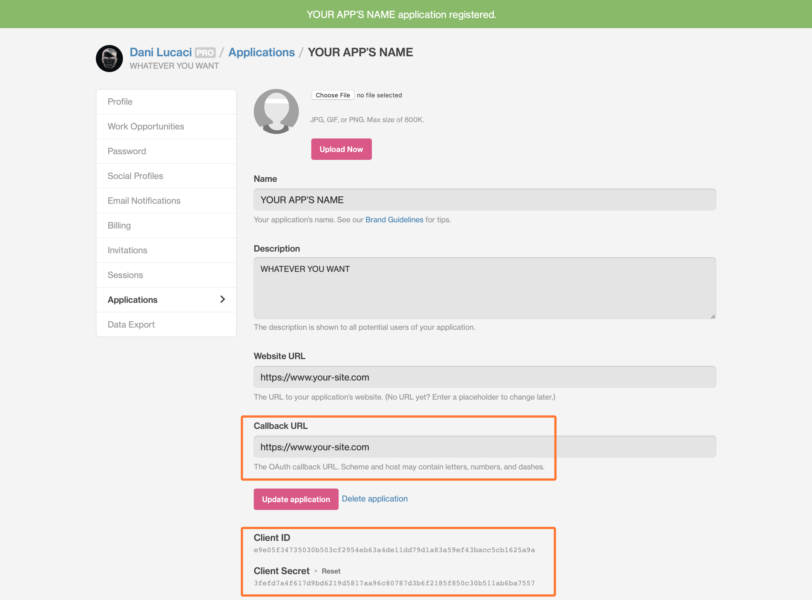

<nav class="toc">

### Índice

<!-- TOC -->

- [Dando de Alta una Nueva Aplicación en Dribbble](#dando-de-alta-una-nueva-aplicación-en-dribbble)
- [Haciendo Peticiones Asíncronas Con React Hooks](#haciendo-peticiones-asíncronas-con-react-hooks)
- [Mostrando Elementos Provisionales](#mostrando-elementos-provisionales)
- [Cargando Más Diseños](#cargando-más-diseños)
- [(Actualización) Refactoring Para Implementar useReducer](#actualización-refactoring-para-implementar-usereducer)
- [Demostración Final](#demostración-final)
- [Próximos pasos](#próximos-pasos)

<!-- /TOC -->

</nav>

## Dando de Alta una Nueva Aplicación en Dribbble

Antes de que puedas empezar a enviar peticiones a la API de Dribbble, primero tienes que dar de alta tu aplicación.

Para ello, tendrás que seguir estos pasos —estoy asumiendo que ya tienes una cuenta en Dribbble.

1. Abre tu cuenta Dribbble
2. Haz click en: **account settings**
3. Haz click en **Applications**
4. Dentro de **Developers**: haz click en _Register a new application_

Ahora deberías poder añadir tus datos, igual que lo hice yo en este ejemplo:



#### Lo importante aquí es:

- El **Callback URL**. Es la URL de tu página web, la cual tienes que escribir incluyendo la parte de `https://`, si no te dará un error.
- El **Client ID** y el **Client Secret**. Necesitarás los dos para poder enviar peticiónes tipo POST y para obtener tu _access token_.

### Obteniendo Un Access Token

Lo siguiente que vas a necesitar es un `CLIENT_ID`.

Para obtener el tuyo, abre una nueva pestaña en tu navegador e introduce esta URL:

```js
https://dribbble.com/oauth/authorize?client_id=CLIENT_ID
```

- `CLIENT_ID` es el _id_ del paso anterior.

Para la aplicación que estoy usando en este tutorial es:

```js
https://dribbble.com/oauth/authorize?client_id=e9e05f3...
```

Haz click en _Authorize_ para autorizar tu nueva aplicación.


Una vez lo tienes, serás redirigido a una página con la URL similar a esta:

```js
http://callback_url?code=5asdas892aas8dh8as9d9ashd
```

El `callback_url` es la URL que has introducido en tu panel de control de Dribbble. Lo más importante en este paso es copiar el código: `5asdas892aas8dh8as9d9ashd`, ya que lo vas a necesitar para el próximo paso.

Para poder obtener un _access token_, yo he usado Postman —si no lo tienes instalado puedes usar este [enlace para descargarlo](https://www.getpostman.com/downloads/)— para poder hacer una petición tipo POST a la siguiente URL de Dribbble:

```js
https://dribbble.com/oauth/token?client_id=CLIENT_ID&client_secret=CLIENT_SECRET&code=CODIGO_URL
```

Con este paso tendrás tu _access token_ que vas a necesitar para hacer peticiones a la API V2 de Dribbble.

#### Lo importante aquí es:

- **CLIENT_ID**: es el _client id_ de tu panel de control de Dribbble (mira la primera captura de pantalla de este tutorial).
- **CLIENT_SECRET**: es el _client secret_ que también tienes del panel de control.
- **CODIGO_URL**: es el código que has obtenido depués de visitar la URL anterior que tiene el `callback_url` de tu página web.

### Haciendo Peticiones de Tipo Post Con Postman

Para poder hacerlo tendrás que seguir estos pasos:

1. Abre Postman
2. Elige el método _POST_
3. Introduce la URL del paso anterior con tu `CLIENT_ID`, `CLIENT_SECRET` y el `CODIGO_URL`

Ahora deberías recibir una respuesta tipo JSON similar a esta:

```json
{
  "access_token": "d8ashd98ashd9a8hsd9ah98dsadsh98ahsd9a8sda",
  "token_type": "bearer",
  "scope": "public",
  "created_at": 1231233453
}
```

Si no funciona, y en cambio recibes este error —o cualquier error de la API:

```json
{
  "error": "invalid_grant",
  "error_description": "The provided authorization grant is invalid, expired, revoked, does not match the redirection URI used in the authorization request, or was issued to another client."
}
```

Tienes que empezar de nuevo y obtener un código nuevo.

Cuando intentaba dar de alta mi aplicación, no podía obtener el _access token_ y no paraba de recibir este error. Después de buscar una solución, al final encontre esta [página de la documentación de la API](https://developer.dribbble.com/v1/oauth/) de Dribbble en la que explican como puedes solucionar los distintos errores que te puede dar la API.

Si todo ha salido bien, ahora deberías tener tu _access token_ que puedes usar para enviar peticiones a la API V2 de Dribbble 🎉.

## Haciendo Peticiones Asíncronas Con React Hooks

Para poder enviar las peticiones a la API, yo usé React Hooks. Si no quieres usar lo mismo, puedes [leer este artículo](https://matthewelsom.com/blog/display-shots-on-webpage-with-dribbble-v2-api.html) en el que te explican como hacerlo usando ajax.

Usar React Hooks para obtener datos de una API es bastante fácil. Pero tienes que saber primero como funcionan.

Es **muy** fácil entrar en un bucle infinito que hará que llegues al límite de tu API en un segundo.

Deberías tener cuidado sobretodo si tu API es un servicio de pago como Firebase o AWS.

Pero no te preocupes, más adelante explicaré como evitar que eso pase.

Para empezar necesitarás lo siguiente:

- **React v16.8** o más reciente instalado (para que puedas usar _hooks_).
- **[Axios](https://github.com/axios/axios)** para poder enviar peticiones a la API de Dribbble.
- **El access token de Dribbble** que has obtenido siguiendo los pasos anteriores de este tutorial.

Antes de continuar, te recomiendo que léas la guía sobre [como usar hooks](https://overreacted.io/a-complete-guide-to-useeffect/) de Dan Abramov, y [este artículo](https://www.robinwieruch.de/react-hooks-fetch-data/) de Robin Wieruch en el que explica algúnas de las técnicas que he usado en este tutorial, entre otras.

Aunqué el mio está basado en el artículo de Robin, lo he cambiado bastante para poder mostrar en pantalla elementos provisionales, además de los _spinners_ como indicadores del estado de la carga de los datos, mientras estos se están obteniendo de la API.

Pero primero, vamos a empezar con obtener los diseños de la API V2 de Dribbble.

### El Endpoint de la API V2 de Dribbble

Para obtener tus diseños de Dribbble, tendrás que acceder al siguiente _endpoint_:

```js
https://api.dribbble.com/v2/user/shots?access_token=ACCESS_TOKEN&page=1&per_page=4
```

**Donde:**

- `ACCESS_TOKEN`: es el _token_ que has obtenido siguiendo los pasos anteriores de este tutorial.
- `&page=1`: esta parte no es necesaria, la uso para la paginación, más adelante lo explico.
- `&per_page=4`: lo mismo, no es necesario. Solo lo uso para la paginación.

### Obteniendo Datos Con Axios

Para este tutorial he usado axios, el cual puedes instalar ejecutando: `npm install axios`.

```jsx{9,11,13}
const [isLoading, setIsLoading] = React.useState(true);
const [isError, setIsError] = React.useState(false);
const [dribbblePage, setDribbblePage] = React.useState(1);
const [dribbblePosts, setDribbblePosts] = React.useState([]);

React.useEffect(() => {
  async function getDribbblePosts() {
    try {
      const dribbbleRes = await axios.get(
        `https://api.dribbble.com/v2/user/shots?access_token=${GATSBY_DRIBBBLE_TOKEN}&page=${dribbblePage}&per_page=${SHOTS_PER_PAGE}`
      );

      setDribbblePosts([...dribbblePosts, ...dribbbleRes.data]);

      if (isLoading) setIsLoading(false);
    } catch (error) {
      console.warn(error);
      if (isLoading) setIsLoading(false);
      setIsError(true);
    }
  }

  getDribbblePosts();
}, [dribbblePosts, dribbblePage, isLoading, isError]);
```

#### Qué tenemos hasta ahora:

- Primero, utilizo `async await` para conseguir los datos, que se guarda usando el _hook_ `setState` en el array `dribbblePosts`.
- La variable de estado local `isLoading` se usa para mostrar en pantalla un indicador de carga —un _spinner_ en la mayoria de los casos—, mientras se obtienen los datos. Inicialmente tiene el valor de `true`, y después cambia el valor a `false`, una vez recibe una respuesta de `await`.
- La petición entera se recoge en un `Try...Catch` para gestionar cualquier error que podría recibir.

Como puedes ver, también estoy usando _array destructuring_ en el array de `dribbblePosts`, ya que `setState()` no combina los datos antiguos con los nuevos, como pasa cuando se usan clases.

Hago esto para poder combinar los diseños que tenía de la petición inicial con los diseños de la nueva petición de red.

Cuando un usuario hace click en el botón de _Cargar más_, se ejecuta una nueva petición de red para obtener más diseños de la API de Dribbble.

Hasta ahora, todo bien.

Pero si intentas ejecutar el código, este entrará en un bucle infinito y la API de Dribbble te devolverá un error de `429 Too Many Requests`.

También tendrás un error de pérdida de memoria si navegas a otra página que la que tiene el componente, antes de que se guarden los datos en el estado local.

Ya que estos se obtienen de forma asíncrona usando `async await`, si navegas a otra página antes de que la función sea resuelta, React intentará almacenarlos en el estado local que pertenece a un componente que ya no existe, y entonces te dará este error:

```js
index.js:2177 Warning: Can’t perform a React state update on an unmounted component.
This is a no-op, but it indicates a memory leak in your application.
To fix, cancel all subscriptions and asynchronous tasks in a useEffect cleanup function.
```

Vamos a ver como podemos resolver estos problemas.

### Evitando Hacer Peticiones de Red en Cada Actualización

Basicamente, el bucle pasa ya que cada vez que el estado cambia en React, ejecutará un nuevo renderizado. Después, en cada renderizado, se hace una nueva petición de red, la cual hará que cambie el estado local de nuevo, y eso llevará a nuevo renderizado.

Y así hasta el infinito.

Una solución sería añadir un array vacio como argumento del hook `useEffect()`, para que solo se ejecute en el primer renderizado. Pero en mi caso, no funcionaría, ya que estoy cambiando el estado local otra vez con:

```jsx
if (isLoading) setIsLoading(false);
```

```jsx{11,13,22}
const [isLoading, setIsLoading] = React.useState(true);
const [isError, setIsError] = React.useState(false);
const [dribbblePage, setDribbblePage] = React.useState(1);
const [dribbblePosts, setDribbblePosts] = React.useState([]);

React.useEffect(() => {
  async function getDribbblePosts() {
    try {
      const dribbbleRes = await axios.get(
        `https://api.dribbble.com/v2/user/shots?access_token=${GATSBY_DRIBBBLE_TOKEN}&page=${dribbblePage}&per_page=${SHOTS_PER_PAGE}`
      );

      setDribbblePosts([...dribbblePosts, ...dribbbleRes.data]);

      if (isLoading) setIsLoading(false);
    } catch (error) {
      console.warn(error);
      if (isLoading) setIsLoading(false);
      setIsError(true);
    }
  }

  getDribbblePosts();
}, []);
```

Esto pasa porque en el primer renderizado del componente, se hace una petición de red y la respuesta de la API se guarda en el array `dribbblePosts`, lo cual hará que se ejecute un nuevo renderizado cuando el estado local cambia.

Después en el segundo renderizado, el array `dribbblePosts` tendrá la información almacenada dentro, pero la petición a la API será ejecutada de nuevo, ya que nada se lo impide.

Y lo mismo pasará cuando se ejecuta `setIsLoading(false)`.

Después de todo esto, habrás notado que tenemos una receta perfecta para un bucle infinito, el cual te dará un error de `429 Too Many Calls`.

En mi caso, la solución es bastante simple, solo hay que envolver la llamada `axios.get()` con un `if`.

```jsx{3,10,13,26,27}
const [isLoading, setIsLoading] = React.useState(true);
const [isError, setIsError] = React.useState(false);
const [postsFetched, setPostsFetched] = React.useState(false);
const [dribbblePage, setDribbblePage] = React.useState(1);
const [dribbblePosts, setDribbblePosts] = React.useState([]);

React.useEffect(() => {
  async function getDribbblePosts() {
    try {
      if (!postsFetched) {
        const dribbbleRes = await axios.get(
          `https://api.dribbble.com/v2/user/shots?access_token=${GATSBY_DRIBBBLE_TOKEN}&page=${dribbblePage}&per_page=${SHOTS_PER_PAGE}`
        );

        setPostsFetched(true);
      }

      setDribbblePosts([...dribbblePosts, ...dribbbleRes.data]);
      if (isLoading) setIsLoading(false);
    } catch (error) {
      console.warn(error);
      setPostsFetched(true);
      if (isLoading) setIsLoading(false);
      setIsError(true);
    }
  }

  if (!postsFetched) {
    getDribbblePosts();
  }
}, [dribbblePosts, dribbblePage, postsFetched, isLoading, isError]);
```

Usando el _boolean_ `postsFetched` puedo limitar la cantidad de peticiones de red que hago en cada renderizado. La primero vez que el componente es renderizado, se ejecuta la petición de red, pero después se hará un nuevo renderizado ya que el estado local cambia otra vez.

Sin embargo, esta vez la petición de red no se hará ya que `postsFetched` valdrá `true`, y no entrará en el `if`.

Cuando haces peticiones de red con el hook `useEffect()`, cada vez que el estado local cambia, React hará que el componente entre en la fase de renderizado de nuevo. Si no compruebas de ningúna forma si ya has hecho una petición anteriormente, o si ya tienes los datos guardados, esto llevará a un bucle infinito de peticiones de red y renderizados.

### Evitando Fugas de Memoria

Para corregir este problema, he usado la función de saneamiento de los React _hooks_.

Estos se ejecutan cada vez que el componente entra en la fase de _unmount_.

```jsx{8,18,19,25,33,34,37,38}
const [isLoading, setIsLoading] = React.useState(true);
const [isError, setIsError] = React.useState(false);
const [postsFetched, setPostsFetched] = React.useState(false);
const [dribbblePage, setDribbblePage] = React.useState(1);
const [dribbblePosts, setDribbblePosts] = React.useState([]);

React.useEffect(() => {
  let didCancel = false;
  let dribbbleRes = {};

  async function getDribbblePosts() {
    try {
      if (!postsFetched) {
        dribbbleRes = await axios.get(
          `https://api.dribbble.com/v2/user/shots?access_token=${GATSBY_DRIBBBLE_TOKEN}&page=${dribbblePage}&per_page=${SHOTS_PER_PAGE}`
        );
        setPostsFetched(true);
      }

      if (!didCancel) {
        setDribbblePosts([...dribbblePosts, ...dribbbleRes.data]);

        if (isLoading) setIsLoading(false);
      }
    } catch (error) {
      console.warn(error);
      if (!didCancel) {
        if (isLoading) setIsLoading(false);
        setPostsFetched(true);
        setIsError(true);
      }
    }
  }

  if (!postsFetched && !didCancel) {
    getDribbblePosts();
  }

  return () => {
    didCancel = true;
  };
}, [dribbblePosts, postsFetched, dribbblePage, isLoading, isError]);
```

Usando un _boolean_ `didCancel` puedo evitar que se almacenen datos en el estado local si el componente ya no esta renderizado.

La función de saneamiento se puede usar para cambiar el valor de `didCancel` de `false` a `true`. Entonces, la próxima vez que se ejecuta, no se guarda nada en el estado local. De esta manera React no intentará guardar datos en el estado local de un componente que ya no esta renderizado.

Ten en cuenta que esto no cancela también la petición de red de axios. Si quieres aprender como hacerlo puedes seguir [sus intrucciones](https://github.com/axios/axios#cancellation).

Genial, hasta ahora tenemos un hook `useEffect()` que:

- Solo obtiene datos de la API de Dribbble una sola vez.
- Almacena los datos solo si el component esta renderizado.

Solo con estas mejoras podría haberlo dado por hecho.

Pero quería mostrar unos elementos provisionales mientras se obtienen los diseños de Dribbble, para evitar tener cambios grandes en el diseño la página cuando estos se renderizan.

## Mostrando Elementos Provisionales

Para poder mostrar elementos provisionales, además del indicador del estado de carga, he usado la paginación de la API de Dribbble. Esto me ha permitido pedir una cantidad limitada de diseños en cada petición de red.

Habrás notado que estoy creando la URL con las _template literal_ de ES6.

```jsx
await axios.get(
  `https://api.dribbble.com/v2/user/shots?access_token=${GATSBY_DRIBBBLE_TOKEN}&page=${dribbblePage}&per_page=${SHOTS_PER_PAGE}`
);
```

La API V2 de Dribbble te permite usar la paginación con los parámetros de consulta de la URL `&page=X` y `&per_page=X`.

### Creando Los Elementos Provisionales

En la petición de red inicial, solo quería mostrar unos 4 o 6 diseños. Para hacerlo estoy usando una constante que guarda la cantidad de diseños que quiero tener en cada petición de red.

```jsx
const SHOTS_PER_PAGE = 4;
```

Esto se usa luego en la URL que `axios.get()` ejecuta para obtener solo 4 diseños por cada página y para crear los elementos provisionales. Estos están creados usando un array que tiene tantos valores dentro como es de grande el valor de la constante `SHOTS_PER_PAGE`.

```jsx
const placeholderArr = Array.from({ length: SHOTS_PER_PAGE }, (v, i) => i);
```

Cuando se utiliza `Array.from()` se puede especificar una segundo argumento que es una función `map()`, que se ejecutará sobre cada elemento del array. De esta manera puedo crear un array previamente llenado sobre el cual puedo ejecutar `.map()` sobre todos sus valores y crear los elementos provisionales mientras `isLoading=true`.

```jsx
{
  isLoading && placeholderArr.map((i) => <DribbblePostPlaceholder key={i} />);
}
```

Para crearlos, puedes usar el código siguiente.

Solo es un `div` que se usa para envolver a sus subcomponentes.

Este utiliza `position: relative;` mientras que los subcomponentes tienen `padding-bottom: 75%;`. El `padding-bottom` de 75% se usa para darles la misma relación de aspecto que las imágenes obtenidas de la API de Dribbble.

También estoy usando una animación de `background-position` para animar el fondo de un gris claro a uno más oscuro, que simula un indicador de carga de la información.

Ten en cuenta que estoy usando Styled Components en este tutorial.

```css
const StyledPlaceholder = styled.div`
  position: relative;
  overflow: hidden;
  height: 100%;
  width: 100%;
`;

const placeholderAnimation = keyframes`
0% {
  background-position: 0% 50%;
 }
 50% {
  background-position: 100% 50%;
 }
 100% {
  background-position: 0% 50%;
 }
 `;

const StyledPlaceholderInner = styled.span`
  display: block;
  width: 100%;
  padding-bottom: 75%;
  background: linear-gradient(
    90deg,
    ${theme.colors.gray100},
    ${theme.colors.gray400},
    ${theme.colors.gray100}
  );
  background-size: 200% 200%;
  animation: ${placeholderAnimation} 3s ease infinite;
`;

function DribbblePostPlaceholder() {
  return (
    <StyledPlaceholder>
      <StyledPlaceholderInner />
    </StyledPlaceholder>
  );
}
```

Una vez `isLoading` cambia a `false`, los elementos provisionales se reemplazan con los diseños de Dribbble.

```jsx
{
  !isLoading &&
    dribbblePosts.map((post) => <DribbblePost key={post.id} post={post} />);
}
```

## Cargando Más Diseños

Cuando estaba diseñando la página en la que esta montado el componente, solo quería mostrar unos 4 diseños como mucho.

Pero también quería tener la opción de poder cargar más si algún usuario quería ver más diseños, sin tener que redirigirle a la página de inicio de Dribbble.

Al principio, pensé en cargar varios diseños —unos 20 más o menos— y después repartirlos en arrays de 4 o 6 diseños cada uno. Pero pronto me di cuenta de que no era muy buena idea descargar tantas imágenes de golpe. Esto era importante sobretodo para los usuarios que estaban visitando mi web con un teléfono móvil que tiene una conexión limitada.

Entonces decidí cargar solo 4 diseños la primera vez, y si luego algún usuario quería ver más, podría usar el botón de _Cargar más_ para mostrar otros 4.

Ya que la API de Dribbble tiene paginación de serie, puedo usar esta característica para obtener una cierta cantidad de imágenes por página, así que esa fue la solución perfecta a mi problema.

Para poder hacerlo, añadí un botón, el cual, cuando se hacía click, ejecutaría la función `loadMorePosts()`.

```jsx
<LoadMore onClick={loadMorePosts}>
  {!isLoadingMore && <LoadMoreLabel>Cargar más...</LoadMoreLabel>}
  {isLoadingMore && <Spinner dark />}
</LoadMore>
```

Una vez se ha pulsado el botón, la función sumaría 1 a la variable de estado local y el boolean `postsFetched` que se usa para controlar si se ejecuta la función `axios.get()`.

```jsx
function loadMorePosts() {
  setDribbblePage(dribbblePage + 1);
  setPostsFetched(false);
  setIsLoadingMore(true);
}
```

Además, la variable `isLoadingMore` me permite mostrar en pantalla más elementos provisionales, mientras se obtienen los nuevos diseños de la API.

Ya que utilizo una nueva variable y no la original `isLoading`, puedo evitar que se cambien los diseños que ya había obtenido en el primer render y, además, poder mostrar los nuevos debajo de los antiguos.

Para hacer que todo esto funcione, también he tenido que combinar los valores del estado local anterior con los valores nuevos, ya que `useState()` sobrescribe todos los valores nuevos en el estado local sin combinarlos.

```jsx
{
  isLoadingMore &&
    placeholderArr.map((i) => <DribbblePostPlaceholder key={i} />);
}
```

### La Versión Final del Componente DribbblePosts

```jsx
function DribbblePosts() {
  const SHOTS_PER_PAGE = 4;

  const [isLoading, setIsLoading] = React.useState(true);
  const [isLoadingMore, setIsLoadingMore] = React.useState(false);
  const [isError, setIsError] = React.useState(false);
  const [postsFetched, setPostsFetched] = React.useState(false);
  const [dribbblePage, setDribbblePage] = React.useState(1);
  const [dribbblePosts, setDribbblePosts] = React.useState([]);

  const placeholderArr = Array.from({ length: SHOTS_PER_PAGE }, (v, i) => i);

  React.useEffect(() => {
    let didCancel = false;
    let dribbbleRes = {};

    async function getDribbblePosts() {
      try {
        if (!postsFetched) {
          dribbbleRes = await axios.get(
            `https://api.dribbble.com/v2/user/shots?access_token=${GATSBY_DRIBBBLE_TOKEN}&page=${dribbblePage}&per_page=${SHOTS_PER_PAGE}`
          );
          setPostsFetched(true);
        }

        if (!didCancel) {
          setDribbblePosts([...dribbblePosts, ...dribbbleRes.data]);

          if (isLoading) setIsLoading(false);
          if (isLoadingMore) setIsLoadingMore(false);
        }
      } catch (error) {
        console.warn(error);
        if (!didCancel) {
          if (isLoading) setIsLoading(false);
          if (isLoadingMore) setIsLoadingMore(false);
          setPostsFetched(true);
          setIsError(true);
        }
      }
    }

    if (!postsFetched && !didCancel) {
      getDribbblePosts();
    }

    return () => {
      didCancel = true;
    };
  }, [
    dribbblePosts,
    postsFetched,
    dribbblePage,
    isLoading,
    isError,
    isLoadingMore,
  ]);

  function loadMorePosts() {
    setDribbblePage(dribbblePage + 1);
    setPostsFetched(false);
    setIsLoadingMore(true);
  }

  return (
    <DribbblePostsWrapper>
      {isError && <ErrorMessage>Lo siento, algo ha salido mal...</ErrorMessage>}

      {isLoading &&
        placeholderArr.map((i) => <DribbblePostPlaceholder key={i} />)}
      {!isLoading &&
        dribbblePosts.map((post) => <DribbblePost key={post.id} post={post} />)}

      {isLoadingMore &&
        placeholderArr.map((i) => <DribbblePostPlaceholder key={i} />)}
      <LoadMore onClick={loadMorePosts}>
        {!isLoadingMore && <LoadMoreLabel>Cargar más...</LoadMoreLabel>}
        {isLoadingMore && <Spinner dark />}
      </LoadMore>
    </DribbblePostsWrapper>
  );
}
```

## (Actualización) Refactoring Para Implementar useReducer

Hasta ahora, el componente funciona perfectamente.

Pero podría ser mejor.

El problema principal que tengo es tener que usar múltiples `if` que evitan que se ejecute un nuevo renderizado cada vez que el estado local cambia. De momento, tengo más de 4 cambios de estado local dentro del hook `useEffect`.

Además, la lista de los argumentos del _hook_ es bastante larga.

```jsx
React.useEffect(() => {
  ...
}, [dribbblePosts, postsFetched, dribbblePage, isLoading, isError, isLoadingMore]);
```

Una buena solución es usar el _hook_ de tipo _reducer_, el cual me permite combinar varios cambios del estado local.

De hecho, no hay que hacer demasiados cambios en el código.

La función de renderizado del componente es casi la misma.

Solo he tenido que extraer el código encargado de obtener los datos, en fichero separado —para poder tener un código más limpio y ordenado.

También he usado array _destructuring_ para obtener las variables devueltas por el _custom hook_ `useDribbbleReducer()`.

```jsx
function DribbblePosts({ locale }) {
  const {
    dribbblePosts,
    shotsPerPage,
    isLoading,
    isLoadingMore,
    isError,
    loadMorePosts,
  } = useDribbbleReducer();

  const placeholderArr = Array.from({ length: shotsPerPage }, (v, i) => i);

  return (
    <DribbblePostsWrapper>
      <DribbblePostH1>Últimos Diseños</DribbblePostH1>
      <DribbbleSubhead>
        Algúnos de los últimos diseños compartidos en Dribbble.
      </DribbbleSubhead>
      {isError && <ErrorMessage>{DRIBBBLE_STATUS[locale].error}</ErrorMessage>}

      {isLoading &&
        placeholderArr.map((i) => <DribbblePostPlaceholder key={i} />)}
      {!isLoading &&
        dribbblePosts.map((post) => <DribbblePost key={post.id} post={post} />)}

      {isLoadingMore &&
        placeholderArr.map((i) => <DribbblePostPlaceholder key={i} />)}

      <StyledLoadMore onClick={loadMorePosts}>
        {!isLoading && !isLoadingMore && (
          <LoadMoreLabel>Cargar más...</LoadMoreLabel>
        )}
        {(isLoading || isLoadingMore) && <Spinner dark />}
      </StyledLoadMore>
    </DribbblePostsWrapper>
  );
}
```

### Creando el Reducer

```jsx{13}
const reducer = (state, action) => {
  switch (action.type) {
    case "FETCH_INIT": {
      return {
        ...state,
      };
    }
    case "FETCH_SUCCESS": {
      return {
        ...state,
        isLoading: false,
        isLoadingMore: false,
        dribbblePosts: [...state.dribbblePosts, ...action.payload],
      };
    }
    case "FETCH_MORE": {
      return {
        ...state,
        isLoadingMore: true,
        dribbblePage: state.dribbblePage + 1,
      };
    }
    case "FETCH_ERROR": {
      return {
        ...state,
        isLoading: false,
        isLoadingMore: false,
        isError: true,
      };
    }
    default:
      return state;
  }
};
```

El _reducer_ es bastante sencillo. Puedo tener un estado local inicial con los valores de `isLoading`, `dribbblePosts`, etc, en un solo objeto que se actualiza cuando el _reducer_ ejecuta las acciones.

Para seguir poder añadir nuevas imágenes a las que ya tenía, he tenido que combinar los valores del estado local antiguo con los nuevos.

```jsx
export default function useDribbbleReducer() {
  const initialState = {
    dribbblePage: 1,
    dribbblePosts: [],
    isLoading: true,
    isLoadingMore: false,
    isError: false,
  };

  const [state, dispatch] = React.useReducer(reducer, initialState);

  React.useEffect(() => {
    let didCancel = false;
    let dribbbleRes = {};

    dispatch({ type: "FETCH_INIT" });

    const fetchData = async () => {
      try {
        dribbbleRes = await axios.get(
          `https://api.dribbble.com/v2/user/shots?access_token=${GATSBY_DRIBBBLE_TOKEN}&page=${
            state.dribbblePage
          }&per_page=4`
        );

        if (!didCancel) {
          dispatch({ type: "FETCH_SUCCESS", payload: dribbbleRes.data });
        }
      } catch (error) {
        if (!didCancel) {
          console.warn(error);
          dispatch({ type: "FETCH_ERROR" });
        }
      }
    };

    fetchData();

    return () => {
      // Prevent memory leak when navigating to another page
      didCancel = true;
    };
  }, [state.dribbblePage]);

  function loadMorePosts() {
    dispatch({ type: "FETCH_MORE" });
  }

  return { ...state, loadMorePosts };
}
```

Como puedes ver, la lista de los argumentos del _hook_ `useEffect` ahora es mucho más limpia. Solo necesita estar pendiente de los cambios hechos en la variable `dribbblePage` que se actualiza cuando se obtienen nuevos datos de la API, usando la paginación.

La única comprobación que aún tengo que hacer es la de `didCancel`. Esta evita que se guarden datos en el estado local del componente, si la función asíncrona devuelve una respuesta despúes de que este ya no este renderizado.

## Demostración Final

En la demostración de más abajo puedes ver las peticiones iniciales (de unos 2 posts para la demo) y las peticiones posteriores que se hacen para obtener 2 diseños más. La experiencia de usuario se ha mejorado bastante usando el indicador del estado de la carga, además de evitar que hayan grandes cambios en el diseño de la página mediante el uso de los elementos provisionales.

<figure>
  <span class="video-wrapper">
    <span class="video__inner video__inner--1920x1200">
      <video autoplay loop muted playsinline controls>
        <source
          src="./obtener_datos_dribbble_con_react.webm"
          type="video/webm"
        />
        <source src="./obtener_datos_dribbble_con_react.mp4" type="video/mp4" />
        Tu navegador no soporta HTML5 video.
        <a href="./obtener_datos_dribbble_con_react.gif">
          Ver un Gif del componente para obtener diseños de Dribbble con React
          Hooks y axios.
        </a>
      </video>
    </span>
  </span>
  <figcaption>
    Componente para obtener diseños de Dribbble con React Hooks y axios.
  </figcaption>
</figure>

## Próximos pasos

De momento estoy bastante contento con los resultados. Tengo todas las características que necesitaba gracias a los React _Hooks_ y la paginación de la API V2 de Dribbble.

Sin embargo, estoy considerando —como mejora— guardar en la caché los resultados de cada petición de red.

Ahora, cada vez que el componente es renderizado, los diseños se obtienen de Dribbble. Entonces cada vez que el usuario abre la página que tiene el componente, hace que se ejecute una nueva petición de red.

En cambio, si guardo los datos en la caché en cada sesión de usuario—, puedo evitar que se haga una petición de red después de cada renderizado. Esto ayudará a consumir menos datos de la tarifa móvil de los usuarios que visitan mi página.
