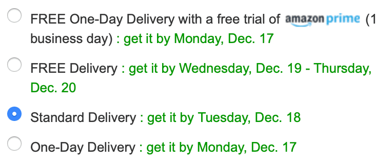

## Initial Problem Assumptions

When I began working on this project I had some initial assumptions that I wanted to validate with user research to see if other people had the same problems and if they had other problems that I haven't identified yet.

- People think that ticket prices are too high if they would like to see several movies each month.
- Current websites and apps have outdated designs.
- People don't have a way to search, filter or sort for movies in the app/website.

To validate my initial assumptions I used a survey and I interviewed 5 users.

The initial research would also help me learn more about them and answer some of the questions that I had:

## Previous Questions

- How are people deciding which movie to see?
- How are they finding out more about the movie they would like to see?
- How many movies do they see each month?
  - Why this many?
- Do they prefer to see movies in a cinema or at home?
  - Why?
- How are they seeing the movies? Alone, with a date, in a group?
  - Why?
- Which difficulties are they having when:
  - Searching for a cinema
  - Searching for a movie to see
  - Using the available websites to purchase movie tickets
  - Selecting seats
  - Buying and paying for the tickets

## Survey Findings

Based on the survey responses I found that:

- 83% of people feel that prices are too high
- 78% of people use external websites or apps to learn more about a movie
- 62% of people decide with one or more persons which one to see

## User Interview Findings

From the user interviews that I did, I had the following insights:

- Movie ticket prices are too high.
- Snacks are too expensive
- Some of people interviewed prefer to bring their own snacks
- They would consider seeing more movies if the cinema had offers or discounts
- They think the overall design is pretty ugly
- They use google o services such as imdb.com to learn more about each movie
- They miss having a tool that shows them which movies are available on a particular time of day or on a specific day
- They feel that they will be spammed when they have to sign up before paying for tickets
- Information about the cinema is hard to find (the seats, services, etc)

## Affinity Diagram

Based on the research findings, I created an Affinity Diagram to help me group the different takeaways I had from the research. From this I decided to work on the following:

- **Searching and filtering movies**
- **Checkout problems**
- **Increase value to the user**

## Problem Statements

Based on the main groups of pain points from the Affinity Diagram, I created the following problem statements for each of the main Personas.

> Users are currently having difficulties deciding which movie they would like to see.

#####How Might We:

**Improve our app so that we can help users decide which movie they would like to see faster?**

> Users become frustrated when they have to create an account before they can make a purchase.

#####How Might We:

**Improve the checkout process so that users are less frustrated and they are able to make a purchase faster?**

> Movie enthusiasts feel that ticket prices are too high, which is preventing them from being able to see as many movies as they would like to.

#####How Might We:

**Improve the checkout process so that users are less frustrated and they are able to make a purchase faster?**

##Personas

My next step was to create the user personas, based on the research findings, to help me design the different features of the app. These feature were based on the different pain points each persona had, and the outcomes they were trying to achieve.

###Alex

He is trying to find a movie that he and his date might like to watch tonight. They are not movie experts and just want to watch a movie. In order to decide which one, they read movie reviews, watch movie trailers and compare several ones before making a final decision.

###Ana

She is a movie enthusiast that likes to watch several movies each month, however she feels current prices are too high and that cinemas aren’t valuing their most loyal customers.

## Feature Prioritization

In order to decide which features to include in the initial MVP, I decided to use a Prioritizacion Matrix based on the value it would provide to the end-user and by how difficult it would be to create and then the MOSCOW method.

## MOSCOW Method

##Selected Features for the MVP

> We will create **an advanced search, filter and sort feature** for **Alex** in order to **help him decide which movie he would like to see faster**.

> We will create **a optimized guest checkout experience** for **Alex** in order to **help him buy his movie ticket without any frustration**.

> We will create **a membership plan** for **Ana** in order to **reduce the cost of seeing several movies a month for movie enthusiasts**.

## Ideation

I used the Crazy 8’s ideation method to help me find different solutions for each of the main features of the initial MVP.

## Movie Searching and Filtering

The first feature I started working on was on the ability to search, filter and sort movies, which was designed to help users find a movie easier, using different filtering options, while also beeing able to sort the results based on several category specific criteria.

Most users had difficulties deciding which movie they would like to see, so I designed this feature to allow them to easily find a movie based on the movie’s genre, showtime, user reviews or length. This ways they didn’t have to use other products or services to learn more about the movies and compare them.

Before I started sketching the nav bar with the searching, filtering and sorting buttons, I decided to see which patterns were being used by other apps or websites that needed a similar feature.

The first product I used for the comparison was Airbnb’s iOS app. One of the reasons for which I considered Airbnb’s design patterns for the searching feature was because their buttons for “Dates” and “Guests” are always visible bellow the search bar, therefore, their users can always see them and know where to find them.

Asos.com’s sort and filter buttons have more visual weight that Airbnb’s ones, however, they were showing the search bar on a different screen. One of the benefits of the way Asos.com implements their sorting and filtering options is that it allows them to easily indicate which sorting or filtering options are applied to remind the user that the search results are being affected by them.

Crutchfield.com’s website shows the search bar and sorting and filtering options at the same time, even though their sort and filter buttons are more separated from the search bar and don’t have the same visual weight as the Asos.com example, which could cause their users to overlook them.

zalando.es had a more complete searching and filtering experience for their users. Besides always showing the filtering button, they also indicate which filtering options have been activated. Furthermore, users are also able to remove individual filters without having to open the filtering menu again.

A “clear all filters” button is also used to allow their users to easily clear all the current filters applied.

## Low-Fidelity Prototype

Once I did the initial competitive research to see which were the currently used design patterns, I began working on the low-fidelity prototype of the movie searching, filtering and sorting feature for the MVP.

### Movie Searching and Filtering Final Version

For the final version of the searching, filtering and sorting feature, I decided to use a combination of the different design patterns mentioned above, which allowed me to include a full-width search bar without having to hide the filter and sort buttons. This design also allowed me to clearly indicate their current state and to allow the users to easily remove any filters applied.

The filtering options were designed in a way that users could apply different filters to improve their search, without having mutually exclusive options, as the [Baymard Institute recomends](https://baymard.com/blog/allow-applying-of-multiple-filter-values) in their article on E-Commerce UX, where they found that 45% of the users tested, tried to apply multiple filters at some point.

By using checkbox style buttons for the filters, users can easily enable and disable filtering options, which don’t have to depend on each other.

### Movie Searching and Filtering Wireflow Diagram

## Movie Searching and Filtering High-Fidelity Prototypes

#### Movie Searching Prototype

<figure>
  
    
      <video autoplay loop muted playsinline controls>
        <source
          src="./ux_case_study_movie_searching_prototype.webm"
          type="video/webm"
        />
        <source
          src="./ux_case_study_movie_searching_prototype.mp4"
          type="video/mp4"
        />
        Your browser does not support HTML5 video.
        <a href="./ux_case_study_movie_searching_prototype.gif">
          View the GIF version of the movie searching experience prototype.
        </a>
      </video>
    
  
  <figcaption>
    High fidelity prototype of the movie searching feature.
  </figcaption>
</figure>

#### Movie Filtering Prototype

<figure>
  
    
      <video autoplay loop muted playsinline controls>
        <source
          src="./ux_case_study_movie_filtering_prototype.webm"
          type="video/webm"
        />
        <source
          src="./ux_case_study_movie_filtering_prototype.mp4"
          type="video/mp4"
        />
        Your browser does not support HTML5 video.
        <a href="./ux_case_study_movie_filtering_prototype.gif">
          View the gif version of the movie filtering interaction prototype.
        </a>
      </video>
    
  
  <figcaption>
    High fidelity prototype of the movie filtering feature.
  </figcaption>
</figure>

#### Movie Seat Choosing Prototype

<figure>
  
    
      <video autoplay loop muted playsinline controls>
        <source
          src="./ux_case_study_seat_choosing_prototype.webm"
          type="video/webm"
        />
        <source
          src="./ux_case_study_seat_choosing_prototype.mp4"
          type="video/mp4"
        />
        Your browser does not support HTML5 video.
        <a href="./ux_case_study_seat_choosing_prototype.gif">
          View the gif version of the movie filtering interaction prototype.
        </a>
      </video>
    
  
  <figcaption>
    High fidelity prototype of the seat choosing process with a mini–map and
    scrolling seat interface.
  </figcaption>
</figure>

## Movie Booking Guest Checkout

The second most important feature of this app was the guest checkout user flow.

One of the most important issues people had in the interviews was that they didn’t like the fact that they have to register before beying able to pay for a movie ticket. Most of them felt that they would receive allot of spam, especially if the overall design of the website/app wasn’t really up-to-date.

Even though guest checkout flow’s are usually designed for users which don’t have an account, they are also particularly useful for users that might have forgotten their password and just don’t want to go through the password-reset-process at that moment.

## Low-Fidelity Prototype

After some initial research for best practices when creating a guest checkout experience, I started working on the low-fidelity wireframes for the prototype.

## Guest Checkout Flow Improvements

### Delayed Account Creation

#### Guest checkout as an option for all users

Research has found that [up to 37% of the users tested](https://baymard.com/blog/delayed-account-creation), would abandon the checkout if they were forced to create an account. Guest checkout experiences are also helpful to registered users who might have forgotten their passwords, which according to the same research, causes up to 19% of all users to abandon the checkout process.

#### Create an account in the checkout confirmation step

Designers should let their users know that they can still create an account at the end of the checkout flow if they would like to do so.

#### Explain why information is needed

According to the same research, privacy-concerned users are less reluctant to share their personal information, such as their phone number or email address, if we explain why we are asking for it.

### Guest Checkout Payment Methods

#### Payment methods placed in close proximity

The different payment methods the app accepts are presented using 3 buttons placed next to each other, following the [recommendations of the research](https://baymard.com/blog/payment-method-selection) made by the Baymard Institute. According to their research, payment methods should be placed together in close proximity (Gestalt principles would help here) so that users can easily compare them with a single glance and see which one is currently active.

Users should also be able to compare the different costs associated to each payment method—if they apply—such as a 2% fee when using a particular payment type.

### Optimizing The Payment Form

#### Insert spaces every 4 digits

The input field for the credit card number was designed to auto insert spaces every 4 digits (for Visa cards, others may differ), as research has found that [as many as 23% of the users tested](https://baymard.com/blog/credit-card-field-auto-format-spaces) would double check the card numbers they typed in groups of 4 digits by manually inserting spaces, so that they are able to easily read and verify the number.

Furthermore, a simple [Luhn validation script](https://gist.github.com/DiegoSalazar/4075533) could be used to check if the card number is valid.

#### Match the printed format of the expiration date

The expiration date input field was designed to match the physical layout and format of “MM/YY” found on most credit cards. Research has shown that most users will try to follow the same format printed on the card when typing the number. Therefore, forms should be designed in a way that they respect the physical format found on credit cards.

Form fields used for credit cards should also use input masks that auto-insert a forwards slash character after the MM in the expiration date and of course, use the appropiate keyboard type for each input field.

### Order Confirmation With Option To Sign Up

### Guest Checkout Wireflow Diagram

### Guest Checkout High-Fidelity Prototype

<figure>
  
    
      <video autoplay loop muted playsinline controls>
        <source
          src="./ux_case_study_guest_checkout_prototype.webm"
          type="video/webm"
        />
        <source
          src="./ux_case_study_guest_checkout_prototype.mp4"
          type="video/mp4"
        />
        Your browser does not support HTML5 video.
        <a href="./ux_case_study_guest_checkout_prototype.gif">
          View the GIF version of the guest checkout final prototype.
        </a>
      </video>
    
  
  <figcaption>The final prototype of the guest checkout process.</figcaption>
</figure>

## Membership Plan

One of the main reason why I decided to design this app was that most of the cinemas that I used to go to didn’t really have any decent membership plans that would provide any decent value.

Most of them gave a point for each euro spent, which users could collect, and when they reached a number of points (100 points, more or less) they could exchange them for a movie ticket.

Considering that a normal ticket usually costs between 5 and 7 euros, people needed to spend about 100 euros before they could get a free ticket, so it’s not really worth it.

This feature of the app was my atempt to see how the experience could be improved in a way that users would actually feel that it actually provides any real value.

Furthermore, based on the findings in the user interviews, my assumptions that most users found the prices to be expensive were validated, so I began working on a solution.

### Designing The Membership Plan Sign Up Process

The sign flow for the membership plan was divided into 4 segments to avoid overwhelming the users with too many form fields at once.

The 4 segments were:

- **Contact details**
- **Shipping information**
- **Payment information**
- **Finished (confirmation screen)**

### Membership Sign Up Wireflow Diagram

### Shipping Information Optimizations

The shipping information step was needed so that users could receive a copy of their membership card.

In order to design this checkout step I decided to do some research to find which are the UX best practices of designing a Shipping Information checkout step.

#### No hidden fees

Hidden charges and delivery costs were found to be one of the main reasons why customers decide to abandon a checkout, so I decided to clearly indicate all the delivery costs the users might have to pay.

#### Store pick-up and delivery methods

Reseach has found that when the store pick-up option isn’t listed next to the other delivery methods, users will miss it and won’t be able to compare if the extra cost of paying the extra 2 or 3 euros for a faster delivery method, would be worth it.

The diferent delivery methods were also designed following the recomendations of another study which found that when using labels such as 2 Days Express or 1 Day Premium users would be confused of the exact date they would receive the product.

By using labels like these, users are forced to have to personally calculate the day in which the product would arrive.

A label of “3-5 days” doesn’t take into consideration the processing time each order might need, the daily cut off time, such as: orders after 4pm will be sent the following day, or if the user chooses a 1 Day Premium shipping option on a friday, which would mean that the order is shipped monday, ultimately making it a 3 day shipping method with a premium cost.

By using labels such as “Arrives by“ or “Get it by”, users would take the delivery date as a promise which would increase their confidence when they have have to decide if the extra cost of a premium delivery is worth it.

However, in order for the final date to be usefull to the user, it should take into account all the necesary factors such as order cut of time, the current time and date or the delivery estimate of the shipping company.

### Membership Sign Up High-Hidelity Prototype

<figure>
  
    
      <video autoplay loop muted playsinline controls>
        <source
          src="./ux_case_study_membership_checkout_prototype.webm"
          type="video/webm"
        />
        <source
          src="./ux_case_study_membership_checkout_prototype.mp4"
          type="video/mp4"
        />
        Your browser does not support HTML5 video.
        <a href="./ux_case_study_membership_checkout_prototype.gif">
          View the GIF version of the seat choosing process prototype.
        </a>
      </video>
    
  
  <figcaption>
    Membership plan with offers and discounts final prototype.
  </figcaption>
</figure>

## Next Steps

#### Something
