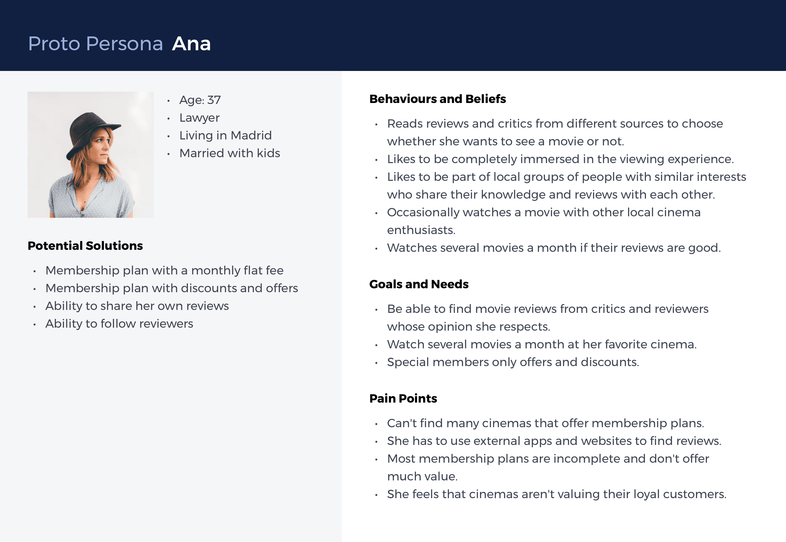
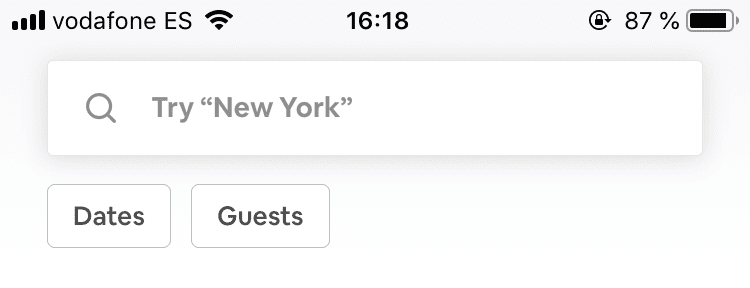
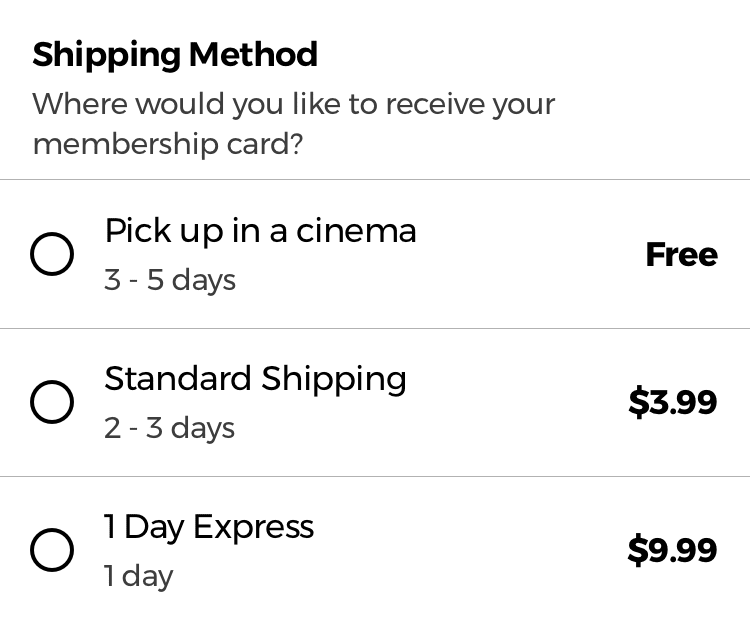
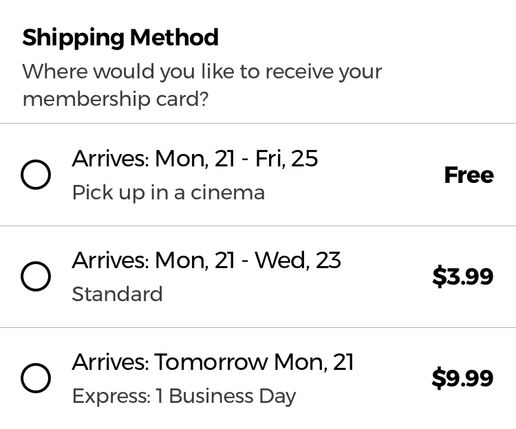

import { Div } from "styles/caseStudy.styles";

export default ({ children }) => (
  

    
{children}

  

);

## Overview

Like most people, I love seeing movies. Especially in a cinema. However, each time I used one of my local cinema’s app or website to try to buy a ticket for a movie, I found that they all had outdated and confusing designs. Furthermore, if I didn’t know which movie I’d like to see, I always had to use Google or other websites to find out more about the movie.

That’s why I decided to see how I could improve the experience of searching for a movie and then buying a ticket for it using an iOS App.

##### My Role

- UX Research
- UI Design
- Interaction Design

##### Tools Used

- Pen and paper
- Sketch
- InVision
- Principle

##### Project Type

- Personal Project

##### Deliverables

- [InVision Prototype](https://invis.io/AERJX7Y8J4F)
- [Moderator Guide](movie_booking_app_moderator_guide.pdf)

## Process

#### Discovery

- User Interviews

#### Analysis

- Affinity Diagram
- Problem Statement
- HMW’s
- Personas
- MOSCOW

#### Ideation

- Crazy 8’s
- Paper Prototype

#### Prototype

- High Fidelity Prototype

#### Test

- 5 Act User Interview

## Discovery

Before I started working on this project, I had an initial assumption:

> People are having trouble searching for a movie that they would like to see when they’re using my local cinema’s website or app.

To validate my assumption and design a solution, I decided to follow a User-Centered Design process with a combination of methods from Lean UX and Google Sprint.

For the first part of the discovery phase, I interviewed 4 users. This helped me better understand the pain points they were having and how they were using the products that were currently available.

But before I started doing the interviews, I made a list of the different questions I had that I needed to answer with the research.

### Previous Questions

- How are people deciding which movie they would like to see?
- How are they finding out more about the movie?
- How many movies do they see each month?
  - Why this many?
- With who are they seeing the movie? Alone, with a date, in a group?
- Are they having trouble when:
  - Searching for a cinema
  - Searching for a movie to see
  - Using the available websites to buy movie tickets
  - Selecting seats
  - Buying and paying for the tickets

### User Interview Findings

From the user interviews I found that people:

- Think that movie tickets and snacks prices are too high.
- Would consider seeing more movies if the cinema had offers or discounts.
- Think the visual design isn’t that great.
- Use google o services such as imdb.com to learn more about each movie.
- Miss having a tool that shows them which movies are available on a particular time of day or on a specific day.
- Feel that the company just wants them to sign up so that they can send them marketing emails.
- Feel that information about the cinema is hard to find (the types of seats that are available, services, etc).

## Analysis

### Affinity Diagram

Once I had a list of all the insights from the research, I made an Affinity Diagram to help me group and identify the common paint points.

So I decided to start working on the following pain points:

- **People need a way to help them decide which movie to see**
- **People are having issues with the checkout flow**
- **People feel that prices are too high**

### Problem Statements

The next step was to identify the problem statements. Then I used the How Might We technique to help me find solutions for each one.

##### Problem Statement

> People are having difficulties deciding which movie they would like to see.

##### How Might We:

> Improve our app so that we can help people decide which movie they would like to see faster?

##### Problem Statement

> People are frustrated when they have to create an account before they can make a purchase.

##### How Might We:

> Improve the checkout process so that people can make purchases without any frustration?

##### Problem Statement

> Movie enthusiasts feel that ticket prices are too high, which is preventing them from being able to see as many movies as they would like to.

##### How Might We:

> Reduce the cost of seeing a movie in a cinema for repeat customers?

### Personas

Based on these problem statements and the research findings, I created 2 user personas. I used them to help me design the features of the app, which were based on their pain points, and on the outcomes they were trying to achieve.

### Alex

He is trying to find a movie that he and his date would like to watch tonight. They are not movie experts and want to watch a movie. To decide which one, they read movie reviews, watch movie trailers and compare several ones before making a decision.

### Ana

She is a movie enthusiast that likes to watch several movies each month, but she feels that current prices are too high and that cinemas are not valuing their most loyal customers.

### Feature Prioritization

To decide which features to include in the initial MVP, I decided to use a Prioritisation Matrix which is based on the value it would provide to the end-user and by how difficult it would be to create.

### MOSCOW Method

Then I used the MOSCOW method to find which are the most important features to be included in the MVP.

#### My MVP would include these 3 main features:

- Ability to search, filter and sort movies
- Optimized guest checkout experience
- Membership plan with offers and discounts

### Feature Hypothesis Statements

Next I used the Lean UX Feature Hypothesis Statements to identify the features that will serve each persona and help them achieve their individual outcome.

> We will create **an advanced search, filter and sort feature** for **Alex** in order to **help him decide which movie he would like to see faster**.

> We will create **an optimized guest checkout experience** for **Alex** in order to **help him buy his movie tickets without any frustration**.

> We will create **a membership plan** for **Ana** in order to **reduce the cost of seeing several movies a month for movie enthusiasts**.

### Ideation

To help me ideate quick solutions to each of the features, I used the Crazy 8’s method since it’s a great way to keep you in a constant creative thinking mode and generate many different ways to design a particular feature.

## Movie Searching and Filtering

The first feature I started working on was on the ability to search, filter and sort movies.

I designed this feature to help users find a movie faster, using different filtering options, while also being able to sort the results based on several category-specific criteria.

Most users had difficulties deciding which movie they would like to see, so the feature is meant to help them find a movie based on its genre, showtime, user reviews or duration. This way they didn’t have to use other products or services to learn more about the movie.

Before I started sketching the app’s nav bar, I decided to see which patterns were being used by other apps or websites that also needed a similar feature.

The first product I compared was Airbnb’s iOS app. One of the reasons for which I started with their app was because the design pattern they were using, allowed them to show their buttons for “Dates” and “Guests”, always visible below the search bar. This way, their users can always see them and know where to go if they need to filter the search results they are seeing.

The next app I compared was Asos’s iOS app. Their sort and filter buttons have more visual weight that Airbnb’s ones, but they didn’t include a search bar since it was on a different screen.

One of the benefits of the way Asos.com implements their sorting and filtering options is that it allows them to show which sorting or filtering options are applied. This way they can remind the user that the search results are being affected by the filters applied.

Crutchfield.com’s website has the search bar and sorting and filtering options at the same time. However, their sort and filter buttons are more separated from the search bar and don’t have the same visual weight as the Asos.com example. This could mean that their users might overlook the options because they don’t stand out as much.

zalando.es had one of the most complete searching and filtering experience for their users. Besides always showing the filtering button, they also indicate which filtering options are active. Furthermore, their users can remove individual filters without having to open the filters menu.

A “clear all filters” button is also used to allow their users to remove all the applied filters if they want to start over with a new search.

### Movie Searching and Filtering Feature

For the final version of the feature, I decided to use a combination of the different design patterns mentioned above. This allowed me to include a full-width search bar without having to hide the filter and sort buttons. This way I could also show if any filters or sorting options are active.

Another benefit is that users could also remove any of filters, either one by one, or all of them at once, by using the clear filters button.

The filtering options are also designed in a way that users can combine them to improve their search, without having mutually exclusive options, following the recommendations from the [article on E-Commerce UX](https://baymard.com/blog/allow-applying-of-multiple-filter-values) made by the Baymard Institute, where they found that up to 45% of the users tested, tried to apply several filters at some point during their search.

### Movie Searching and Filtering Wireflow Diagram

## Movie Searching and Filtering High-Fidelity Prototypes

#### Movie Searching Prototype

<figure>
  
    
      <video autoPlay loop muted playsInline controls>
        <source
          src="./ux_case_study_movie_searching_prototype.webm"
          type="video/webm"
        />
        <source
          src="./ux_case_study_movie_searching_prototype.mp4"
          type="video/mp4"
        />
        Your browser does not support HTML5 video.
        <a href="./ux_case_study_movie_searching_prototype.gif">
          View the GIF version of the movie searching feature prototype.
        </a>
      </video>
    
  
  <figcaption>
    High fidelity prototype of the movie searching feature.
  </figcaption>
</figure>

#### Movie Filtering Prototype

<figure>
  
    
      <video autoPlay loop muted playsInline controls>
        <source
          src="./ux_case_study_movie_filtering_prototype.webm"
          type="video/webm"
        />
        <source
          src="./ux_case_study_movie_filtering_prototype.mp4"
          type="video/mp4"
        />
        Your browser does not support HTML5 video.
        <a href="./ux_case_study_movie_filtering_prototype.gif">
          View the gif version of the movie filtering interaction prototype.
        </a>
      </video>
    
  
  <figcaption>
    High fidelity prototype of the movie filtering feature.
  </figcaption>
</figure>

#### Movie Seat Choosing Prototype

<figure>
  
    
      <video autoPlay loop muted playsInline controls>
        <source
          src="./ux_case_study_seat_choosing_prototype.webm"
          type="video/webm"
        />
        <source
          src="./ux_case_study_seat_choosing_prototype.mp4"
          type="video/mp4"
        />
        Your browser does not support HTML5 video.
        <a href="./ux_case_study_seat_choosing_prototype.gif">
          View the gif version of the movie filtering interaction prototype.
        </a>
      </video>
    
  
  <figcaption>
    High fidelity prototype of the seat choosing process with a mini–map and
    scrolling seat interface.
  </figcaption>
</figure>

## Guest Checkout Flow

The second feature of this app was the guest checkout user flow.

One of the main issues people had in the interviews was that they didn’t like the fact that they have to register before they can pay for the movie ticket. Most of them felt that they would receive a lot of spam, especially if the overall design of the website/app isn’t that up-to-date.

Even though guest checkout flows are usually designed for users which don’t have an account yet, they are also useful for users that have forgotten their password and don’t want to go through the password-reset-process at the moment.

After some initial research to see which are the design patterns and best practices used for designing a checkout flow, I started working on the prototype of the feature.

### Delayed Account Creation

#### Guest checkout as an option for all users

According to the [research made](https://baymard.com/blog/delayed-account-creation) by the Baymard Institute, up to 37% of the users tested, would abandon the checkout if they are forced to create an account. Therefore, I decided to allow the users of the app to be able to make a payment without having to create an account first, by creating a guest checkout experience for everyone, no mather if they have an account or not.

#### Create an account in the checkout confirmation step

Since I wasn’t asking for every user to create an account first, I decided to let them know that they can make a purchase now, and if they would like to register to save their payment or shipping information for future purchases, they can still create an account at the end of the checkout process if they would like to.

#### Explain why information is needed

Furthermore —according to the same reseach—, if users are concerned about their privacy, the product can explain why their personal information is needed, which will help reduce their fear that it’s just for sending them marketing emails.

### Guest Checkout Payment Methods

#### Payment methods placed in close proximity

The different payment methods that the app accepts are shown using 3 buttons placed next to each other, following the [recommendations of the research](https://baymard.com/blog/payment-method-selection) made by the Baymard Institute.

According to them, payment methods should be placed together in close proximity (Gestalt principles would help here) so that users can easily compare them with a single glance and see which one is currently active.

Users should also be able to compare the different costs associated with each payment method —if they apply— such as a 2% fee when using a particular payment type.

### Optimizing The Payment Form

#### Insert spaces every 4 digits

I designed the input field for the credit card number so that it auto inserts spaces every 4 digits (in the case of Visa cards, others may differ). According to a research study, most [users double check](https://baymard.com/blog/credit-card-field-auto-format-spaces) the card numbers they typed in groups of 4 digits by manually inserting spaces, which they do so that they can easily read and verify the number they typed.

Furthermore, a [Luhn validation script](https://gist.github.com/DiegoSalazar/4075533) could be used to check if the card number typed is valid.

#### Match the printed format of the expiration date

The expiration date input field was designed to match the physical layout and format of “MM/YY” found on most credit cards. [Research has found](https://baymard.com/blog/how-to-format-expiration-date-fields) that most users will try to follow the same format printed on the card when typing the number. Therefore, forms should be designed in a way that they respect the physical format found on credit cards.

Form fields used for credit cards should also use input masks that auto-insert a forwards slash character after the MM in the expiration date and use the appropriate keyboard type for each input field.

### Order Confirmation With Option To Sign Up

#### Sign up in the last step of the checkout process

The order confirmation screen was designed to allow users to save their personal details such as their email or payment information for future purchases.

Rather then being forced to create an account before they can make a purchase, the option to create an account is placed at the end of the checkout process.

This way users can still sign up and create an account with the app, but instead of being in their way of paying for the ticket, it’s a helpful feature that let’s them make future purchases faster if they use the app again.

Even though it’s still the same amount of input fields, users will not think it’s just so that you can send them marketing emails.

### Guest Checkout Wireflow Diagram

### Guest Checkout High-Fidelity Prototype

<figure>
  
    
      <video autoPlay loop muted playsInline controls>
        <source
          src="./ux_case_study_guest_checkout_prototype.webm"
          type="video/webm"
        />
        <source
          src="./ux_case_study_guest_checkout_prototype.mp4"
          type="video/mp4"
        />
        Your browser does not support HTML5 video.
        <a href="./ux_case_study_guest_checkout_prototype.gif">
          View the GIF version of the guest checkout final prototype.
        </a>
      </video>
    
  
  <figcaption>The final prototype of the guest checkout process.</figcaption>
</figure>

## Membership Plan

The third feature of the app was the membership plan with offers and discounts.

In the interviews, most users complained that even though most cinemas had membership plans, they didn’t offer any decent value.

Most of them gave you a point for each euro spent. Then, these points could be used to get a movie ticket or snacks from the bar. However, if you’d like to exchange them for a ticket, you would need about 100 points, which means you would need to spend 100 euros before you can get a free ticket, so it’s not really worth it.

This feature of the app was my attempt to see how I could improve the experience in a way that users feel that it is worth it and they would recognize the value it provides them.

### Designing The Membership Plan Sign Up Process

The sign flow for the membership plan was divided into 4 segments to avoid overwhelming the users with too many form fields at once.

The 4 segments were:

- **Contact details**
- **Shipping information**
- **Payment information**
- **Finished (confirmation screen)**

### Membership Sign Up Wireflow Diagram

### Shipping Information Optimizations

The shipping information step is needed so that users can receive a copy of their membership card. To design this checkout step I decided to do some previous research to see which are the UX best practices of designing a Shipping Information checkout step.

#### No hidden fees

Hidden charges and delivery costs are one of the main reasons why customers decide to abandon a checkout, so I decided to clearly indicate all the delivery costs the users would have to pay.

#### Store pick-up and delivery methods

[Research has found](https://baymard.com/blog/store-pickup-as-shipping-option) that when the store pick-up option isn’t listed next to the other delivery methods, users will miss it and won’t be able to compare if the extra cost of paying the extra 2 or 3 euros for a faster delivery method is worth it.

The different delivery methods are also designed following the recommendations of a [study](https://baymard.com/blog/shipping-speed-vs-delivery-date) which found that when using labels such as 2 Days Express or 1 Day Premium users would be confused of the exact date they would receive the product.

By using labels like these, users are forced to have to personally calculate the day in which the product would arrive.

A label of “3-5 days” doesn’t take into consideration the processing time each order might need, the daily cut off time (orders after 4 pm will be sent the following day), or if the user chooses a 1 Day Premium shipping option on a Friday, which would mean that the order is shipped Monday, ultimately making it a 3 day shipping method with a premium cost.

By using labels such as “Arrives by“ or “Get it by”, users would take the delivery date as a promise which would increase their confidence when they have to decide if the extra cost of a premium delivery is worth it.

However, in order for the final date to be useful to the user, it should take into account all the necessary factors such as order cut of time, the current time and date or the delivery estimate of the shipping company.

### Membership Sign Up High-Hidelity Prototype

<figure>
  
    
      <video autoPlay loop muted playsInline controls>
        <source
          src="./ux_case_study_membership_checkout_prototype.webm"
          type="video/webm"
        />
        <source
          src="./ux_case_study_membership_checkout_prototype.mp4"
          type="video/mp4"
        />
        Your browser does not support HTML5 video.
        <a href="./ux_case_study_membership_checkout_prototype.gif">
          View the GIF version of the seat choosing process prototype.
        </a>
      </video>
    
  
  <figcaption>
    Membership plan with offers and discounts final prototype.
  </figcaption>
</figure>

## Usability Testing

The final step in my process was to test the app. For the testing I used the Google Ventures 5 Act Interview, in which I interviewed 5 people and gave each of them tasks that they would have to try to complete using the app.

The questions I wanted to answer with the interviews were:

- Does the app help people decide which movie they’d like to see faster?
- Does the app help people learn more the each movie?
- Will people sign up for the membership plans?
- Can people go through the checkout process without any issues?
- Is the guest checkout flow helpful?

### The results:

- 4 out of 5 users signed up for the membership plan
- 5 out 5 users used the search bar and filters to help them find a movie
- 5 out of 5 users said that it’s much easier to learn all they need about a movie inside the app
- 4 out of 5 users used the guest checkout flow and 3 of them signed up at the end

## Conclusion

