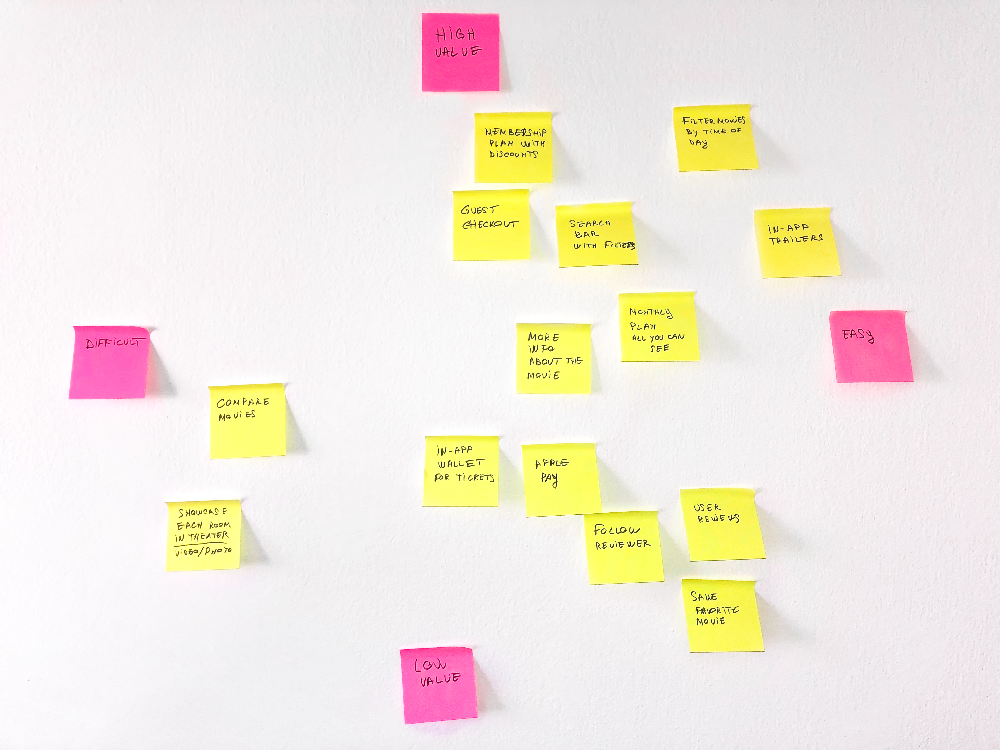
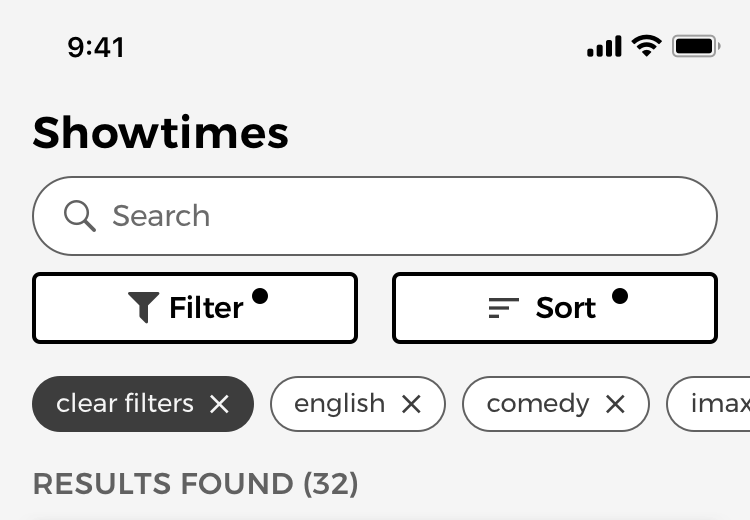

## Introducción

Como la mayoría de la gente, me encanta ver películas. Sobretodo en un cine. Sin embargo, cada vez que usaba una de las aplicaciones o sitios web de uno de los cines de mi ciudad para intentar comprar una entrada para una película, me encontraba con que todos tenían diseños anticuados y confusos. Además, si no sabía qué película me gustaría ver, siempre tenía que usar Google u otras páginas web para obtener más información sobre la película.

Por eso decidí ver cómo podría mejorar la experiencia de buscar una película y luego comprar una entrada para ella usando una aplicación iOS.

##### Mi Rol

- Recerca UX
- Diseño UI
- Diseño de Interacción

##### Herramientas Utilizadas

- papel y bolígrafo
- Sketch
- InVision
- Principle

##### Tipo De Proyecto

- Proyecto Personal

##### Entregables

- [Prototipo InVision](https://invis.io/AERJX7Y8J4F)
- [Guia del Moderador](movie_booking_app_moderator_guide.pdf)

## Proceso

#### Descubrimiento

- User Interviews

#### Análisis

- Diagrama de Afinidad
- Problem Statement
- HMW’s
- Personas
- MOSCOW

#### Ideación

- Crazy 8’s
- Prototipo en papel

#### Prototipo

- Prototipo de alta fidelidad

#### Test

- Entrevista de usuarios 5 de fases

## Descubrimiento

Antes de empezar a trabajar en este proyecto, tenía una suposición inicial:

> Las personas tienen dificultades para buscar una película que les gustaría ver cuando usan la aplicación o página web de uno de los cines de mi ciudad.

Para validar mi suposición y diseñar una solución, decidí seguir un proceso de diseño centrado en el usuario con una combinación de métodos de Lean UX y Google Sprint.

Para la primera parte de la fase de descubrimiento, entrevisté a 4 usuarios. Esto me ayudó a entender mejor las dificultades que tenían y cómo estaban usando los productos que estaban disponibles en el momento.

Pero antes de comenzar a hacer las entrevistas, hice una lista de las diferentes preguntas a las que quería que responder con la investigación inicial.

### Preguntas Previas

- ¿Cómo deciden las personas qué película les gustaría ver?
- ¿Cómo aprenden más sobre la película?
- ¿Cuántas películas ven cada mes?
  - ¿Por qué tantas?
- ¿Con quién están viendo la película? ¿Solos, con una cita, en grupo?
- ¿Están teniendo problemas cuando:
  - Están buscando un cine
  - Están buscando una película para ver
  - Utilizan las páginas web disponibles para comprar entradas de cine
  - Están eligiendo los asientos
  - Comprando y pagando las entradas

### Conclusiones de las Entrevistas

Una vez hice las entrevistas, encontré que las personas:

- Piensan que las entradas de cine y los precios del bar del cine son demasiado altos.
- Considerarían ver más películas si el cine tuviera ofertas o descuentos.
- Piensan que el diseño visual no es tan bueno.
- Usan páginas web externas como Google o imdb.com, para aprender más sobre cada película.
- Échan de menos tener una herramienta que les muestra qué películas están disponibles en un momento determinado del día o en un día específico.
- Piensan que la empresa solo quiere que se registren para que puedan enviarles correos electrónicos de marketing.
- Piensan que la información sobre el cine es difícil de encontrar (los tipos de asientos disponibles, servicios, etc.).

## Análisis

### Diagrama de Afinidad

Una vez que tuve una lista de todas las conclusiones de las entrevistas, use un Diagrama de Afinidad para ayudarme a agrupar e identificar los problemas comunes.

Así que decidí empezar a trabajar en los siguientes problemas principales que tenían las personas:

- **Las personas necesitan una manera de ayudarles a decidir qué película ver.**
- **Las personas tienen problemas con el proceso de pago.**
- **Las personas sienten que los precios son demasiado altos.**

### Declaración de Problemas

El próximo paso fue usar la técnica de declaración de problemas de la metodología Lean UX. Después use la técnica de _Cómo Podríamos_ para ayudarme a encontrar soluciones para cada uno de ellos.

##### Problema

> Las personas tiene dificultades para decidir qué película les gustaría ver.

##### ¿Cómo Podríamos?

> ¿Mejorar nuestra aplicación para que podamos ayudar a las personas a decidir qué película les gustaría ver más rápido?

##### Problema

> Las personas se sienten frustradas cuando tienen que crear una cuenta antes de poder hacer una compra.

##### ¿Cómo Podríamos?

> ¿Mejorar el proceso de compra para que las personas puedan realizar compras sin frustración?

##### Problema

> Los entusiastas del cine sienten que los precios de las entradas son demasiado altos, lo que les impide ver tantas películas como les gustaría.

##### ¿Cómo Podríamos?

> ¿Reducir el coste de ver una película en un cine para clientes habituales?

### Personas

Basándome en estas declaraciones de problemas y los resultados de la investigación, creé 2 personas. Los utilicé para ayudarme a diseñar las características de la aplicación, que estaban basadas en los problemas que las personas tenían con los productos actuales y en los resultados que querían conseguir.

### Alex

Está intentando encontrar una película que les gustaría ver esta noche, tanto a él como a su pareja. No son expertos en el cine y quieren ver una película. Para decidir cuál ver, leen críticas de películas, ven avances de películas y comparan varios antes de tomar una decisión.

### Ana

Es una entusiasta del cine a la que le gusta ver varias películas cada mes, pero siente que los precios actuales son demasiado altos y que los cines no están valorando a sus clientes más leales.

### Priorización de características

Para decidir qué características incluir en el MVP inicial, decidí usar una Matriz de Priorización que se basa en el valor que proporcionaría al usuario final y por lo difícil que sería crearla.

### Método MOSCOW

Luego utilicé el método MOSCOW para encontrar cuáles son las características más importantes que se incluirán en el MVP.

#### Mi MVP incluiría estas 3 características principales:

- Posibilidad de buscar, filtrar y ordenar películas.
- Experiencia de pago optimizada para usuarios no registrados.
- Club de socios con ofertas y descuentos.

### Declaración de Hipótesis de Características

Luego, utilicé las declaraciones de hipótesis de las características de Lean UX para identificar las características que servirán a cada persona y ayudarlas a lograr su resultado individual.

> Crearemos una **características de búsqueda avanzada, con filtros y clasificaciónes** para **Alex** con el fin de **ayudarlo a decidir qué película le gustaría ver más rápido**.

> Crearemos una **experiencia de pago de invitado optimizada** para **Alex** con el fin de **ayudarle a comprar sus entradas para el cine sin ninguna frustración**.

> Crearemos un **plan de membresía** para **Ana** con el fin de **reducir el coste de ver varias películas al mes para los entusiastas del cine**.

### Ideación

Para ayudarme a idear soluciones rápidamente para cada una de las características, utilicé el método de Crazy 8, ya que es una manera excelente de mantenerte en un modo de pensamiento creativo constante para generar muchas formas diferentes de diseñar una característica.

## Busqueda y Filtrado de Peliculas

La primera característica en la que empecé a trabajar fue en la de buscar, filtrar y ordenar películas.

Diseñé esta característica para ayudar a las personas a encontrar una película más rápido, usando diferentes opciones de filtrado, y a la vez poder ordenar los resultados según varios criterios específicos de cada categoría.

La mayoría de las personas entrevistadas tuvieron dificultades para decidir qué película les gustaría ver, por lo que la función está destinada a ayudarles a encontrar una película basada en su género, programación, reseñas de usuarios o duración. De esta manera, no tenían que usar otros productos o servicios para aprender más sobre la película.

Antes de comenzar a esbozar la barra de navegación de la aplicación, decidí ver qué patrones de diseño estaban utilizando otras aplicaciones o sitios web que también necesitaban una característica similar.

El primer producto que comparé fue la aplicación iOS de Airbnb. Una de las razones por las que comencé con la suya fue porque el patrón de diseño que estaban usando les permitía tener siempre visibles sus botones para "Fechas" e "Invitados", debajo de la barra de búsqueda. De esta manera, sus usuarios siempre pueden verlos y saber dónde ir si necesitan filtrar sus resultados de búsqueda.

La siguiente aplicación que comparé fue la de Asos para iOS. Sus botones de clasificación y filtrado tienen más peso visual que la de Airbnb, pero no ellos no incluyen una barra de búsqueda ya que esta en una pantalla diferente.

Uno de los beneficios de la forma en que Asos.com implementa sus opciones de clasificación y filtrado es que les permite mostrar qué opciones están aplicadas en el momento. De esta manera, pueden recordar al usuario que los resultados de la búsqueda están limitados por los filtros aplicados.

En el caso de la página web de Crutchfield.com, tienen la barra de búsqueda y las opciones de clasificación y filtrado visibles en todo momento. Sin embargo, sus botones de clasificación y filtrado están más separados de la barra de búsqueda y no tienen el mismo peso visual que el ejemplo de Asos.com. Esto podría significar que sus usuarios podrían pasar por alto las opciones porque no destacan tanto visualmente.

zalando.es tenía una de las experiencias de búsqueda y filtrado más completas para sus usuarios. Además de mostrar siempre el botón de filtrado, también indican qué opciones de filtrado están activas. Además, sus usuarios pueden eliminar los filtros individuales sin tener que abrir el menú de filtros.

También se usa un botón "Borrar todos los filtros" para permitir que sus usuarios eliminen todos los que están aplicados si desean comenzar de nuevo con una nueva búsqueda.

### Caracteristica De Busqueda Y Filtrado De Peliculas

Para la versión final de la característica, decidí usar una combinación de los diferentes patrones de diseño mencionados anteriormente. Esto me permitió incluir una barra de búsqueda que ocupa todo el ancho de la pantalla sin tener que ocultar las opciones de filtrado o el boton de clasificación. De esta manera también podría mostrar si hay filtros u opciones de clasificación activos.

Otro beneficio es que los usuarios también pueden eliminar cualquiera de los filtros, uno por uno, o todos a la vez, usando el botón "Borrar filtros".

Las opciones de filtrado también están diseñadas de manera que los usuarios puedan combinarlas para mejorar su búsqueda, sin tener opciones mutuamente exclusivas, siguiendo las recomendaciones del [artículo sobre E-Commerce UX](https://baymard.com/blog/allow-applying-of-multiple-filter-values) realizado por el Instituto Baymard, donde encontraron que hasta el 45% de los usuarios que participaron en su estudio, intentaron aplicar varios filtros en algún momento durante su búsqueda.

### Diagrama de Flujo de las Opciones de Búsqueda y Filtrado de Peliculas

### Prototipo de Alta Fidelidad de las Opciones de Búsqueda y Filtrado de Peliculas

#### Prototipo de la Busqueda de Películas

<figure>
  
    
      <video autoPlay loop muted playsInline controls>
        <source
          src="./ux_case_study_movie_searching_prototype.webm"
          type="video/webm"
        />
        <source
          src="./ux_case_study_movie_searching_prototype.mp4"
          type="video/mp4"
        />
        Su navegador no soporta video HTML5.
        <a href="./ux_case_study_movie_searching_prototype.gif">
          Ver el GIF del prototipo de alta fidelidad de la opciones de búsqueda
          de peliculas.
        </a>
      </video>
    
  
  <figcaption>
    Prototipo de alta fidelidad de la opciones de búsqueda de peliculas.
  </figcaption>
</figure>

#### Prototipo del Filtrado de Películas

<figure>
  
    
      <video autoPlay loop muted playsInline controls>
        <source
          src="./ux_case_study_movie_filtering_prototype.webm"
          type="video/webm"
        />
        <source
          src="./ux_case_study_movie_filtering_prototype.mp4"
          type="video/mp4"
        />
        Su navegador no soporta video HTML5.
        <a href="./ux_case_study_movie_filtering_prototype.gif">
          Ver el GIF del prototipo de la opciones de filtrado de peliculas.
        </a>
      </video>
    
  
  <figcaption>
    Prototipo de alta fidelidad de la opciones de filtrado de peliculas.
  </figcaption>
</figure>

#### Prototipo de las Opciones de Selección de Asientos

<figure>
  
    
      <video autoPlay loop muted playsInline controls>
        <source
          src="./ux_case_study_seat_choosing_prototype.webm"
          type="video/webm"
        />
        <source
          src="./ux_case_study_seat_choosing_prototype.mp4"
          type="video/mp4"
        />
        Su navegador no soporta video HTML5.
        <a href="./ux_case_study_seat_choosing_prototype.gif">
          Ver el GIF del prototipo de las opciones de selección de asientos.
        </a>
      </video>
    
  
  <figcaption>
    Prototipo de alta fidelidad del proceso de elección de asientos con un mini
    mapa e interfaz de desplazamiento del asiento.
  </figcaption>
</figure>

## Proceso de Compra como Invitado

La segunda característica de esta aplicación fue el proceso de compra de entradas como invitado.

Uno de los principales problemas que las personas tuvieron en las entrevistas fue que no les gustó el hecho de que tienen que registrarse antes de poder pagar sus entradas para ver una película. La mayoría de ellos consideraron que recibirían una gran cantidad de spam, sobretodo si el diseño general de la página web o aplicación no estaban tan actualizados.

A pesar de que los procesos de compra de entradas como invitado normalmente están diseñados para usuarios que todavía no tienen una cuenta, también son útiles para los usuarios que han olvidado su contraseña y no desean pasar por el proceso de restablecimiento de contraseña en este momento.

Después de investigar previamente para ver cuáles son las mejores prácticas utilizadas para diseñar un proceso de pago, empecé a trabajar en el prototipo de la característica.

### Creación de Cuenta Aplazada

#### Checkout de invitados como opción para todos los usuarios.

Según el [estudio realizado](https://baymard.com/blog/delayed-account-creation) por el Instituto Baymard, hasta el 37% de los usuarios que participaron en el, abandonarían el proceso de compra si se ven obligados a crear una cuenta. Por lo tanto, decidí permitir que los usuarios de la aplicación puedan realizar un pago sin tener que crear una cuenta primero, creando una experiencia de pago como invitado para todos, sin importar si tienen una cuenta o no.

#### Crear una cuenta en el paso de confirmación de pago

Como no estaba pidiendo a cada usuario que creara una cuenta primero, decidí informarles que ahora pueden realizar una compra, y si desean registrarse para guardar su información de pago o envío para futuras compras, podrán crear una cuenta al final del proceso de pago si lo desean.

#### Explicar por qué se necesita su información

Además, de acuerdo con el mismo estudio, si los usuarios están preocupados por su privacidad, el producto puede explicar por qué se necesita su información personal, lo que ayudará a reducir su miedo de que sea solo para enviarles correos electrónicos de marketing.

### Métodos de Pago para las Compras como Invitado

#### Métodos de pago disponibles ubicados uno al lado del otro

Los diferentes métodos de pago que acepta la aplicación se muestran usando 3 botones ubicados uno al lado del otro, siguiendo las [recomendaciones de la investigación](https://baymard.com/blog/payment-method-selection) realizada por el Instituto Baymard.

Según ellos, los métodos de pago deben colocarse juntos muy cerca (los principios de Gestalt ayudarían aquí) para que los usuarios puedan compararlos fácilmente con una sola mirada y ver cuál está activo actualmente.

Los usuarios también deben poder comparar los diferentes costes asociados con cada método de pago, si corresponde, como una tarifa del 2% cuando se utiliza un tipo de pago en particular.

### Optimizando el Formulario de Pago

#### Insertar espacios cada 4 dígitos

Diseñé el campo de entrada del número de tarjeta de crédito para que este inserte automáticamente espacios cada 4 dígitos (en el caso de las tarjetas Visa, otras pueden ser diferentes). Según un estudio, la mayoría de los usuarios [comprueban dos veces los números de tarjeta](https://baymard.com/blog/credit-card-field-auto-format-spaces) que escribieron en grupos de 4 dígitos insertando espacios manualmente, lo cuál hacen para que puedan leer y comprobar fácilmente el número que escribieron.

Además, se podría usar un [script de validación de Luhn](https://gist.github.com/DiegoSalazar/4075533) para comprobar si el número de tarjeta escrito es válido.

#### Hacer coincidir el formato de la fecha de vencimiento con el impreso

El campo de entrada de la fecha de vencimiento fue diseñado para coincidir con el diseño físico y el formato de "MM / YY" que se encuentra en la mayoría de las tarjetas de crédito. [Un estudio ha demostrado](https://baymard.com/blog/how-to-format-expiration-date-fields) que la mayoría de los usuarios intentarán seguir el mismo formato impreso en la tarjeta al escribir el número. Por tanto, los formularios deben diseñarse de manera que respeten el formato físico que se encuentra en las tarjetas de crédito.

Los campos de formulario utilizados para las tarjetas de crédito también deben usar máscaras de entrada que insertan automáticamente un carácter de barra diagonal después del MM en la fecha de vencimiento y el tipo de teclado apropiado para cada campo de entrada del formulario.

### Confirmación del Pedido con Opción que Permite Registrarse

#### Darse de Alta en el Último Paso del Proceso de Pago

La pantalla de confirmación de pedido fue diseñada para permitir a los usuarios guardar sus datos personales, como su correo electrónico o información de pago para futuras compras.

En lugar de ser obligados a tener que crear una cuenta antes de que puedan realizar una compra, una mejor opción es permitirles crear una cuenta en el último paso del proceso de pago.

De esta manera, los usuarios aún pueden registrarse para guardar sus datos para pagos futuros, pero en lugar de ser algo molesto, pasa a es una característica útil que les permite hacer futuras compras más rápido si vuelven a usar la aplicación ya que no tendrán que volver a introducir los datos.

A pesar de que sigue siendo la misma cantidad de campos de entrada, los usuarios no pensarán que solo se tienen que registrar para que la empresa pueda enviarles correos electrónicos de marketing.

### Diagrama de Flujo de la Experiencia de Pago como Invitados

### Prototipo de Alta Fidelidad de la Experiencia de Pago como Invitados

<figure>
  
    
      <video autoPlay loop muted playsInline controls>
        <source
          src="./ux_case_study_guest_checkout_prototype.webm"
          type="video/webm"
        />
        <source
          src="./ux_case_study_guest_checkout_prototype.mp4"
          type="video/mp4"
        />
        Su navegador no soporta video HTML5.
        <a href="./ux_case_study_guest_checkout_prototype.gif">
          Ver el GIF del prototipo de alta fidelidad de la experiencia de pago
          como invitados.
        </a>
      </video>
    
  
  <figcaption>
    El prototipo final de alta fidelidad de la experiencia de pago como
    invitados.
  </figcaption>
</figure>

## Club de Socios

La tercera característica de la aplicación fue el club de socios con ofertas y descuentos.

En las entrevistas, la mayoría de los usuarios se quejaron de que la mayoría de los clubs de socios que ofrecen los cines actualmente no valen la pena ya que no aportan suficiente valor como para darse de alta.

La mayoría de ellos dan un punto por cada euro gastado. Luego, estos puntos pueden usarse para obtener una entrada para una película o para comprar en el bar del cine. Sin embargo, para poder cambiarlos por una entrada, hacen falta unos 100 puntos, lo que significa que hay que gastar 100 euros antes de poder obtener una entrada gratis, por lo que no vale tanto la pena.

Esta característica de la aplicación fue mi intento de ver cómo podría mejorar la experiencia de manera que los usuarios sientan que vale la pena y consideren que les proporciona suficiente valor como para darse de alta.

### Diseñando el Proceso de Alta del Club de Socios

El proceso de alta para el club de socios se dividió en 4 segmentos para evitar sobrecargar a los usuarios con demasiados campos de formulario a la vez.

Los 4 segmentos fueron:

- **Datos de contacto**
- **Información de envío**
- **Datos de pago**
- **Finalizado (pantalla de confirmación)**

### Diagrama de Flujo del Proceso de Alta del Club de Socios

### Optimizaciones para la Fase de la Información de Envío

La fase de recogida de la información de envío es necesaria para que los usuarios puedan recibir una copia de su tarjeta del club de socios. Para diseñar esta fase, decidí realizar una investigación previa para ver cuáles son las mejores prácticas de UX para diseñar la fase del proceso de pago en la que se recogen los datos de envío.

Pantalla de la fase de recogida de la información de envío con textos optimizados para evitar confundir a los usuarios con las diferentes opciones de envío.

#### Sin costes escondidos

Los cargos ocultos y los costes de entrega son una de las razones principales por las que los clientes deciden abandonar un proceso de pago, por lo que decidí indicar claramente todos los costes de entrega que los usuarios tendrían que pagar.

#### Opción de recoger en tienda y métodos de envío

[Un estudio reciente](https://baymard.com/blog/store-pickup-as-shipping-option) ha demostrado que cuando la opción de recoger en la tienda no aparece junto a los otros métodos de entrega, los usuarios no se darán cuenta de que esta existe, y no podrán comparar si el coste adicional de pagar los 2 o 3 euros más para una opción de entrega más rápida vale la pena.

Además, los diferentes métodos de entrega también están diseñados siguiendo las recomendaciones de un [estudio](https://baymard.com/blog/shipping-speed-vs-delivery-date) que encontró que al usar etiquetas como 2 Days Express o 1 Day Premium, los usuarios se confundirían con la fecha exacta en que recibirían el producto.

Al usar etiquetas como estas, los usuarios se ven obligados a tener que calcular personalmente el día en que llegaría el producto.

Una etiqueta de "3-5 días" no tiene en cuenta el tiempo de procesamiento que cada orden podría necesitar, la hora de corte diaria (las órdenes después de las 16h se enviarán al día siguiente), o si el usuario elige un envío _Express de 1 Día_ en un viernes, lo que significa que el pedido se envía el lunes, lo que lo convierte en un método de envío de 3 días con un coste superior.

Al usar etiquetas como "Llegará el:" o "Recíbelo el:", los usuarios tomarán la fecha de entrega como una promesa que aumentaría su confianza a la hora de decidir si el coste adicional de una opción de envio _Express_ vale la pena o no.

Sin embargo, para que la fecha final sea útil para el usuario, esta debe tener en cuenta todos los factores necesarios, como el la hora de corte de los envíos, la hora y fecha actual o el tiempo estimado de entrega de la compañía de envío.

### Prototipo de Alta Fidelidad del Proceso de Alta del Club de Socios

<figure>
  
    
      <video autoPlay loop muted playsInline controls>
        <source
          src="./ux_case_study_membership_checkout_prototype.webm"
          type="video/webm"
        />
        <source
          src="./ux_case_study_membership_checkout_prototype.mp4"
          type="video/mp4"
        />
        Su navegador no soporta video HTML5.
        <a href="./ux_case_study_membership_checkout_prototype.gif">
          Ver el GIF del prototipo de alta fidelidad del proceso de alta del
          club de socios
        </a>
      </video>
    
  
  <figcaption>
    Prototipo de alta fidelidad del proceso de alta del club de socios.
  </figcaption>
</figure>

## Pruebas de Usabilidad

El último paso de mi proceso de diseño fue probar la aplicación. Para las pruebas de usabilidad utilicé el método de Entrevistas de 5 Actos de Google Ventures, en el que entrevisté a 5 personas y les di a cada una de ellas tareas que tendrían que intentar completar usando la aplicación.

Las preguntas que quería responder con las entrevistas fueron:

- ¿Ayuda la aplicación a los usuarios a decidir qué película les gustaría ver más rápido?
- ¿Ayuda la aplicación a los usuarios a aprender más sobre cada película?
- ¿Se apuntarán los usuarios al club de socios?
- ¿Pueden los completar el proceso de compra sin ningún problema?
- ¿Es útil el proceso de pago como invitado para los usuarios?

### Los Resultados:

- 4 de cada 5 usuarios se dieron de alta en el club de socios
- 5 de cada 5 usuarios usaron la barra de búsqueda y los filtros para ayudarles a encontrar una película
- 5 de cada 5 usuarios dijeron que es mucho más fácil aprender todo lo que necesitan sobre una película dentro de la aplicación
- 4 de cada 5 usuarios usaron el proceso de pago como invitados y 3 de ellos se registraron al final

## Conclusión

