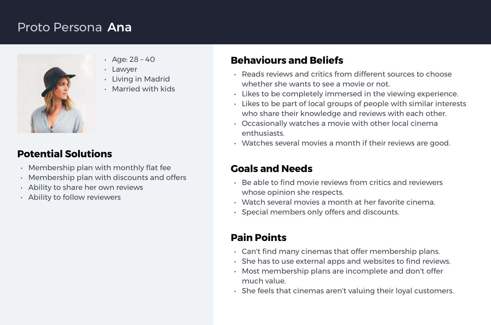
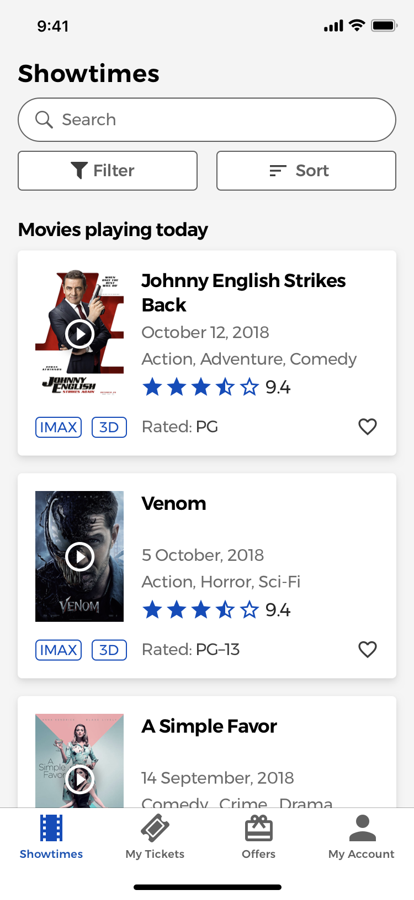

This is a concept app I designed to see how I could improve the experience of searching, finding and booking a movie based on my personal experiences and pain points I had while trying to book a movie. I decided to follow a modified Lean UX process, based on my initial assumptions, using proto–personas and with the help of the Lean UX sub–hypothesis statements to discover and design features that would serve each of the personas pain points and needs.

**The final design includes:**

* Advanced faceted search and filtering to allow users to find movies.
* Save movies for later.
* In app movie reviews and ability to follow favorite reviewers.
* Membership plans with multiple benefits.
* Guest checkout experience.
* Segmented, highly optimized checkout flow.

  <h4 class="toc__title">Table of Contents</h4>
<!-- TOC -->

- [Why I designed this app](#why-i-designed-this-app)
- [Previous Assumptions](#previous-assumptions)
- [Proto–Personas](#protopersonas)
- [User Stories](#user-stories)
- [Lean UX sub-hypothesis statements](#lean-ux-sub-hypothesis-statements)
- [Advanced Filtering and Searching](#advanced-filtering-and-searching)
- [Read reviews and follow reviewers](#read-reviews-and-follow-reviewers)
- [Save favorite movies](#save-favorite-movies)
- [Movie ticket guest checkout](#movie-ticket-guest-checkout)

<!-- /TOC -->

##Why I designed this app

I decided to design this app as each time I tried to find and book a movie, all the websites and apps that I used from my local cinemas had outdated designs, no real benefit to their membership plans and very limited searching and filtering features.

Therefore, I decided to see how I could improve the movie searching and booking experience.

The app was design based on my personal assumptions, pain points and needs and would need to be validated with real user testing, to see if other users are having the same issues and if the design solutions created help them achieve their end goals.

To find the different problems and features, I decided to follow a modified version of Jeff Gothelf’s Lean UX process and created a list of the different assumptions I had about the current issues users were having when booking a movie:

##Previous Assumptions

* Users find it hard to search for movies in the current app.
* Users have to exit the app to read reviews for the movie they would like to see.
* The app isn't always stable and movie trailers won't always load.
* Users can’t purchase movie tickets without having to sign up, no guest checkout experience is available.
* Users that like to watch many movies each month feel  that the tickets are too expensive.
* The UI is overloaded with adds.
* Main CTA's don't stand out or are unclear to what will happen if they are pressed.

Based on these assumptions I created two proto–personas to create the features that would solve their pain points and needs.

##Proto–Personas

###Ana

She is a cinema enthusiast that would like to watch several movies each month without having to spend too much money. She doesn't mind signing up for a membership plan, if it provides the right benefits to her.

###Alex

He is in a crowded and noisy restaurant with his date and they decided they would like to see a movie tonight. They are not sure which movie they might like, so they need a way to search and filter movies, read reviews and book the tickets easily without wasting too much time.

The next step was to create the user stories for each of the main pain points.

##User Stories

###Alex

#####User Need

**Search and find movies, read reviews and save his favorite movies for later.**

#####User Story

>“As a person on a date I want to be able to find a movie to watch tonight with my date, which we will both enjoy.”

####Features:

* Advanced Filtering and Searching
* Find, read and write reviews
* Follow favorite reviewers
* Save favorite movies

#####User Need

**Choose seats and book tickets.**

#####User Story

>“As a user I need a fast and easy way to book a movie so that I can cary on with my night out.”

####Features:

* Guest checkout with option to create account at the end
* Multiple payment options
* Biometric payment options using Apple Pay
* Segmented checkout

###Ana

#####User Need

**Membership plan with offers and discounts.**

#####User Story

>“As a cinema enthusiast I need a membership plan with offers and discounts so that I can watch as many movies as I would like, without having to spend too much money.”

####Features:

* Members club with offers and discounts
* Members only special screenings and events
* Members club unlimited movie viewing each month

**To sum up, the main paint points these features are solving for the personas are:**

* Offer a membership plan for users that would like to watch many movies. The plans should be based on a subscription model and offer unlimited movies, significant discounts and several other benefits for the users. This way they will feel that the plans offer a decent value and are worth the investment. As an added benefit for cinema enthusiast, the plan would offer special preview screenings and a priority bar access to avoid long queues.
* Create an easy to use and straight forward way of searching for movies, learning more about them and purchasing the tickets with having to register or spend too much time in the process.

##Lean UX sub-hypothesis statements

Following the next step in the Lean UX process, Jeff Gothelf recommends we create a sub-hypotheses features list to get a better picture of which persona each feature is serving.

The sub-hypothesis statement definition:

>"We will create **this feature** for **this persona** in order to achieve **this outcome**."

So I began working on the sketches of how each feature could be designed. First I started with the user story of Alex and his need to search, filter and decide on a movie.

##Advanced Filtering and Searching

####Sub-hypothesis

We will create **an advanced searching and filtering feature** for **Alex** in order to **help him find a movie that he and his date would like to watch.**

One of the more challenging parts of the design of this app for me was how to implement the searching and filtering feature. The final design was the result of several trials and errors that I made before I decided on the best version.

####First versions of the search, and filtering and sorting features

Before I decided on the final version I tried several other ones, however they all had their pros and cons.

My first design of the nav bar included the search bar and the tabbed navigation which showed movies being screened during the day, week, upcomming or by how popular they were.

  

  

  

    

####Pros

* Search bar is always visible.
* Users can easily see only movies shown today, this week, upcoming or by how popular they are.

####Cons

* Filter and sort buttons are hidden behind the search bar. The user has to initiate the search by tapping the search button.
* Once search is active, the tabbed navigation is a duplicate of the filtering options available.
* Do I show the tabbed navigation when filtering is open, or not? Will it confuse the user?

    

  

One of the biggest issues of this version for me was what happened if the user was on the Upcoming tab when he activated Search? Is the filtering, searching and sorting aplied only on the results of the Upcoming tab, or are they aplied on the entire list of movies the app has currently available?

  

  

  

  

  

  

In order to try to solve this issue I removed the tabbed navigation and showed the filter and sort button all time, however when the search bar was activated and the user was typing, the sort and filter buttons had to move bellow it to make room for the larger search bar, which caused layout shifts or I had to leave extra room in the nav bar for when the search bar was active.

So I had to keep searching for a better solution.

  

  

  

  

  

  

In order to find a better solution to this design problem, I decided to  do some competitive analysis—even though most of the apps analized were not direct competitors—to see how other apps were solving this issue and what design patterns they were using.

One of the design patterns I liked most was how Airbnb was showing their buttons to choose the dates and guests when searching for a home. This way there is no need to hide the buttons behind the search bar.

Asos.com shows their sort and filter buttons with more visual weight that Airbnb, however they show the search bar in a different screen. One of the benefits of the way Asos.com implements their sorting and filtering options is that it allows them to easily indicate if the sorting or filtering options are applied to remind the user that the results shown are being afected by them. 

Another good design pattern used is indicating the number of available results the applied filters return.

Crutchfield.com’s website shows the search bar and sorting and filtering options at the same time, even though their sort and filter buttons are more separated from the search bar and don’t have the same visual weight as the Asos.com example.

E–commerce giat zalando.es features one of the best filtering experiences for their users.

Besides showing the filtering button all of the time, they also indicate their users which filter options have been activated. Users are also able to remove individual filters without having to open the filtering menu again, directly from the swipeable list.

A “clear all filters” button is also used to allow their users to easily clear all the current filters applied.

###The final version

  

  

  

  

  

  

The final version included with the app had all the features I needed and none of the disadvantages.

I decided to use a combination of the different design patterns mentioned above, which allowed me to include a full width search bar, always visible filter and sort buttons and applied filters.

Another benefit of using this approach is that users can apply different filters to improve their search, without having mutually exclusive options, as the Baymard Institute recomends in their article on E–Commerce UX, where they found that 45% of the users tested, tried to apply multiple filters at some point.

By using checkbox style buttons for the filters, users can easily enable and disable filtering options, which don’t have to depend on each other.

###Filtering options final prototype

<figure>
  
    
        <video autoplay loop muted playsinline>
          <source src="./video.webm" type="video/webm">
          <source src="./video.mp4" type="video/mp4">
          Your browser does not support HTML5 video.
          <a href="./animated.gif">Click here to view original GIF</a>
        </video>
      
    
  <figcaption>The final prototype and design of the movie filtering interaction.</figcaption>
</figure>

###Sorting options

Another important part of the movie finding experience I studied was the sorting functionality. Besides the normal sorting options of “Price Low to High” or “Rating” I decided to improve the sorting experience by using category specific sorting options.

The Baymard Institute [recomends](https://baymard.com/) designers should create this type of sorting experience to allow their users improve the results they see by using category specific options such as—in my case—Popularity (the most booked movies), or by user rating (the highest rated movies first).

By using a combination of the mutually exclusive filters and the enhanced sorting with category specific options, users can easily find the movies that best suits their personal needs and tastes.

###Movie searching

The searching experience was designed to show in real time the amount of results the query typed by the user has, as well as showing only the relevant results.

<figure>
  
    
        <video autoplay loop muted playsinline>
          <source src="./video.webm" type="video/webm">
          <source src="./video.mp4" type="video/mp4">
          Your browser does not support HTML5 video.
          <a href="./animated.gif">Click here to view original GIF</a>
        </video>
      
    
  <figcaption>The final prototype and design of the movie searching experience.</figcaption>
</figure>

##Read reviews and follow reviewers

####Sub-hypothesis

We will create **in app movie reviews** for **Alex** in order for **him to be able to read reviews other users have made.**

Users can read reviews of the movies they might like to watch directly in the app without having to look for them on Google. They can also follow a reviewer and see all the other reviews the reviewer has made, by opening the reviewers profile.

By allowing users to read reviews made by others, the principle of social validation is used which increases their confidence of whether they would enjoy the movie or not.

###Reading reviews prototype

<figure>
  
    
        <video autoplay loop muted playsinline>
          <source src="./video.webm" type="video/webm">
          <source src="./video.mp4" type="video/mp4">
          Your browser does not support HTML5 video.
          <a href="./animated.gif">Click here to view original GIF</a>
        </video>
      
    
  <figcaption>The final prototype and design of reading a movie review and following a reviewer.</figcaption>
</figure>

##Save favorite movies

####Sub-hypothesis

We will create **a save favorite movies feature** for **Alex** so that he can **save his favorite movies for later.**

Users can save their favorite movies for later, in the app, so that they can have a list of the movies they would like to see. They can save the movie in any of the movie listing screens or within the movie details page. Once users have saved a movie, they can check their personal list of movies in their account page.

  

  

  

  

  

  

  

  

  

###Choose movie session and seats.

####Sub-hypothesis

We will create **a seat choosing feature** for **Alex** so that he can **see which seats are best and book them.**

###Choosing a movie session

Once users have decided which movie they would like to see, they  can filter the available showtimes by the day the movie is playing, by the time of day or by the type of viewing experience, such as IMAX, 3D, 4D, etc.

After that, users can then choose the exact movie session. When choosing a showtime, users will be able to see how many available seats are left for each of the sessions to decide whether they should hurry or not to buy the seats if not many are left.

###Choose movie seats

The seat choosing process has been another part of the apps design where I had to try several versions before I decided on the final one.

###The initial version

In the first version of the design I tried to pack all of the different seats a movie theater might have, however I soon realized that this layout isn’t always the same and most cinemas have small and large rooms with many more seats than this approach has.

Another issue I had was that the tap sizes we’re not large enough to meet the iOS requirements of 44pt or the Android ones of 48pt. 

When the user tried to choose a seat, he might accidentally choose one next to the seat he is trying to pick, so I had to increase the size of the seats in order to have large enough tap sizes.

  

  

  

    

####Pros

* All the seats are visible all of the time.
* Can easily indicate the chosen seats.
* Fits up to 20 or more chosen seats at the same time without clipping.

####Cons

* Not a realistic seat layout and theater floor plan.
* Tap size isn’t large enough.
* Users might select the worng seat due to the small tap size.

    

  

###The improved version

In order to solve the issues of the initial design I increased the padding between each of the seats and the size of each of them to have a larger and more appropiate tap size.

In order to solve the issue of the layout not being realistic, I decided to use a scrolling seat floor plan with a mini–map in the bottom of the screen, where the user could get an idea of the general location of the current view inside the theaters room.

This approach solved most of the issues I had with the initial one, and also allowed me to show a large amount of selected seats the user has chosen, as not every purchase is going to be a 2 seat purchase for a couple. A group of friends of 6 or more people might also want to watch a movie, so I had to think of a way to show more than 2 or 3 chosen seats at the same time.

###The final prototype

<figure>
  
    
        <video autoplay loop muted playsinline>
          <source src="./video.webm" type="video/webm">
          <source src="./video.mp4" type="video/mp4">
          Your browser does not support HTML5 video.
          <a href="./animated.gif">Click here to view original GIF</a>
        </video>
      
    
  <figcaption>The final version of the seat choosing process with a mini–map and scolling seat interface.</figcaption>
</figure>

##Movie ticket guest checkout